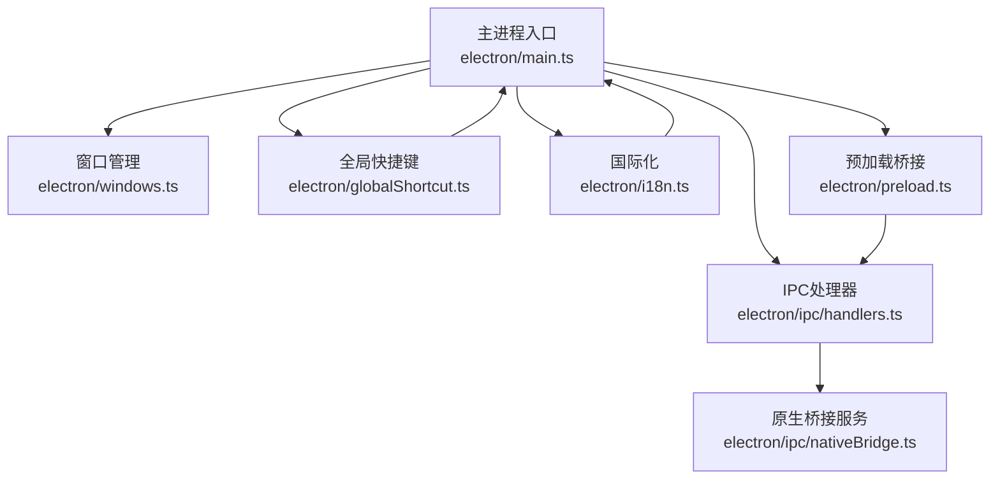
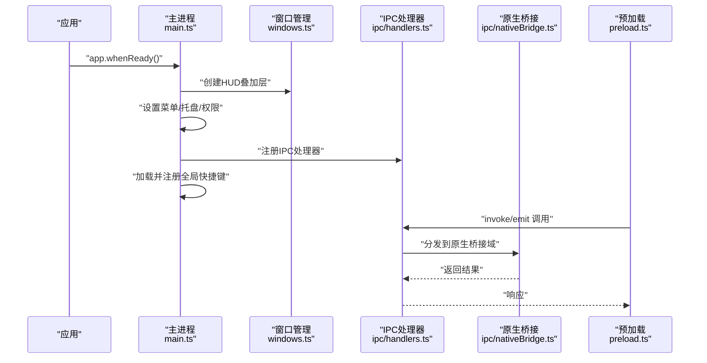
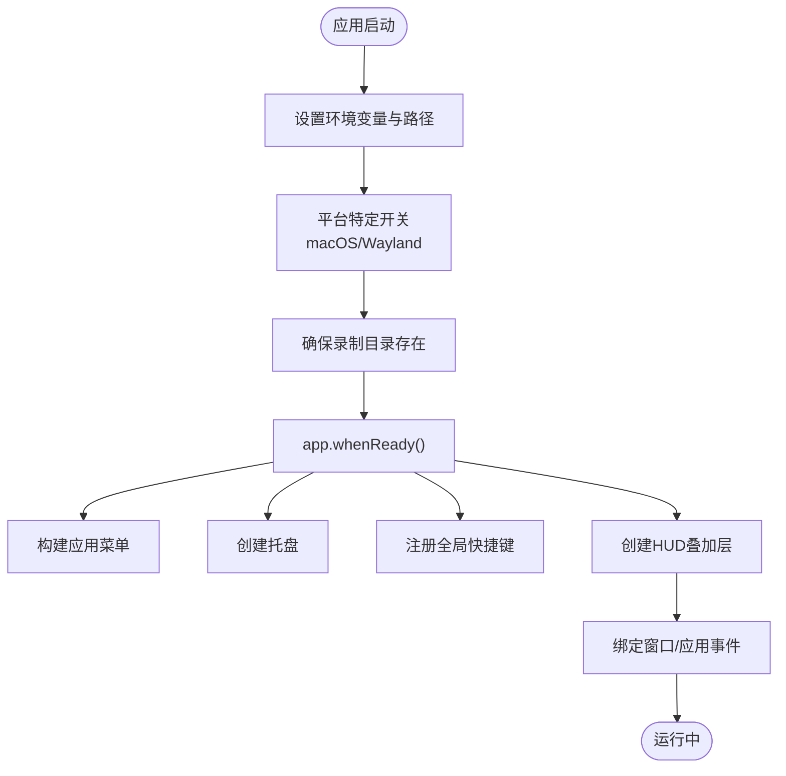
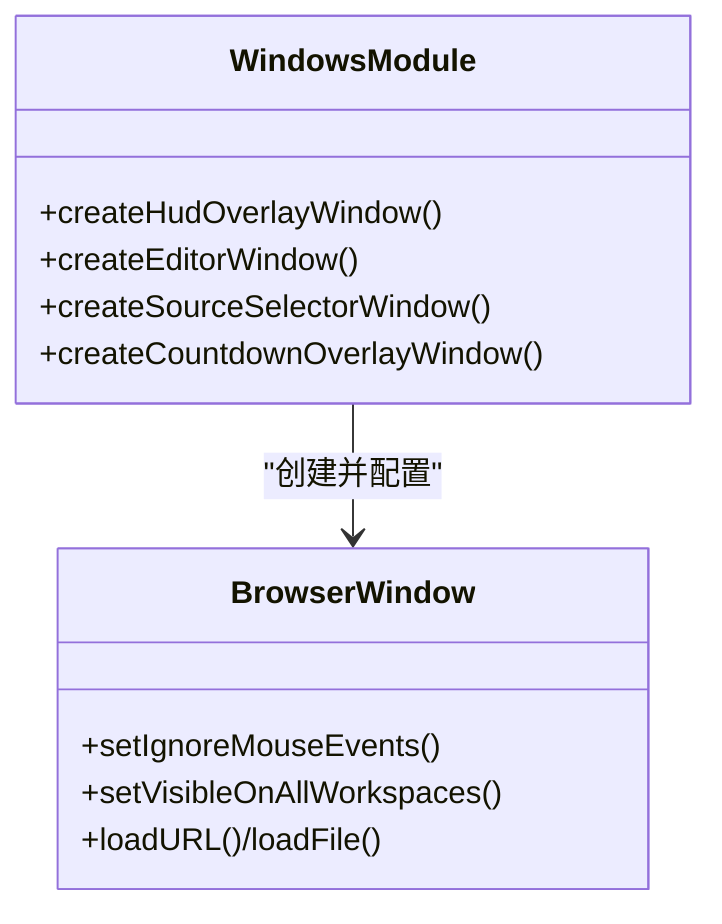
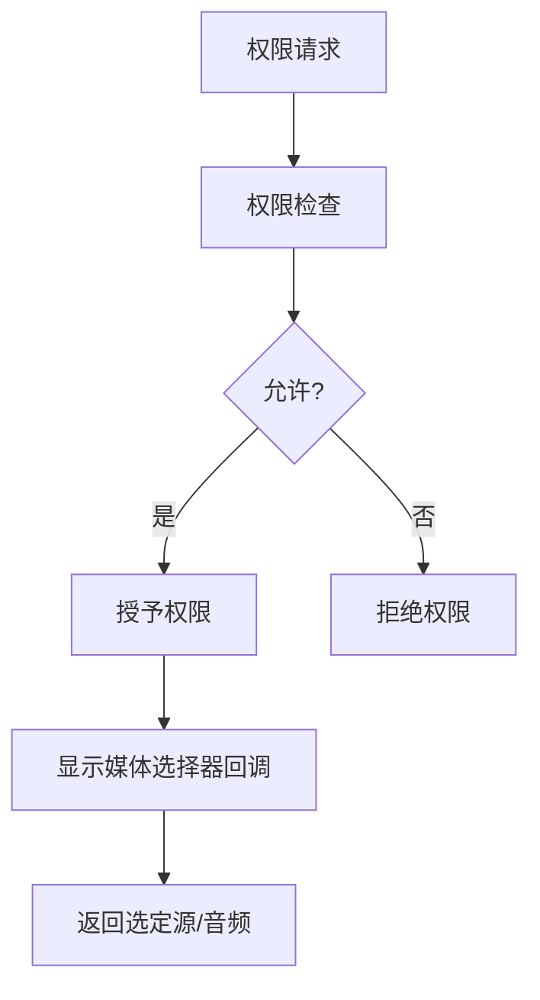
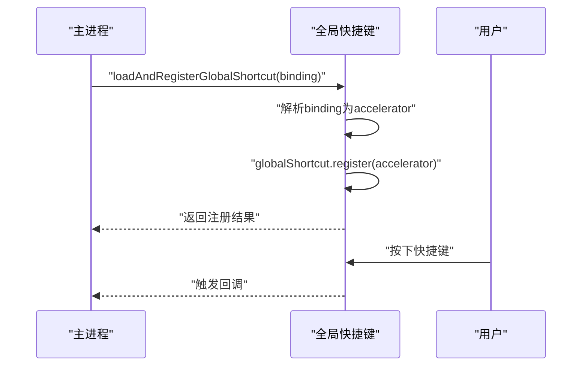
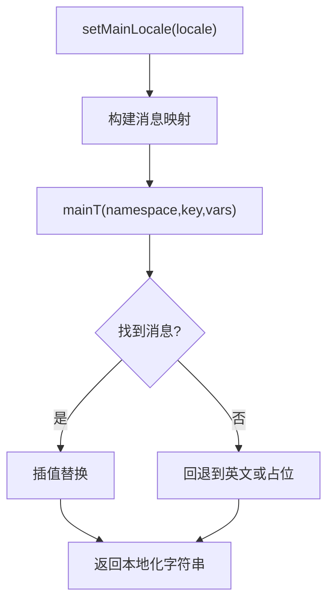
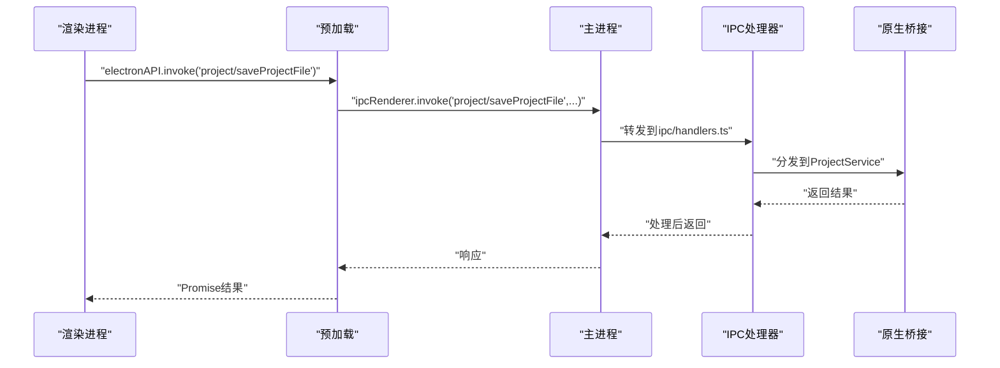
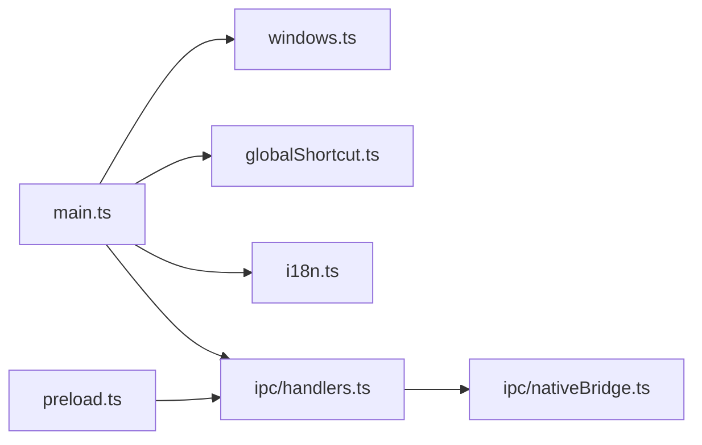

# Electron主进程架构

<cite>
**本文档引用的文件**
- [electron/main.ts](file://electron/main.ts)
- [electron/globalShortcut.ts](file://electron/globalShortcut.ts)
- [electron/i18n.ts](file://electron/i18n.ts)
- [electron/windows.ts](file://electron/windows.ts)
- [electron/preload.ts](file://electron/preload.ts)
- [electron/ipc/handlers.ts](file://electron/ipc/handlers.ts)
- [electron/ipc/nativeBridge.ts](file://electron/ipc/nativeBridge.ts)
- [src/lib/shortcuts.ts](file://src/lib/shortcuts.ts)
</cite>

## 目录
1. [简介](#简介)
2. [项目结构](#项目结构)
3. [核心组件](#核心组件)
4. [架构总览](#架构总览)
5. [详细组件分析](#详细组件分析)
6. [依赖关系分析](#依赖关系分析)
7. [性能考量](#性能考量)
8. [故障排查指南](#故障排查指南)
9. [结论](#结论)
10. [附录](#附录)

## 简介
本文件面向OpenScreen的Electron主进程，系统性阐述其架构设计与实现要点，覆盖应用初始化、系统集成、资源管理、全局快捷键、国际化、安全策略、权限管理、沙箱机制、生命周期钩子、崩溃恢复与错误处理、主进程与其他进程的协调机制以及最佳实践与调试技巧。目标是帮助开发者快速理解并高效维护主进程代码。

## 项目结构
OpenScreen的Electron主进程位于electron目录下，采用按功能模块划分的组织方式：
- 主入口与生命周期：electron/main.ts
- 窗口管理：electron/windows.ts
- 预加载桥接：electron/preload.ts
- IPC处理器与业务逻辑：electron/ipc/handlers.ts
- 原生桥接服务：electron/ipc/nativeBridge.ts
- 全局快捷键：electron/globalShortcut.ts
- 国际化：electron/i18n.ts
- 快捷键定义（渲染层）：src/lib/shortcuts.ts

图表来源
- [electron/main.ts:460-574](file://electron/main.ts#L460-L574)
- [electron/windows.ts:52-121](file://electron/windows.ts#L52-L121)
- [electron/ipc/handlers.ts:1-120](file://electron/ipc/handlers.ts#L1-L120)
- [electron/ipc/nativeBridge.ts:92-236](file://electron/ipc/nativeBridge.ts#L92-L236)
- [electron/globalShortcut.ts:66-80](file://electron/globalShortcut.ts#L66-L80)
- [electron/i18n.ts:62-112](file://electron/i18n.ts#L62-L112)
- [electron/preload.ts:15-281](file://electron/preload.ts#L15-L281)

章节来源
- [electron/main.ts:1-120](file://electron/main.ts#L1-L120)
- [electron/windows.ts:1-120](file://electron/windows.ts#L1-L120)
- [electron/ipc/handlers.ts:1-120](file://electron/ipc/handlers.ts#L1-L120)

## 核心组件
- 应用初始化与生命周期
  - 初始化环境变量、路径常量与录制目录
  - 平台特定开关（macOS禁用特定特性、Linux Wayland支持）
  - 注册窗口事件与应用级事件（窗口关闭、激活、退出）
- 窗口体系
  - HUD叠加层、编辑器窗口、源选择器、倒计时覆盖层
  - 透明、无框、置顶等特性，跨工作区可见（macOS）
- 权限与沙箱
  - 默认会话权限检查与请求处理器
  - 显示媒体选择器回调（自定义选择源）
  - 预加载上下文隔离与Node集成关闭
- IPC与原生桥接
  - 统一的原生桥接通道与域分发
  - 录制流注册表与文件落盘策略
- 全局快捷键
  - 加载用户配置或默认快捷键，动态注册与注销
- 国际化
  - 主进程侧轻量i18n，复用渲染层翻译文件

章节来源
- [electron/main.ts:31-120](file://electron/main.ts#L31-L120)
- [electron/main.ts:431-458](file://electron/main.ts#L431-L458)
- [electron/main.ts:459-574](file://electron/main.ts#L459-L574)
- [electron/windows.ts:52-121](file://electron/windows.ts#L52-L121)
- [electron/ipc/handlers.ts:47-120](file://electron/ipc/handlers.ts#L47-L120)
- [electron/ipc/nativeBridge.ts:92-236](file://electron/ipc/nativeBridge.ts#L92-L236)
- [electron/globalShortcut.ts:41-80](file://electron/globalShortcut.ts#L41-L80)
- [electron/i18n.ts:62-112](file://electron/i18n.ts#L62-L112)

## 架构总览
主进程通过应用就绪事件完成初始化，随后构建菜单、托盘、注册全局快捷键，并创建HUD叠加层作为首个窗口。渲染进程通过预加载桥接与主进程通信，执行录制、项目管理、原生能力调用等操作。IPC处理器集中管理业务逻辑，原生桥接服务提供系统、项目、光标数据能力。

图表来源
- [electron/main.ts:459-574](file://electron/main.ts#L459-L574)
- [electron/windows.ts:52-121](file://electron/windows.ts#L52-L121)
- [electron/ipc/handlers.ts:1-120](file://electron/ipc/handlers.ts#L1-L120)
- [electron/ipc/nativeBridge.ts:124-236](file://electron/ipc/nativeBridge.ts#L124-L236)
- [electron/preload.ts:15-281](file://electron/preload.ts#L15-L281)

## 详细组件分析

### 应用初始化与生命周期
- 初始化
  - 设置APP_ROOT、VITE_PUBLIC、主/渲染目录常量
  - macOS禁用特定特性以改善屏幕录制体验
  - Linux在Wayland环境下启用Ozone Wayland与PipeWire捕获
  - 确保录制目录存在
- 生命周期事件
  - window-all-closed：退出应用
  - activate：无可见窗口时显示主窗口
  - will-quit：注销所有全局快捷键
- 菜单与托盘
  - 构建应用菜单（含文件、编辑、视图、窗口）
  - 托盘图标与上下文菜单，支持打开/停止录制/退出

图表来源
- [electron/main.ts:31-120](file://electron/main.ts#L31-L120)
- [electron/main.ts:431-458](file://electron/main.ts#L431-L458)
- [electron/main.ts:459-574](file://electron/main.ts#L459-L574)

章节来源
- [electron/main.ts:31-120](file://electron/main.ts#L31-L120)
- [electron/main.ts:431-458](file://electron/main.ts#L431-L458)
- [electron/main.ts:459-574](file://electron/main.ts#L459-L574)

### 窗口管理
- 窗口类型
  - HUD叠加层：透明、无框、置顶、跟随虚拟桌面
  - 编辑器窗口：最大化、隐藏标题栏（macOS）、背景色注入
  - 源选择器：透明、居中、跟随虚拟桌面
  - 倒计时覆盖层：透明、不可聚焦、居中
- 关键配置
  - 预加载脚本、额外参数（资产基础URL）
  - contextIsolation开启、Node集成关闭
  - macOS可见于所有工作区、ready-to-show避免闪烁

图表来源
- [electron/windows.ts:52-121](file://electron/windows.ts#L52-L121)
- [electron/windows.ts:127-185](file://electron/windows.ts#L127-L185)
- [electron/windows.ts:191-229](file://electron/windows.ts#L191-L229)
- [electron/windows.ts:235-282](file://electron/windows.ts#L235-L282)

章节来源
- [electron/windows.ts:52-121](file://electron/windows.ts#L52-L121)
- [electron/windows.ts:127-185](file://electron/windows.ts#L127-L185)
- [electron/windows.ts:191-229](file://electron/windows.ts#L191-L229)
- [electron/windows.ts:235-282](file://electron/windows.ts#L235-L282)

### 权限管理与沙箱机制
- 权限检查与请求
  - setPermissionCheckHandler与setPermissionRequestHandler允许媒体、屏幕、摄像头等权限
  - setDisplayMediaRequestHandler自定义选择源，控制是否返回音频回放
- 沙箱与安全
  - 预加载开启contextIsolation，关闭Node集成
  - webSecurity在编辑器窗口显式关闭（用于开发场景）
- macOS麦克风权限
  - 启动时检查并请求麦克风访问

图表来源
- [electron/main.ts:468-519](file://electron/main.ts#L468-L519)
- [electron/windows.ts:78-84](file://electron/windows.ts#L78-L84)
- [electron/windows.ts:146-153](file://electron/windows.ts#L146-L153)

章节来源
- [electron/main.ts:468-519](file://electron/main.ts#L468-L519)
- [electron/windows.ts:78-84](file://electron/windows.ts#L78-L84)
- [electron/windows.ts:146-153](file://electron/windows.ts#L146-L153)

### 全局快捷键注册与处理
- 快捷键定义
  - 默认“打开应用”快捷键（如需）
  - 键名映射到Electron加速键（空格、方向键、Enter等）
- 动态注册与冲突
  - 新注册成功后再注销旧快捷键，避免冲突
  - 支持从用户配置文件加载快捷键
- 触发回调
  - 注册时传入回调（如显示主窗口）

图表来源
- [electron/globalShortcut.ts:26-64](file://electron/globalShortcut.ts#L26-L64)
- [electron/globalShortcut.ts:66-80](file://electron/globalShortcut.ts#L66-L80)
- [electron/main.ts:570-571](file://electron/main.ts#L570-L571)

章节来源
- [electron/globalShortcut.ts:26-64](file://electron/globalShortcut.ts#L26-L64)
- [electron/globalShortcut.ts:66-80](file://electron/globalShortcut.ts#L66-L80)
- [electron/main.ts:570-571](file://electron/main.ts#L570-L571)
- [src/lib/shortcuts.ts:108-118](file://src/lib/shortcuts.ts#L108-L118)

### 国际化系统
- 资源加载
  - 直接导入渲染层翻译JSON（common、dialogs命名空间）
  - 支持多语言：en、ar、es、fr、it、ja-JP、ko-KR、ru、tr、vi、zh-CN、zh-TW
- 运行时切换
  - setMainLocale设置当前语言
  - mainT根据命名空间与点路径查找消息，支持插值
- 主进程菜单与托盘文案
  - 使用mainT生成本地化文本，动态更新菜单与托盘

图表来源
- [electron/i18n.ts:45-58](file://electron/i18n.ts#L45-L58)
- [electron/i18n.ts:62-83](file://electron/i18n.ts#L62-L83)
- [electron/i18n.ts:100-111](file://electron/i18n.ts#L100-L111)
- [electron/main.ts:525-529](file://electron/main.ts#L525-L529)

章节来源
- [electron/i18n.ts:45-58](file://electron/i18n.ts#L45-L58)
- [electron/i18n.ts:62-83](file://electron/i18n.ts#L62-L83)
- [electron/i18n.ts:100-111](file://electron/i18n.ts#L100-L111)
- [electron/main.ts:525-529](file://electron/main.ts#L525-L529)

### IPC与原生桥接
- 原生桥接通道
  - 统一通道名与版本元数据
  - 域分发：system、project、cursor
  - 成功/失败响应封装
- 服务层
  - SystemService：平台信息、资源路径、能力查询
  - ProjectService：项目保存/加载、当前视频路径管理
  - CursorService：光标能力、遥测与录制数据加载
- 预加载桥接
  - 暴露electronAPI，封装ipcRenderer调用
  - 提供录制、项目、导出、诊断等方法

图表来源
- [electron/preload.ts:15-281](file://electron/preload.ts#L15-L281)
- [electron/ipc/nativeBridge.ts:92-236](file://electron/ipc/nativeBridge.ts#L92-L236)
- [electron/ipc/handlers.ts:1-120](file://electron/ipc/handlers.ts#L1-L120)

章节来源
- [electron/ipc/nativeBridge.ts:92-236](file://electron/ipc/nativeBridge.ts#L92-L236)
- [electron/preload.ts:15-281](file://electron/preload.ts#L15-L281)
- [electron/ipc/handlers.ts:1-120](file://electron/ipc/handlers.ts#L1-L120)

### 安全策略与错误处理
- 文件访问白名单
  - approvedPaths动态批准用户选择的路径
  - getAllowedReadDirs限制读取范围（如RECORDINGS_DIR）
  - isPathAllowed综合判断路径合法性
- 录制输出路径校验
  - resolveRecordingOutputPath禁止路径遍历与嵌套
- 错误处理
  - 原生桥接统一错误响应
  - finalizeRecordingFile根据是否流式写入决定补丁或落盘

章节来源
- [electron/ipc/handlers.ts:69-121](file://electron/ipc/handlers.ts#L69-L121)
- [electron/ipc/handlers.ts:260-278](file://electron/ipc/handlers.ts#L260-L278)
- [electron/ipc/nativeBridge.ts:66-81](file://electron/ipc/nativeBridge.ts#L66-L81)

## 依赖关系分析
- 模块耦合
  - main.ts依赖windows.ts、globalShortcut.ts、i18n.ts、ipc/handlers.ts
  - preload.ts依赖ipc/handlers.ts提供的接口
  - ipc/nativeBridge.ts依赖各服务类与状态存储
- 外部依赖
  - Electron API（app、BrowserWindow、ipcMain、desktopCapturer等）
  - Node内置模块（fs、path、os、child_process等）

图表来源
- [electron/main.ts:1-28](file://electron/main.ts#L1-L28)
- [electron/ipc/handlers.ts:1-46](file://electron/ipc/handlers.ts#L1-L46)
- [electron/ipc/nativeBridge.ts:1-18](file://electron/ipc/nativeBridge.ts#L1-L18)
- [electron/preload.ts:1-7](file://electron/preload.ts#L1-L7)

章节来源
- [electron/main.ts:1-28](file://electron/main.ts#L1-L28)
- [electron/ipc/handlers.ts:1-46](file://electron/ipc/handlers.ts#L1-L46)
- [electron/ipc/nativeBridge.ts:1-18](file://electron/ipc/nativeBridge.ts#L1-L18)
- [electron/preload.ts:1-7](file://electron/preload.ts#L1-L7)

## 性能考量
- 窗口渲染优化
  - ready-to-show时机显示，避免首帧闪烁
  - 编辑器窗口注入背景CSS，减少白屏/黑屏
- 资源路径
  - 通过additionalArguments传递资产基础URL，避免路径计算开销
- 录制与文件写入
  - 录制流优先流式写盘，减少内存占用
  - 未流式时再回退到缓冲写盘

章节来源
- [electron/windows.ts:96-102](file://electron/windows.ts#L96-L102)
- [electron/windows.ts:160-170](file://electron/windows.ts#L160-L170)
- [electron/ipc/handlers.ts:291-302](file://electron/ipc/handlers.ts#L291-L302)

## 故障排查指南
- 全局快捷键无效
  - 检查binding解析与accelerator生成
  - 确认新注册成功后再注销旧快捷键
- 权限被拒
  - macOS检查麦克风权限状态与请求流程
  - 核对权限检查/请求处理器返回值
- 录制文件异常
  - 确认resolveRecordingOutputPath未被路径遍历绕过
  - finalizeRecordingFile是否正确区分流式/非流式写盘
- 托盘菜单不更新
  - set-locale后需重新构建菜单与托盘

章节来源
- [electron/globalShortcut.ts:41-64](file://electron/globalShortcut.ts#L41-L64)
- [electron/main.ts:468-519](file://electron/main.ts#L468-L519)
- [electron/ipc/handlers.ts:260-278](file://electron/ipc/handlers.ts#L260-L278)
- [electron/ipc/handlers.ts:291-302](file://electron/ipc/handlers.ts#L291-L302)
- [electron/main.ts:525-529](file://electron/main.ts#L525-L529)

## 结论
OpenScreen的Electron主进程通过清晰的模块划分与严格的权限/安全策略，实现了稳定高效的录制与编辑工作流。全局快捷键与国际化提升了可用性；原生桥接与IPC处理器提供了强大的扩展能力。遵循本文档的最佳实践与排障建议，可有效提升开发效率与系统稳定性。

## 附录
- 开发与调试建议
  - 使用HEADLESS环境变量进行无界面测试
  - 在预加载中记录关键IPC调用，便于定位问题
  - 利用原生桥接的meta字段追踪请求与时间戳
- 最佳实践
  - 保持contextIsolation开启，谨慎暴露API
  - 对外部输入严格校验与白名单控制
  - 使用统一的错误响应格式，便于前端展示