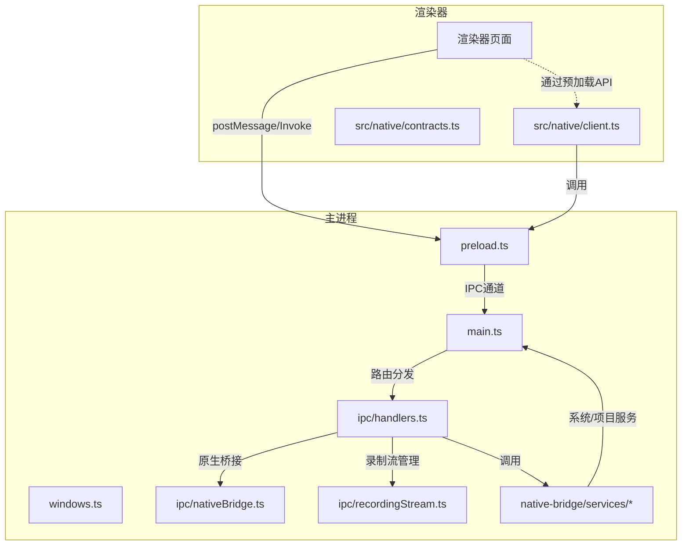
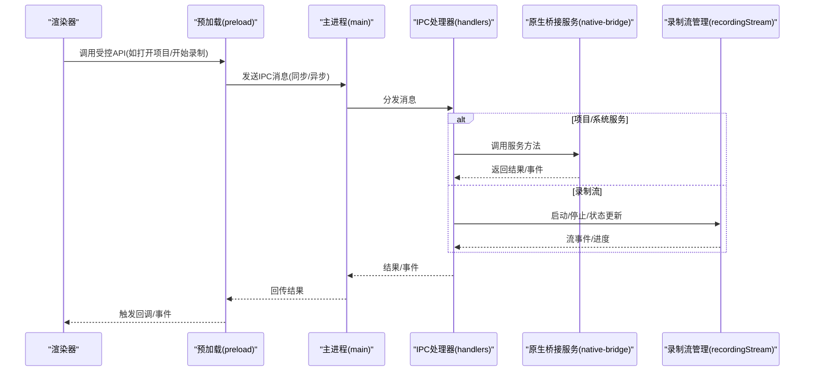
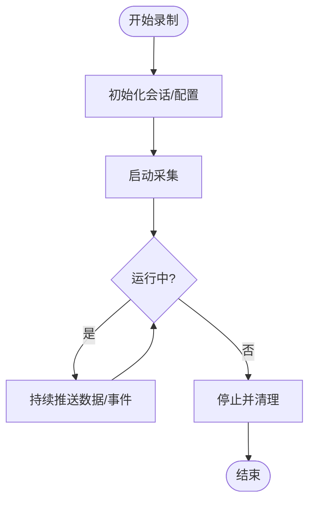
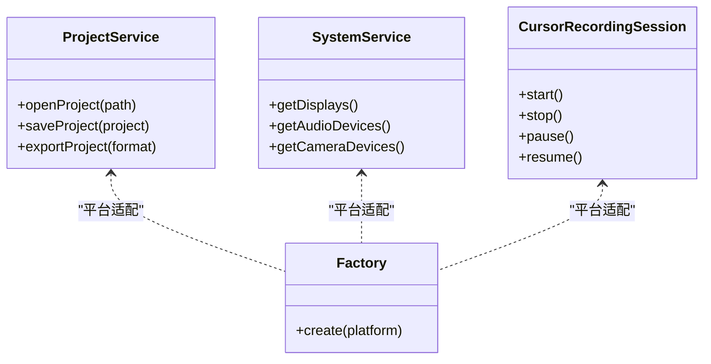
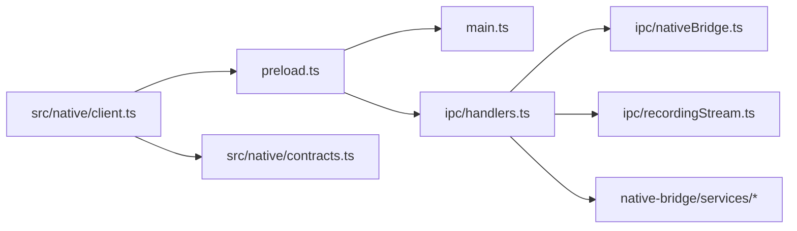

# IPC通信系统

<cite>
**本文引用的文件**
- [electron/main.ts](file://electron/main.ts)
- [electron/preload.ts](file://electron/preload.ts)
- [electron/ipc/handlers.ts](file://electron/ipc/handlers.ts)
- [electron/ipc/nativeBridge.ts](file://electron/ipc/nativeBridge.ts)
- [electron/ipc/recordingStream.ts](file://electron/ipc/recordingStream.ts)
- [electron/native-bridge/services/projectService.ts](file://electron/native-bridge/services/projectService.ts)
- [electron/native-bridge/services/systemService.ts](file://electron/native-bridge/services/systemService.ts)
- [electron/native-bridge/cursor/recording/session.ts](file://electron/native-bridge/cursor/recording/session.ts)
- [electron/native-bridge/cursor/recording/factory.ts](file://electron/native-bridge/cursor/recording/factory.ts)
- [src/native/client.ts](file://src/native/client.ts)
- [src/native/contracts.ts](file://src/native/contracts.ts)
- [docs/02-architecture/01-ipc-communication-system.md](file://docs/02-architecture/01-ipc-communication-system.md)
</cite>

## 目录
1. [简介](#简介)
2. [项目结构](#项目结构)
3. [核心组件](#核心组件)
4. [架构总览](#架构总览)
5. [详细组件分析](#详细组件分析)
6. [依赖关系分析](#依赖关系分析)
7. [性能考量](#性能考量)
8. [故障排查指南](#故障排查指南)
9. [结论](#结论)
10. [附录](#附录)

## 简介
本文件系统性梳理OpenScreen的IPC（进程间通信）体系，聚焦Electron主进程与渲染器进程之间的消息传递机制，覆盖同步与异步通信模式；深入解析IPC处理器在录制流管理、原生桥接通信以及项目文件操作中的实现；阐述预加载脚本如何安全地向渲染器暴露有限API，同时阻断直接Node.js访问；并提供消息序列化、错误处理、超时机制与性能优化策略、具体IPC调用示例、消息格式定义、调试技巧及跨进程数据共享的最佳实践与安全考虑。

## 项目结构
OpenScreen的IPC相关代码主要分布在以下位置：
- Electron主进程入口与窗口管理：electron/main.ts、electron/windows.ts
- 预加载脚本：electron/preload.ts
- IPC处理器与录制流：electron/ipc/handlers.ts、electron/ipc/nativeBridge.ts、electron/ipc/recordingStream.ts
- 原生桥接服务层：electron/native-bridge/services/*
- 渲染器侧原生客户端封装：src/native/client.ts、src/native/contracts.ts
- 架构文档：docs/02-architecture/01-ipc-communication-system.md

图表来源
- [electron/main.ts](file://electron/main.ts)
- [electron/preload.ts](file://electron/preload.ts)
- [electron/ipc/handlers.ts](file://electron/ipc/handlers.ts)
- [electron/ipc/nativeBridge.ts](file://electron/ipc/nativeBridge.ts)
- [electron/ipc/recordingStream.ts](file://electron/ipc/recordingStream.ts)
- [electron/native-bridge/services/projectService.ts](file://electron/native-bridge/services/projectService.ts)
- [src/native/client.ts](file://src/native/client.ts)

章节来源
- [electron/main.ts](file://electron/main.ts)
- [electron/preload.ts](file://electron/preload.ts)
- [electron/ipc/handlers.ts](file://electron/ipc/handlers.ts)
- [electron/ipc/nativeBridge.ts](file://electron/ipc/nativeBridge.ts)
- [electron/ipc/recordingStream.ts](file://electron/ipc/recordingStream.ts)
- [electron/native-bridge/services/projectService.ts](file://electron/native-bridge/services/projectService.ts)
- [src/native/client.ts](file://src/native/client.ts)

## 核心组件
- 主进程入口与窗口：负责创建BrowserWindow、注册IPC监听、初始化全局快捷键等。
- 预加载脚本：在隔离上下文中向渲染器暴露受控API，屏蔽Node.js能力，仅暴露必要方法。
- IPC处理器：集中处理来自渲染器的请求，执行业务逻辑（如项目文件操作、系统服务调用），并返回结果或触发事件。
- 原生桥接：封装系统级能力（如屏幕录制、光标采集、麦克风/摄像头设备），通过IPC与渲染器交互。
- 录制流管理：负责录制会话生命周期、数据流控制、事件广播与资源释放。
- 渲染器原生客户端：对预加载暴露的API进行封装，形成统一的调用接口。

章节来源
- [electron/main.ts](file://electron/main.ts)
- [electron/preload.ts](file://electron/preload.ts)
- [electron/ipc/handlers.ts](file://electron/ipc/handlers.ts)
- [electron/ipc/nativeBridge.ts](file://electron/ipc/nativeBridge.ts)
- [electron/ipc/recordingStream.ts](file://electron/ipc/recordingStream.ts)
- [electron/native-bridge/services/systemService.ts](file://electron/native-bridge/services/systemService.ts)
- [src/native/client.ts](file://src/native/client.ts)

## 架构总览
下图展示从渲染器到主进程、再到原生桥接与系统服务的整体调用链路，以及录制流的管理路径。

图表来源
- [electron/main.ts](file://electron/main.ts)
- [electron/preload.ts](file://electron/preload.ts)
- [electron/ipc/handlers.ts](file://electron/ipc/handlers.ts)
- [electron/ipc/nativeBridge.ts](file://electron/ipc/nativeBridge.ts)
- [electron/ipc/recordingStream.ts](file://electron/ipc/recordingStream.ts)
- [electron/native-bridge/services/projectService.ts](file://electron/native-bridge/services/projectService.ts)

## 详细组件分析

### 预加载脚本与安全沙箱
- 预加载在隔离上下文运行，禁用Node.js全局对象，仅暴露必要API。
- 通过contextBridge对外暴露受控方法，确保渲染器只能通过白名单接口访问主进程能力。
- 对外暴露的API需严格校验参数类型与范围，避免注入风险。
- 建议对敏感操作增加权限检查与二次确认流程。

章节来源
- [electron/preload.ts](file://electron/preload.ts)

### IPC处理器与消息路由
- 主进程在入口中注册IPC监听，将消息分发至对应处理器。
- 处理器按功能域划分：项目文件操作、系统服务、录制流管理、原生桥接。
- 支持同步与异步两种模式：
  - 同步：适合轻量查询与快速返回（如设备列表、状态查询）。
  - 异步：适合耗时任务（如文件写入、录制启动/停止、系统调用）。
- 错误处理：捕获异常并以标准化错误对象回传；对可恢复错误提供重试策略。

章节来源
- [electron/main.ts](file://electron/main.ts)
- [electron/ipc/handlers.ts](file://electron/ipc/handlers.ts)

### 录制流管理
- 录制会话生命周期：初始化、启动、暂停/恢复、停止、清理。
- 数据流控制：帧/音频采样、缓冲区管理、事件广播（进度、错误、完成）。
- 资源管理：确保在停止后释放内存与句柄，避免泄漏。
- 与原生桥接协作：根据平台选择最优录制方案（如ScreenCaptureKit/WGC）。

图表来源
- [electron/ipc/recordingStream.ts](file://electron/ipc/recordingStream.ts)
- [electron/native-bridge/cursor/recording/session.ts](file://electron/native-bridge/cursor/recording/session.ts)
- [electron/native-bridge/cursor/recording/factory.ts](file://electron/native-bridge/cursor/recording/factory.ts)

章节来源
- [electron/ipc/recordingStream.ts](file://electron/ipc/recordingStream.ts)
- [electron/native-bridge/cursor/recording/session.ts](file://electron/native-bridge/cursor/recording/session.ts)
- [electron/native-bridge/cursor/recording/factory.ts](file://electron/native-bridge/cursor/recording/factory.ts)

### 原生桥接通信
- 将系统级能力抽象为服务层（如项目服务、系统服务、光标服务），由IPC处理器统一调度。
- 通过工厂模式创建不同平台的录制会话，保证跨平台一致性。
- 与渲染器通过预加载暴露的API对接，避免直接Node.js访问。

图表来源
- [electron/native-bridge/services/projectService.ts](file://electron/native-bridge/services/projectService.ts)
- [electron/native-bridge/services/systemService.ts](file://electron/native-bridge/services/systemService.ts)
- [electron/native-bridge/cursor/recording/factory.ts](file://electron/native-bridge/cursor/recording/factory.ts)
- [electron/native-bridge/cursor/recording/session.ts](file://electron/native-bridge/cursor/recording/session.ts)

章节来源
- [electron/native-bridge/services/projectService.ts](file://electron/native-bridge/services/projectService.ts)
- [electron/native-bridge/services/systemService.ts](file://electron/native-bridge/services/systemService.ts)
- [electron/native-bridge/cursor/recording/factory.ts](file://electron/native-bridge/cursor/recording/factory.ts)
- [electron/native-bridge/cursor/recording/session.ts](file://electron/native-bridge/cursor/recording/session.ts)

### 渲染器侧原生客户端
- 在渲染器中封装对预加载API的调用，提供一致的Promise/回调接口。
- 参数校验与错误转换：将底层异常转换为用户友好的提示。
- 事件订阅：支持订阅录制进度、系统状态变化等事件。

章节来源
- [src/native/client.ts](file://src/native/client.ts)
- [src/native/contracts.ts](file://src/native/contracts.ts)

## 依赖关系分析
- 预加载脚本依赖主进程提供的IPC通道，并通过contextBridge暴露API。
- IPC处理器依赖原生桥接服务与录制流模块。
- 原生桥接服务依赖平台特定实现（如ScreenCaptureKit/WGC）。
- 渲染器侧原生客户端依赖预加载API与消息契约。

图表来源
- [electron/preload.ts](file://electron/preload.ts)
- [electron/main.ts](file://electron/main.ts)
- [electron/ipc/handlers.ts](file://electron/ipc/handlers.ts)
- [electron/ipc/nativeBridge.ts](file://electron/ipc/nativeBridge.ts)
- [electron/ipc/recordingStream.ts](file://electron/ipc/recordingStream.ts)
- [electron/native-bridge/services/systemService.ts](file://electron/native-bridge/services/systemService.ts)
- [src/native/client.ts](file://src/native/client.ts)
- [src/native/contracts.ts](file://src/native/contracts.ts)

章节来源
- [electron/preload.ts](file://electron/preload.ts)
- [electron/main.ts](file://electron/main.ts)
- [electron/ipc/handlers.ts](file://electron/ipc/handlers.ts)
- [electron/ipc/nativeBridge.ts](file://electron/ipc/nativeBridge.ts)
- [electron/ipc/recordingStream.ts](file://electron/ipc/recordingStream.ts)
- [electron/native-bridge/services/systemService.ts](file://electron/native-bridge/services/systemService.ts)
- [src/native/client.ts](file://src/native/client.ts)
- [src/native/contracts.ts](file://src/native/contracts.ts)

## 性能考量
- 消息序列化：优先使用可序列化的数据结构，避免循环引用与大对象频繁拷贝；对二进制数据采用Base64或Buffer传输时注意内存峰值。
- 异步优先：耗时操作一律走异步IPC，避免阻塞UI线程；对高频事件（如录制进度）采用节流/去抖。
- 资源管理：录制流与系统句柄必须在停止后及时释放；缓存策略要设置上限与过期时间。
- 并发控制：限制同时进行的长任务数量，避免CPU/IO争用导致卡顿。
- 日志与监控：记录IPC往返时间、错误率与资源占用，便于定位瓶颈。

## 故障排查指南
- 常见问题
  - 渲染器无法调用预加载API：检查预加载是否正确注入、contextBridge是否暴露目标方法、CSP策略是否允许。
  - IPC调用无响应：确认主进程已注册监听、处理器未抛出未捕获异常、渲染器端未提前取消Promise。
  - 录制失败：检查平台权限（麦克风/摄像头/屏幕）、驱动版本、系统兼容性；查看录制流事件日志。
- 调试技巧
  - 使用开发者工具的“Main”和“Renderer”面板分别观察主进程与渲染器的调用栈。
  - 在主进程打印IPC消息的入参与出参，定位异常点。
  - 对高频事件进行采样统计，识别性能热点。
- 错误处理与超时
  - 统一错误对象结构，包含code、message、建议操作；对网络/系统类错误提供重试与降级策略。
  - 为异步IPC设置合理超时（如10-30秒），超时后主动清理资源并通知渲染器。

章节来源
- [electron/preload.ts](file://electron/preload.ts)
- [electron/ipc/handlers.ts](file://electron/ipc/handlers.ts)
- [electron/ipc/recordingStream.ts](file://electron/ipc/recordingStream.ts)

## 结论
OpenScreen的IPC体系通过预加载脚本的安全边界、主进程的集中路由与原生桥接的服务化设计，实现了渲染器与系统能力的可控交互。结合异步消息、严格的错误处理与资源管理策略，系统在功能完整性与性能稳定性之间取得了平衡。建议在后续迭代中进一步完善消息契约文档、引入更细粒度的权限控制与审计日志。

## 附录

### IPC调用示例与消息格式
- 示例场景
  - 打开项目：渲染器调用预加载API -> 主进程处理器 -> 项目服务 -> 返回结果。
  - 开始录制：渲染器发起 -> 预加载 -> 主进程 -> 录制流管理 -> 原生桥接 -> 推送事件。
- 消息格式建议
  - 请求：{ action: string, payload?: any, requestId?: string }
  - 响应：{ requestId?: string, success: boolean, data?: any, error?: { code: string, message: string } }
  - 事件：{ type: string, payload?: any }

章节来源
- [electron/ipc/handlers.ts](file://electron/ipc/handlers.ts)
- [electron/ipc/nativeBridge.ts](file://electron/ipc/nativeBridge.ts)
- [electron/ipc/recordingStream.ts](file://electron/ipc/recordingStream.ts)
- [src/native/client.ts](file://src/native/client.ts)

### 安全最佳实践
- 严格最小权限：仅暴露渲染器必需的API，避免一次性开放全部Node能力。
- 输入验证：对所有外部输入进行类型与范围校验，拒绝不可信数据。
- 权限检查：关键操作（如文件写入、系统调用）前置权限校验与用户确认。
- 隐私保护：录制与导出涉及隐私数据时，遵循最小化原则与本地化存储。

章节来源
- [electron/preload.ts](file://electron/preload.ts)
- [electron/native-bridge/services/projectService.ts](file://electron/native-bridge/services/projectService.ts)
- [electron/native-bridge/services/systemService.ts](file://electron/native-bridge/services/systemService.ts)