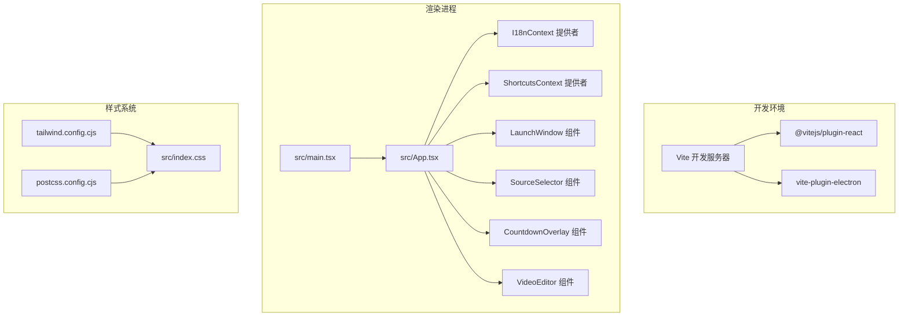
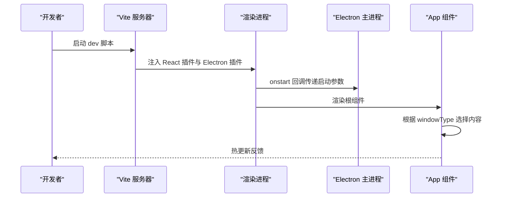
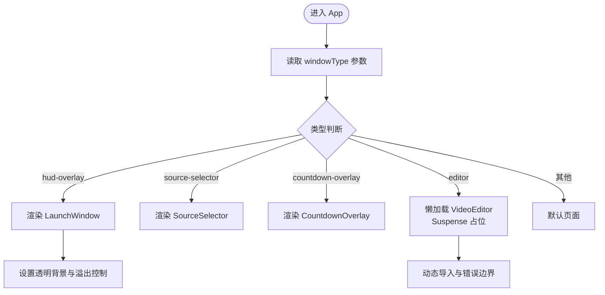
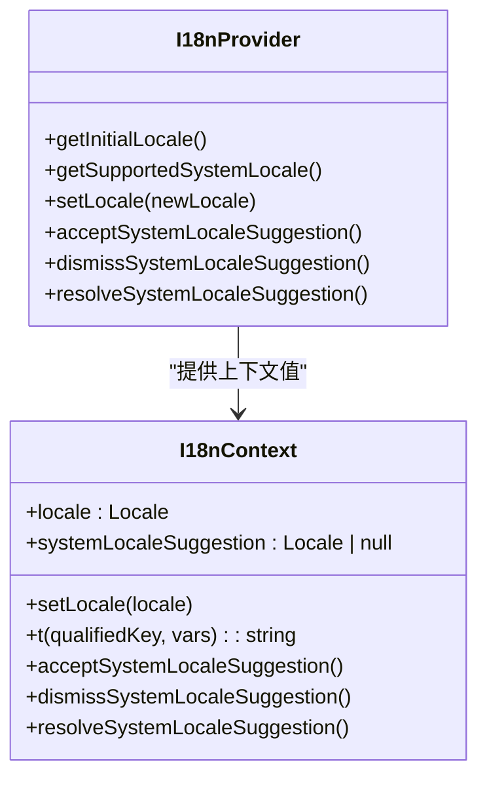
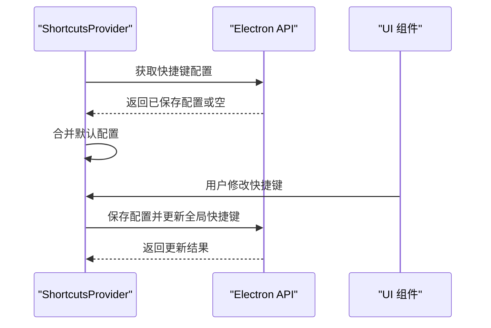
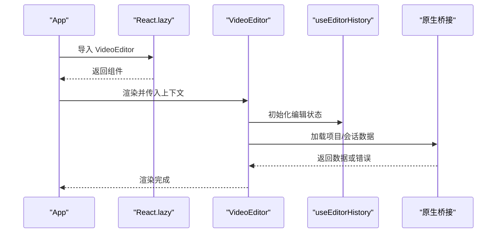
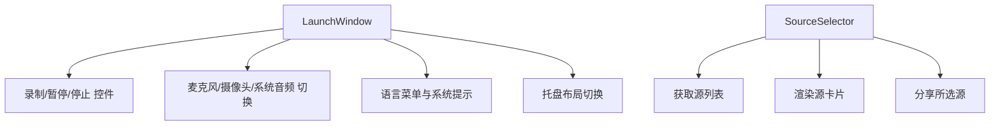
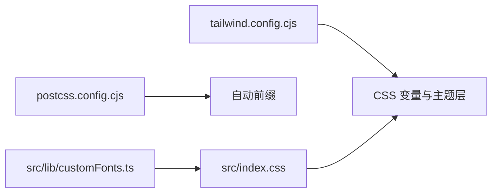
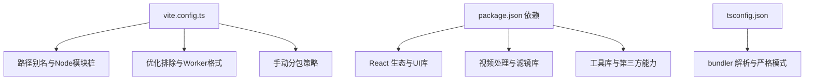

# React渲染器架构

<cite>
**本文档引用的文件**
- [package.json](file://package.json)
- [vite.config.ts](file://vite.config.ts)
- [tsconfig.json](file://tsconfig.json)
- [tsconfig.node.json](file://tsconfig.node.json)
- [src/main.tsx](file://src/main.tsx)
- [src/App.tsx](file://src/App.tsx)
- [src/index.css](file://src/index.css)
- [tailwind.config.cjs](file://tailwind.config.cjs)
- [postcss.config.cjs](file://postcss.config.cjs)
- [src/contexts/I18nContext.tsx](file://src/contexts/I18nContext.tsx)
- [src/contexts/ShortcutsContext.tsx](file://src/contexts/ShortcutsContext.tsx)
- [src/components/video-editor/VideoEditor.tsx](file://src/components/video-editor/VideoEditor.tsx)
- [src/components/launch/LaunchWindow.tsx](file://src/components/launch/LaunchWindow.tsx)
- [src/components/launch/SourceSelector.tsx](file://src/components/launch/SourceSelector.tsx)
- [src/components/launch/CountdownOverlay.tsx](file://src/components/launch/CountdownOverlay.tsx)
- [src/lib/customFonts.ts](file://src/lib/customFonts.ts)
</cite>

## 目录
1. [简介](#简介)
2. [项目结构](#项目结构)
3. [核心组件](#核心组件)
4. [架构总览](#架构总览)
5. [详细组件分析](#详细组件分析)
6. [依赖关系分析](#依赖关系分析)
7. [性能考虑](#性能考虑)
8. [故障排除指南](#故障排除指南)
9. [结论](#结论)
10. [附录](#附录)

## 简介
本文件面向OpenScreen的React渲染器架构，围绕基于Vite的现代前端工程化体系，系统阐述模块打包、热重载与生产优化策略；解析React应用整体结构（根组件、路由配置与状态管理模式）；详解TypeScript集成与编译配置；说明CSS-in-JS与Tailwind结合的样式系统及主题管理；梳理组件层次结构、依赖注入与上下文管理；总结性能优化（代码分割、懒加载、内存管理）；并提供开发工具链、调试配置与构建流程的最佳实践。

## 项目结构
OpenScreen采用Electron + Vite + React + TypeScript的混合架构。渲染进程由Vite驱动，通过插件与Electron主进程协同，实现开发时热重载与生产时多平台打包。TypeScript启用bundler模式，确保模块解析与类型安全。样式系统以Tailwind为核心，配合PostCSS与自定义CSS变量实现深色/浅色主题切换与动画扩展。

**图表来源**
- [vite.config.ts:1-75](file://vite.config.ts#L1-L75)
- [src/main.tsx:1-25](file://src/main.tsx#L1-L25)
- [src/App.tsx:1-119](file://src/App.tsx#L1-L119)
- [tailwind.config.cjs:1-86](file://tailwind.config.cjs#L1-L86)
- [postcss.config.cjs:1-7](file://postcss.config.cjs#L1-L7)
- [src/index.css:1-309](file://src/index.css#L1-L309)

**章节来源**
- [package.json:15-45](file://package.json#L15-L45)
- [vite.config.ts:1-75](file://vite.config.ts#L1-L75)
- [tsconfig.json:1-31](file://tsconfig.json#L1-L31)
- [tsconfig.node.json:1-17](file://tsconfig.node.json#L1-L17)

## 核心组件
- 根入口与启动流程：渲染进程从src/main.tsx启动，根据windowType参数设置透明背景，并在StrictMode下挂载I18nProvider与App。
- 应用根组件：src/App.tsx根据windowType动态选择渲染内容，支持HUD叠加层、源选择器、倒计时覆盖层与视频编辑器。编辑器采用React.lazy进行代码分割与Suspense占位。
- 国际化上下文：I18nContext.tsx提供语言检测、存储与Electron主进程同步，支持系统语言建议与命名空间翻译函数。
- 快捷键上下文：ShortcutsContext.tsx负责加载/保存快捷键配置，跨平台检测并持久化全局快捷键。
- 样式系统：Tailwind配置扩展动画、阴影与颜色变量，PostCSS处理自动前缀；index.css定义CSS变量与主题层叠。

**章节来源**
- [src/main.tsx:1-25](file://src/main.tsx#L1-L25)
- [src/App.tsx:11-118](file://src/App.tsx#L11-L118)
- [src/contexts/I18nContext.tsx:88-193](file://src/contexts/I18nContext.tsx#L88-L193)
- [src/contexts/ShortcutsContext.tsx:31-83](file://src/contexts/ShortcutsContext.tsx#L31-L83)
- [tailwind.config.cjs:1-86](file://tailwind.config.cjs#L1-L86)
- [postcss.config.cjs:1-7](file://postcss.config.cjs#L1-L7)
- [src/index.css:1-309](file://src/index.css#L1-L309)

## 架构总览
渲染器通过Vite插件与Electron主进程交互，开发时启用热重载，生产时按需拆分vendor与业务包，减少首屏体积。React应用通过上下文提供者注入国际化与快捷键能力，组件按窗口类型动态渲染，编辑器采用懒加载与Suspense提升用户体验。

**图表来源**
- [vite.config.ts:10-26](file://vite.config.ts#L10-L26)
- [src/main.tsx:18-24](file://src/main.tsx#L18-L24)
- [src/App.tsx:18-118](file://src/App.tsx#L18-L118)

## 详细组件分析

### 根组件与窗口类型路由
- 动态路由：根据URL查询参数windowType决定渲染内容，支持hud-overlay、source-selector、countdown-overlay与editor。
- HUD特殊处理：对HUD窗口设置透明背景与固定尺寸，避免滚动条引入问题。
- 编辑器懒加载：使用React.lazy与Suspense提供加载占位，降低首屏负载。

**图表来源**
- [src/App.tsx:18-118](file://src/App.tsx#L18-L118)
- [src/components/launch/LaunchWindow.tsx:87-400](file://src/components/launch/LaunchWindow.tsx#L87-L400)
- [src/components/launch/SourceSelector.tsx:16-203](file://src/components/launch/SourceSelector.tsx#L16-L203)
- [src/components/launch/CountdownOverlay.tsx:3-30](file://src/components/launch/CountdownOverlay.tsx#L3-L30)

**章节来源**
- [src/App.tsx:18-118](file://src/App.tsx#L18-L118)

### 国际化上下文（I18nContext）
- 语言检测：优先localStorage存储，其次系统语言匹配，支持简繁中文与基础语言映射。
- 翻译函数：提供命名空间翻译与变量替换，统一多模块文案。
- 与主进程同步：变更语言后通知Electron主进程，保持系统级一致性。

**图表来源**
- [src/contexts/I18nContext.tsx:88-193](file://src/contexts/I18nContext.tsx#L88-L193)

**章节来源**
- [src/contexts/I18nContext.tsx:88-193](file://src/contexts/I18nContext.tsx#L88-L193)

### 快捷键上下文（ShortcutsContext）
- 配置加载：启动时从Electron读取持久化配置，合并默认值。
- 平台适配：检测是否为macOS，调整快捷键显示与行为。
- 全局快捷键：保存配置后更新全局快捷键注册。

**图表来源**
- [src/contexts/ShortcutsContext.tsx:31-83](file://src/contexts/ShortcutsContext.tsx#L31-L83)

**章节来源**
- [src/contexts/ShortcutsContext.tsx:31-83](file://src/contexts/ShortcutsContext.tsx#L31-L83)

### 视频编辑器（懒加载与状态管理）
- 懒加载：编辑器组件通过React.lazy按需加载，显著降低初始包体。
- 状态管理：使用自定义Hook与useEditorHistory维护复杂编辑状态，支持撤销/重做。
- 外部集成：与原生桥接、用户偏好、导出器等模块协作，实现录制、预览与导出功能。

**图表来源**
- [src/App.tsx:11-16](file://src/App.tsx#L11-L16)
- [src/components/video-editor/VideoEditor.tsx:179-800](file://src/components/video-editor/VideoEditor.tsx#L179-L800)

**章节来源**
- [src/App.tsx:11-16](file://src/App.tsx#L11-L16)
- [src/components/video-editor/VideoEditor.tsx:179-800](file://src/components/video-editor/VideoEditor.tsx#L179-L800)

### HUD录制面板与源选择器
- HUD窗口：提供录制控制、设备选择与语言菜单，支持拖拽与布局切换。
- 源选择器：枚举屏幕与窗口源，支持缩略图与图标展示，选择后回传给主进程。

**图表来源**
- [src/components/launch/LaunchWindow.tsx:87-800](file://src/components/launch/LaunchWindow.tsx#L87-L800)
- [src/components/launch/SourceSelector.tsx:16-203](file://src/components/launch/SourceSelector.tsx#L16-L203)

**章节来源**
- [src/components/launch/LaunchWindow.tsx:87-800](file://src/components/launch/LaunchWindow.tsx#L87-L800)
- [src/components/launch/SourceSelector.tsx:16-203](file://src/components/launch/SourceSelector.tsx#L16-L203)

### 样式系统与主题管理
- Tailwind扩展：新增动画、阴影与颜色变量，支持深色/浅色主题切换。
- PostCSS：Autoprefixer自动添加厂商前缀，保证跨浏览器兼容。
- 自定义字体：通过自定义工具加载与管理Google Fonts，避免阻塞主线程。

**图表来源**
- [tailwind.config.cjs:1-86](file://tailwind.config.cjs#L1-L86)
- [postcss.config.cjs:1-7](file://postcss.config.cjs#L1-L7)
- [src/index.css:1-309](file://src/index.css#L1-L309)
- [src/lib/customFonts.ts:136-145](file://src/lib/customFonts.ts#L136-L145)

**章节来源**
- [tailwind.config.cjs:1-86](file://tailwind.config.cjs#L1-L86)
- [postcss.config.cjs:1-7](file://postcss.config.cjs#L1-L7)
- [src/index.css:1-309](file://src/index.css#L1-L309)
- [src/lib/customFonts.ts:136-145](file://src/lib/customFonts.ts#L136-L145)

## 依赖关系分析
- 构建与打包：Vite配置中通过别名与优化排除，将Pixi、React生态与视频处理库拆分为独立chunk，提升缓存命中率。
- 运行时依赖：React 18、Radix UI组件库、Tailwind与动画插件、GSAP与PIXI用于高性能动画与滤镜效果。
- 类型系统：TypeScript启用bundler解析与严格模式，确保类型安全与模块路径别名一致。

**图表来源**
- [vite.config.ts:28-73](file://vite.config.ts#L28-L73)
- [package.json:47-90](file://package.json#L47-L90)
- [tsconfig.json:13-26](file://tsconfig.json#L13-L26)

**章节来源**
- [vite.config.ts:28-73](file://vite.config.ts#L28-L73)
- [package.json:47-90](file://package.json#L47-L90)
- [tsconfig.json:13-26](file://tsconfig.json#L13-L26)

## 性能考虑
- 代码分割与懒加载：编辑器组件按需加载，结合Suspense占位，显著降低首屏脚本大小与解析时间。
- 手动分包：将Pixi、React与视频处理库独立拆分，提升浏览器缓存复用效率。
- 构建优化：生产环境启用Terser压缩并剔除console调试语句，减小产物体积。
- 样式优化：Tailwind按需生成，CSS变量与动画减少重复样式计算。
- 字体加载：自定义字体异步加载并校验，避免阻塞关键渲染路径。

**章节来源**
- [src/App.tsx:11-16](file://src/App.tsx#L11-L16)
- [vite.config.ts:47-73](file://vite.config.ts#L47-L73)
- [src/index.css:1-309](file://src/index.css#L1-L309)
- [src/lib/customFonts.ts:68-104](file://src/lib/customFonts.ts#L68-L104)

## 故障排除指南
- 热重载失效：检查Vite插件配置与Electron插件onstart回调，确认渲染进程未被测试模式禁用。
- 样式异常：确认Tailwind扫描路径与PostCSS插件顺序，检查CSS变量覆盖与主题层叠。
- 国际化不生效：验证I18nContext初始化逻辑与localStorage可用性，确认主进程语言同步接口存在。
- 快捷键无效：检查Electron保存与全局快捷键更新返回值，确认平台检测与默认配置合并逻辑。
- 字体加载失败：查看字体加载超时与校验逻辑，确认Google Fonts URL合法性与网络可达性。

**章节来源**
- [vite.config.ts:10-26](file://vite.config.ts#L10-L26)
- [tailwind.config.cjs:1-86](file://tailwind.config.cjs#L1-L86)
- [src/contexts/I18nContext.tsx:113-141](file://src/contexts/I18nContext.tsx#L113-L141)
- [src/contexts/ShortcutsContext.tsx:55-64](file://src/contexts/ShortcutsContext.tsx#L55-L64)
- [src/lib/customFonts.ts:107-133](file://src/lib/customFonts.ts#L107-L133)

## 结论
OpenScreen的React渲染器以Vite为核心，结合Electron实现现代化开发体验与跨平台发布。通过上下文提供者注入国际化与快捷键能力，组件按窗口类型动态渲染，编辑器采用懒加载与状态管理提升性能与可维护性。Tailwind与PostCSS构成灵活的样式体系，配合自定义字体加载策略保障视觉一致性与性能。整体架构在开发效率、运行性能与用户体验之间取得良好平衡。

## 附录
- 开发脚本：dev、preview、build、lint、format、test等，分别对应开发服务器、预览、构建打包、代码质量与测试。
- 构建目标：生产构建结合Terser压缩与手动分包策略，针对不同依赖族（Pixi、React、视频处理）进行独立chunk划分。
- 测试与端到端：单元测试与浏览器测试配置，端到端测试覆盖关键工作流。

**章节来源**
- [package.json:15-45](file://package.json#L15-L45)
- [vite.config.ts:47-73](file://vite.config.ts#L47-L73)