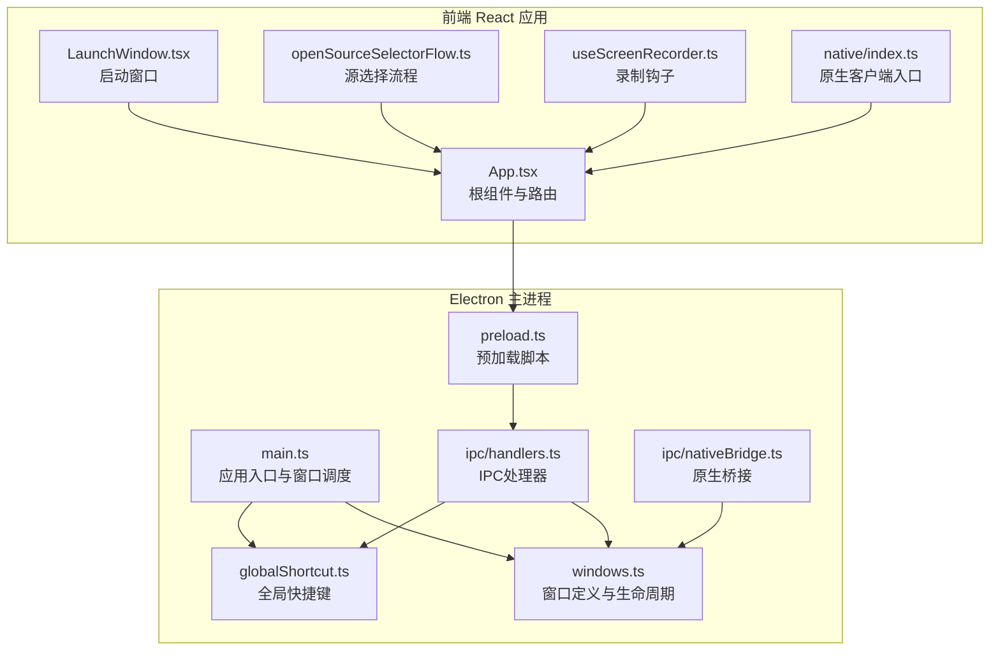
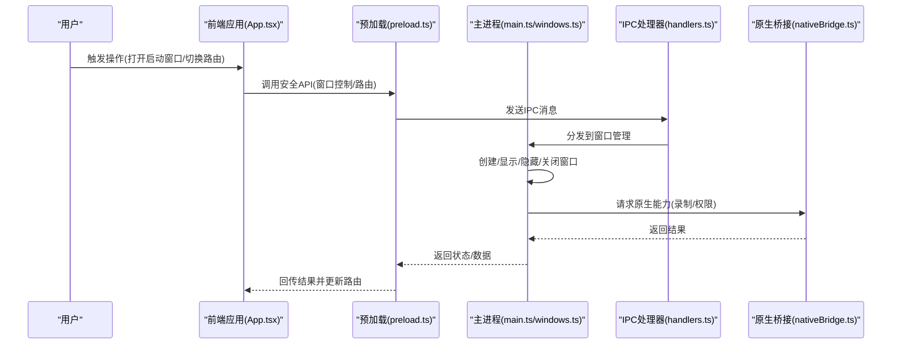
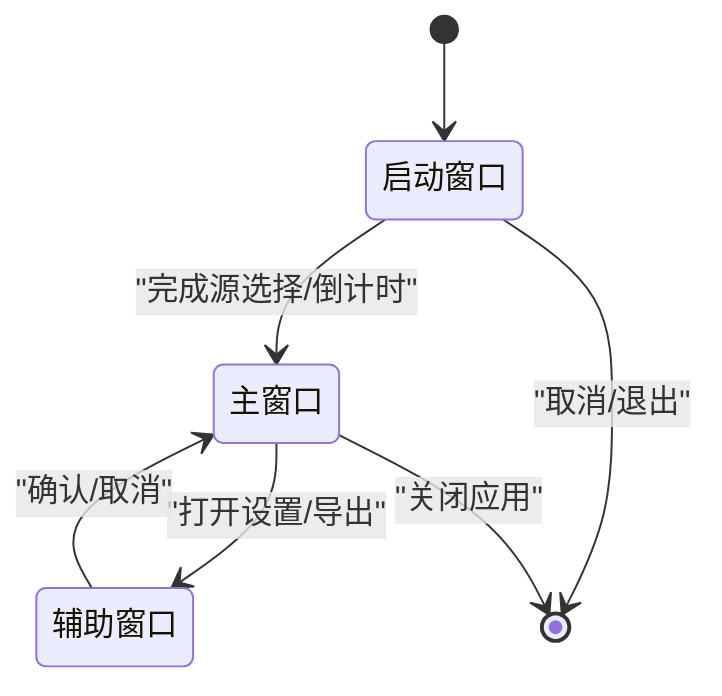
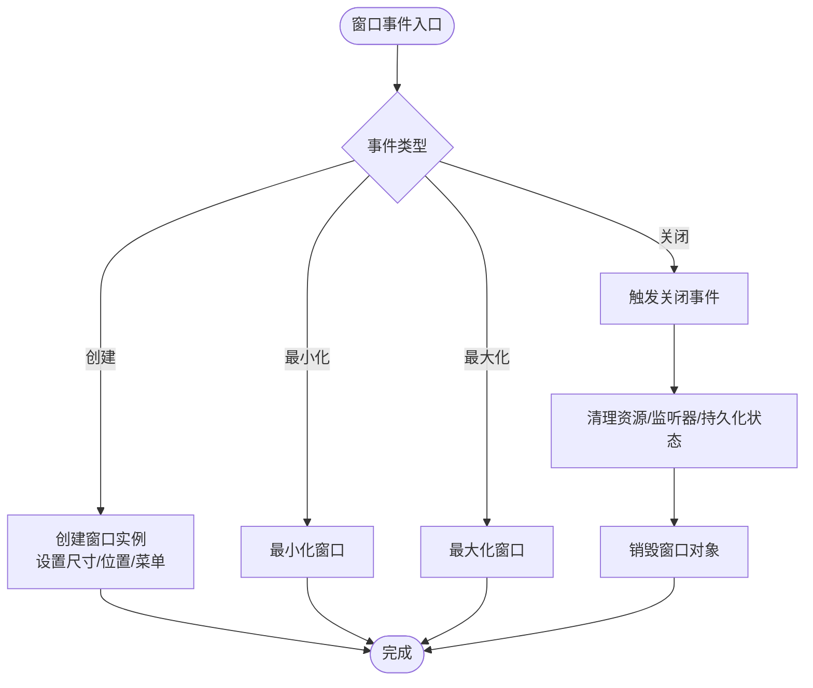
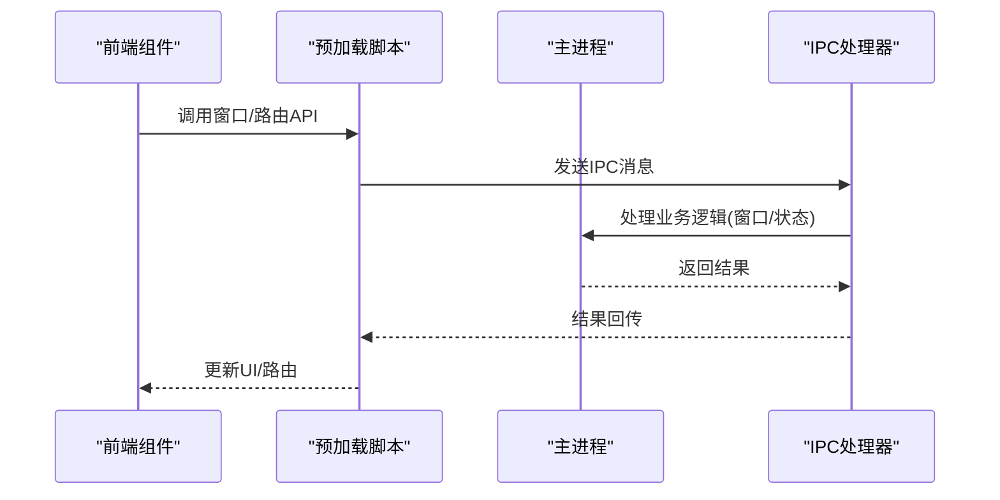
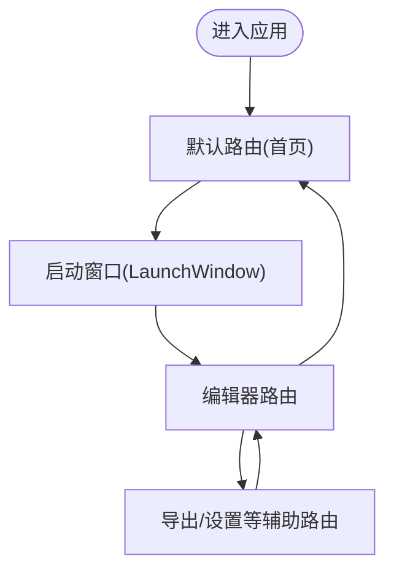
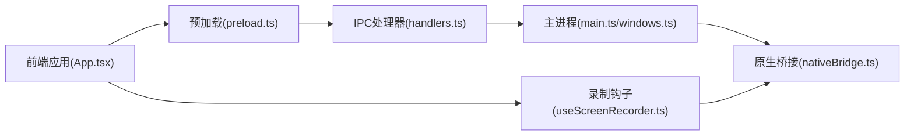

# 窗口管理与路由

<cite>
**本文引用的文件**
- [electron/main.ts](file://electron/main.ts)
- [electron/windows.ts](file://electron/windows.ts)
- [electron/globalShortcut.ts](file://electron/globalShortcut.ts)
- [src/components/launch/LaunchWindow.tsx](file://src/components/launch/LaunchWindow.tsx)
- [src/components/launch/openSourceSelectorFlow.ts](file://src/components/launch/openSourceSelectorFlow.ts)
- [src/App.tsx](file://src/App.tsx)
- [src/hooks/useScreenRecorder.ts](file://src/hooks/useScreenRecorder.ts)
- [src/native/client.ts](file://src/native/client.ts)
- [src/native/index.ts](file://src/native/index.ts)
- [src/lib/recordingSession.ts](file://src/lib/recordingSession.ts)
- [src/utils/platformUtils.ts](file://src/utils/platformUtils.ts)
- [src/lib/userPreferences.ts](file://src/lib/userPreferences.ts)
- [electron/ipc/handlers.ts](file://electron/ipc/handlers.ts)
- [electron/ipc/nativeBridge.ts](file://electron/ipc/nativeBridge.ts)
- [electron/preload.ts](file://electron/preload.ts)
- [docs/02-architecture/02-window-management-and-routing.md](file://docs/02-architecture/02-window-management-and-routing.md)
</cite>

## 目录
1. [简介](#简介)
2. [项目结构](#项目结构)
3. [核心组件](#核心组件)
4. [架构总览](#架构总览)
5. [详细组件分析](#详细组件分析)
6. [依赖关系分析](#依赖关系分析)
7. [性能考虑](#性能考虑)
8. [故障排查指南](#故障排查指南)
9. [结论](#结论)
10. [附录](#附录)

## 简介
本文件面向OpenScreen的窗口管理与路由系统，聚焦Electron应用中的多窗口架构设计与实现，覆盖主窗口、启动窗口与其他辅助窗口的生命周期管理；窗口创建、销毁、最小化、最大化与关闭的处理逻辑；窗口间数据传递、状态同步与通信机制；应用路由策略（页面导航、URL管理与历史记录）；窗口尺寸调整、位置记忆与多显示器支持；窗口权限管理、模态对话框处理与全局快捷键注册；以及最佳实践与性能优化建议。

## 项目结构
OpenScreen采用“前端React应用 + Electron主进程 + 预加载脚本 + IPC桥接”的分层架构。窗口管理主要由Electron主进程负责，前端通过预加载脚本暴露的安全通道与主进程通信，实现窗口控制、路由与状态同步。

图表来源
- [electron/main.ts](file://electron/main.ts)
- [electron/windows.ts](file://electron/windows.ts)
- [electron/globalShortcut.ts](file://electron/globalShortcut.ts)
- [electron/ipc/handlers.ts](file://electron/ipc/handlers.ts)
- [electron/ipc/nativeBridge.ts](file://electron/ipc/nativeBridge.ts)
- [electron/preload.ts](file://electron/preload.ts)
- [src/App.tsx](file://src/App.tsx)
- [src/components/launch/LaunchWindow.tsx](file://src/components/launch/LaunchWindow.tsx)
- [src/components/launch/openSourceSelectorFlow.ts](file://src/components/launch/openSourceSelectorFlow.ts)
- [src/hooks/useScreenRecorder.ts](file://src/hooks/useScreenRecorder.ts)
- [src/native/index.ts](file://src/native/index.ts)

章节来源
- [electron/main.ts](file://electron/main.ts)
- [electron/windows.ts](file://electron/windows.ts)
- [electron/preload.ts](file://electron/preload.ts)
- [src/App.tsx](file://src/App.tsx)

## 核心组件
- 主进程窗口管理：集中定义窗口类型、尺寸、位置、菜单与行为，统一处理窗口事件与生命周期。
- 启动窗口：用于选择录制源与计时倒数等引导流程，完成后可转交到主编辑器窗口或退出。
- 辅助窗口：如设置面板、导出对话框等，按需创建与销毁。
- 预加载脚本：向渲染进程暴露安全的API，承载IPC通信与权限声明。
- IPC处理器：在主进程中响应渲染进程请求，协调窗口与系统功能。
- 全局快捷键：注册系统级热键，触发窗口显示、录制控制等操作。
- 原生桥接：连接Electron与原生模块（如macOS ScreenCaptureKit、Windows WGC），用于高性能采集。

章节来源
- [electron/windows.ts](file://electron/windows.ts)
- [electron/globalShortcut.ts](file://electron/globalShortcut.ts)
- [electron/ipc/handlers.ts](file://electron/ipc/handlers.ts)
- [electron/ipc/nativeBridge.ts](file://electron/ipc/nativeBridge.ts)
- [electron/preload.ts](file://electron/preload.ts)
- [src/components/launch/LaunchWindow.tsx](file://src/components/launch/LaunchWindow.tsx)

## 架构总览
下图展示从用户交互到窗口控制与路由的整体流程，包括主进程窗口调度、IPC通信、前端路由与原生能力调用。

图表来源
- [electron/main.ts](file://electron/main.ts)
- [electron/windows.ts](file://electron/windows.ts)
- [electron/ipc/handlers.ts](file://electron/ipc/handlers.ts)
- [electron/ipc/nativeBridge.ts](file://electron/ipc/nativeBridge.ts)
- [electron/preload.ts](file://electron/preload.ts)
- [src/App.tsx](file://src/App.tsx)

## 详细组件分析

### 主窗口与启动窗口生命周期
- 启动窗口：负责源选择与倒计时等引导流程，完成后根据用户选择决定进入编辑器或结束会话。
- 主窗口：承载视频编辑器UI，处理录制、播放、导出等核心功能。
- 辅助窗口：按需创建（如设置、导出），完成后销毁以释放资源。

图表来源
- [src/components/launch/LaunchWindow.tsx](file://src/components/launch/LaunchWindow.tsx)
- [src/components/launch/openSourceSelectorFlow.ts](file://src/components/launch/openSourceSelectorFlow.ts)
- [src/App.tsx](file://src/App.tsx)

章节来源
- [src/components/launch/LaunchWindow.tsx](file://src/components/launch/LaunchWindow.tsx)
- [src/components/launch/openSourceSelectorFlow.ts](file://src/components/launch/openSourceSelectorFlow.ts)
- [src/App.tsx](file://src/App.tsx)

### 窗口创建、销毁与事件处理
- 窗口创建：在主进程集中定义窗口参数（尺寸、位置、菜单、webPreferences），并通过统一方法创建。
- 销毁：监听窗口关闭事件，清理资源与监听器，确保无内存泄漏。
- 最小化/最大化：根据平台差异与用户偏好进行处理，必要时保存窗口状态以便恢复。
- 关闭：区分用户主动关闭与应用退出，执行必要的清理与持久化。

图表来源
- [electron/windows.ts](file://electron/windows.ts)
- [electron/main.ts](file://electron/main.ts)

章节来源
- [electron/windows.ts](file://electron/windows.ts)
- [electron/main.ts](file://electron/main.ts)

### 窗口间数据传递与状态同步
- 预加载脚本向渲染进程暴露受控API，前端通过这些API发起IPC请求。
- IPC处理器在主进程内协调窗口状态与系统能力，返回结果给前端。
- 原生桥接负责底层能力（如录制）与主进程之间的通信，再由主进程转发至前端。

图表来源
- [electron/preload.ts](file://electron/preload.ts)
- [electron/ipc/handlers.ts](file://electron/ipc/handlers.ts)
- [electron/ipc/nativeBridge.ts](file://electron/ipc/nativeBridge.ts)

章节来源
- [electron/preload.ts](file://electron/preload.ts)
- [electron/ipc/handlers.ts](file://electron/ipc/handlers.ts)
- [electron/ipc/nativeBridge.ts](file://electron/ipc/nativeBridge.ts)

### 应用路由策略与URL管理
- 前端路由：基于根组件与页面组件组织导航，支持页面切换与历史记录。
- URL管理：通过前端路由实现URL与当前视图的映射，便于分享与书签。
- 历史记录：结合浏览器历史API与应用内部状态，保证导航一致性。

图表来源
- [src/App.tsx](file://src/App.tsx)
- [src/components/launch/LaunchWindow.tsx](file://src/components/launch/LaunchWindow.tsx)

章节来源
- [src/App.tsx](file://src/App.tsx)
- [src/components/launch/LaunchWindow.tsx](file://src/components/launch/LaunchWindow.tsx)

### 窗口尺寸调整、位置记忆与多显示器支持
- 尺寸调整：根据屏幕分辨率与DPR动态计算窗口尺寸，避免模糊与裁剪。
- 位置记忆：在主进程保存窗口位置与大小，应用重启后恢复。
- 多显示器：检测主屏与扩展屏，优先在主屏显示启动窗口，编辑器窗口可在多屏间移动。

章节来源
- [electron/windows.ts](file://electron/windows.ts)
- [src/utils/platformUtils.ts](file://src/utils/platformUtils.ts)
- [src/lib/userPreferences.ts](file://src/lib/userPreferences.ts)

### 权限管理、模态对话框与全局快捷键
- 权限管理：通过预加载脚本声明所需权限，主进程在窗口创建时配置webPreferences，确保最小权限原则。
- 模态对话框：前端通过受控API触发，主进程以模态方式创建窗口，阻断父窗口交互。
- 全局快捷键：注册系统级热键，如开始/暂停录制、打开编辑器等，提升可用性。

章节来源
- [electron/preload.ts](file://electron/preload.ts)
- [electron/globalShortcut.ts](file://electron/globalShortcut.ts)
- [electron/windows.ts](file://electron/windows.ts)

### 录制会话与窗口联动
- 录制会话：前端通过钩子与原生客户端协作，主进程协调窗口显示与录制窗口的生命周期。
- 状态同步：录制状态通过IPC在前后端同步，窗口根据状态切换显示与交互。

章节来源
- [src/hooks/useScreenRecorder.ts](file://src/hooks/useScreenRecorder.ts)
- [src/native/client.ts](file://src/native/client.ts)
- [src/native/index.ts](file://src/native/index.ts)
- [src/lib/recordingSession.ts](file://src/lib/recordingSession.ts)

## 依赖关系分析
- 前端对主进程的依赖：通过预加载脚本暴露的API进行IPC通信，避免直接访问Node/Electron API。
- 主进程对原生模块的依赖：通过原生桥接与ScreenCaptureKit/WGC交互，实现高性能采集。
- 窗口与路由的耦合：窗口生命周期与前端路由紧密配合，确保导航与窗口状态一致。

图表来源
- [src/App.tsx](file://src/App.tsx)
- [electron/preload.ts](file://electron/preload.ts)
- [electron/ipc/handlers.ts](file://electron/ipc/handlers.ts)
- [electron/main.ts](file://electron/main.ts)
- [electron/windows.ts](file://electron/windows.ts)
- [electron/ipc/nativeBridge.ts](file://electron/ipc/nativeBridge.ts)
- [src/hooks/useScreenRecorder.ts](file://src/hooks/useScreenRecorder.ts)

章节来源
- [src/App.tsx](file://src/App.tsx)
- [electron/preload.ts](file://electron/preload.ts)
- [electron/ipc/handlers.ts](file://electron/ipc/handlers.ts)
- [electron/main.ts](file://electron/main.ts)
- [electron/windows.ts](file://electron/windows.ts)
- [electron/ipc/nativeBridge.ts](file://electron/ipc/nativeBridge.ts)
- [src/hooks/useScreenRecorder.ts](file://src/hooks/useScreenRecorder.ts)

## 性能考虑
- 窗口数量控制：避免同时创建过多窗口，及时销毁不再使用的辅助窗口。
- IPC频率优化：合并频繁的IPC调用，减少主线程阻塞。
- 渲染进程资源回收：在路由切换或窗口关闭时，清理定时器、事件监听与大对象引用。
- 多显示器适配：仅在需要时重绘或重新布局，避免全量刷新。
- 原生能力调用：尽量复用原生会话，避免重复初始化与销毁。

## 故障排查指南
- 窗口无法创建：检查主进程窗口定义与webPreferences配置，确认权限声明与路径正确。
- 窗口显示异常：核对尺寸、位置与DPR计算，确认多显示器检测逻辑。
- IPC无响应：验证预加载脚本是否正确注入API，检查IPC处理器是否注册对应通道。
- 全局快捷键无效：确认平台支持与权限授予，检查主进程快捷键注册顺序。
- 录制失败：检查原生桥接初始化与权限授权，确认会话状态与窗口显示状态一致。

章节来源
- [electron/windows.ts](file://electron/windows.ts)
- [electron/preload.ts](file://electron/preload.ts)
- [electron/ipc/handlers.ts](file://electron/ipc/handlers.ts)
- [electron/globalShortcut.ts](file://electron/globalShortcut.ts)
- [electron/ipc/nativeBridge.ts](file://electron/ipc/nativeBridge.ts)

## 结论
OpenScreen的窗口管理与路由系统通过清晰的分层架构实现了稳定的多窗口体验：主进程统一调度窗口生命周期，预加载脚本提供安全可控的通信通道，前端路由与窗口状态协同，原生桥接保障高性能采集。遵循本文的最佳实践与排障建议，可进一步提升系统的稳定性、性能与可维护性。

## 附录
- 参考文档：窗口管理与路由设计说明
  - [docs/02-architecture/02-window-management-and-routing.md](file://docs/02-architecture/02-window-management-and-routing.md)