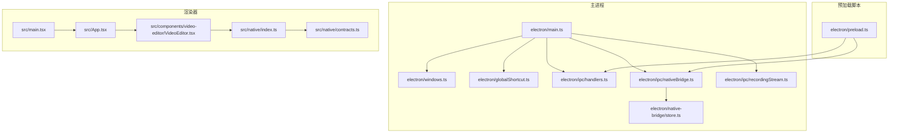
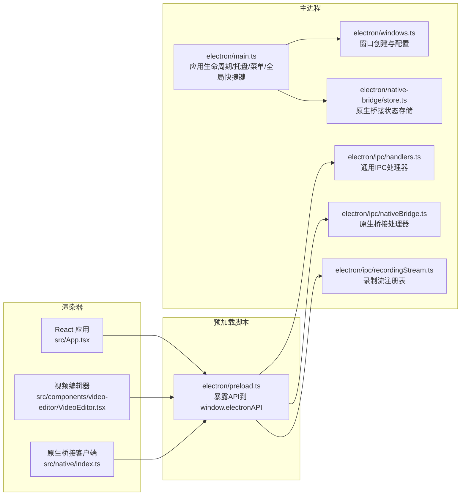
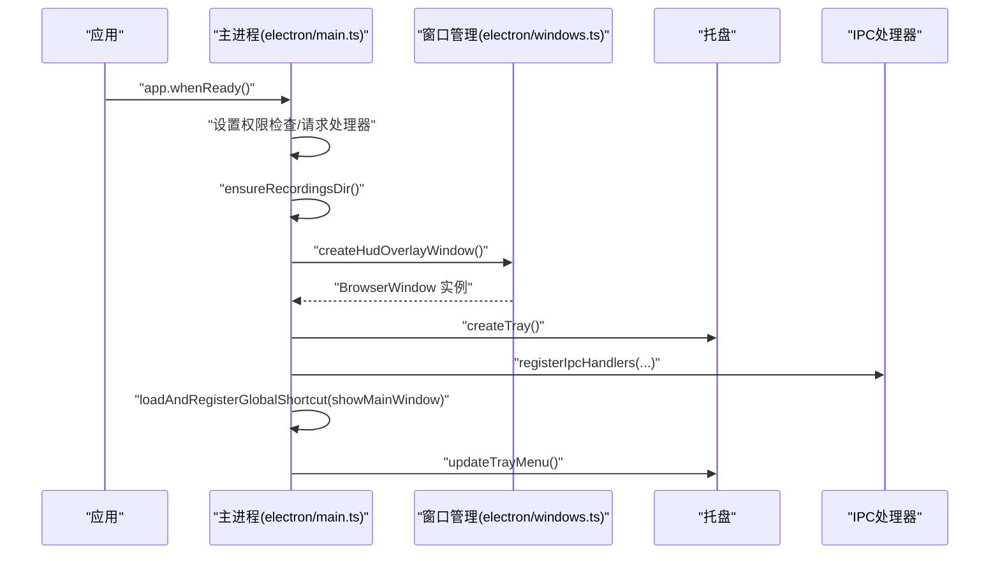
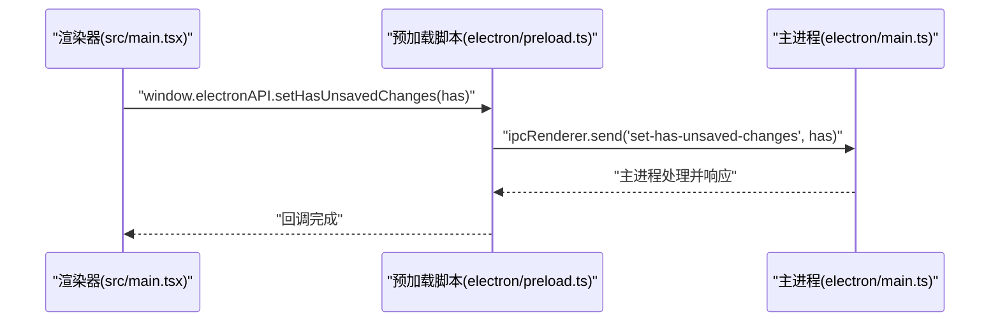
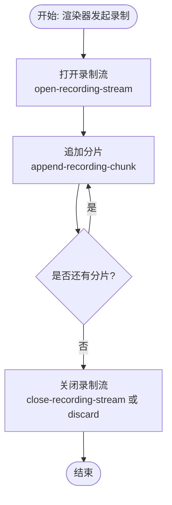
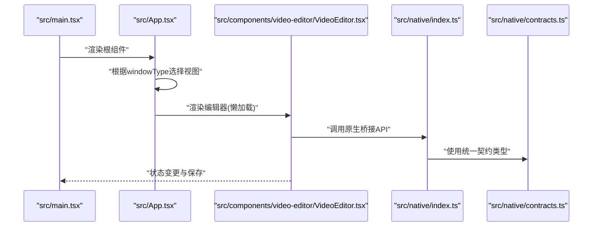
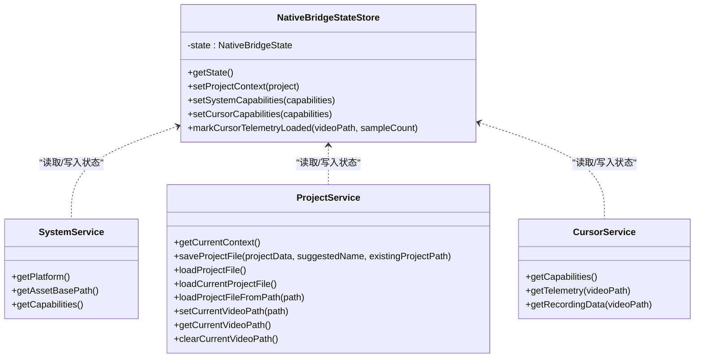
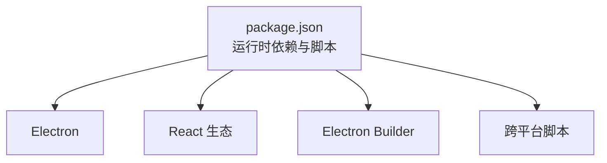

# 系统架构

<cite>
**本文档引用的文件**
- [electron/main.ts](file://electron/main.ts)
- [electron/preload.ts](file://electron/preload.ts)
- [electron/windows.ts](file://electron/windows.ts)
- [electron/globalShortcut.ts](file://electron/globalShortcut.ts)
- [electron/ipc/handlers.ts](file://electron/ipc/handlers.ts)
- [electron/ipc/nativeBridge.ts](file://electron/ipc/nativeBridge.ts)
- [electron/ipc/recordingStream.ts](file://electron/ipc/recordingStream.ts)
- [electron/native-bridge/store.ts](file://electron/native-bridge/store.ts)
- [src/App.tsx](file://src/App.tsx)
- [src/main.tsx](file://src/main.tsx)
- [src/components/video-editor/VideoEditor.tsx](file://src/components/video-editor/VideoEditor.tsx)
- [src/native/index.ts](file://src/native/index.ts)
- [src/native/contracts.ts](file://src/native/contracts.ts)
- [package.json](file://package.json)
</cite>

## 目录
1. [引言](#引言)
2. [项目结构](#项目结构)
3. [核心组件](#核心组件)
4. [架构总览](#架构总览)
5. [详细组件分析](#详细组件分析)
6. [依赖分析](#依赖分析)
7. [性能考量](#性能考量)
8. [故障排查指南](#故障排查指南)
9. [结论](#结论)
10. [附录](#附录)

## 引言
本文件面向OpenScreen项目的系统架构文档，聚焦于基于Electron的主进程-渲染器分离架构设计。文档从应用生命周期与窗口管理、IPC通信机制、原生能力桥接、渲染器端React应用组织与状态管理等维度进行深入剖析，并结合跨平台兼容性与性能优化策略，帮助开发者快速理解并扩展该系统。

## 项目结构
OpenScreen采用典型的Electron多窗口架构：主进程负责应用生命周期、权限控制、窗口创建与销毁、全局快捷键注册；渲染器端以React应用为核心，通过预加载脚本暴露受控API给渲染器使用；原生能力通过“原生桥接”域在主进程侧统一编排，再由IPC通道返回给渲染器。

**图表来源**
- [electron/main.ts](file://electron/main.ts)
- [electron/windows.ts](file://electron/windows.ts)
- [electron/globalShortcut.ts](file://electron/globalShortcut.ts)
- [electron/ipc/handlers.ts](file://electron/ipc/handlers.ts)
- [electron/ipc/nativeBridge.ts](file://electron/ipc/nativeBridge.ts)
- [electron/ipc/recordingStream.ts](file://electron/ipc/recordingStream.ts)
- [electron/native-bridge/store.ts](file://electron/native-bridge/store.ts)
- [electron/preload.ts](file://electron/preload.ts)
- [src/main.tsx](file://src/main.tsx)
- [src/App.tsx](file://src/App.tsx)
- [src/components/video-editor/VideoEditor.tsx](file://src/components/video-editor/VideoEditor.tsx)
- [src/native/contracts.ts](file://src/native/contracts.ts)
- [src/native/index.ts](file://src/native/index.ts)

**章节来源**
- [electron/main.ts](file://electron/main.ts)
- [electron/windows.ts](file://electron/windows.ts)
- [electron/preload.ts](file://electron/preload.ts)
- [src/main.tsx](file://src/main.tsx)
- [src/App.tsx](file://src/App.tsx)
- [src/components/video-editor/VideoEditor.tsx](file://src/components/video-editor/VideoEditor.tsx)
- [src/native/contracts.ts](file://src/native/contracts.ts)
- [src/native/index.ts](file://src/native/index.ts)

## 核心组件
- 主进程入口与生命周期
  - 负责应用启动、权限检查与请求、窗口管理、托盘与菜单、全局快捷键注册、录制目录初始化等。
- 窗口管理
  - 提供HUD叠加层、编辑器窗口、源选择器、倒计时覆盖层四种窗口类型，分别用于不同阶段的用户交互。
- 预加载脚本
  - 通过contextBridge向渲染器暴露安全可控的API集合，统一管理IPC调用与事件监听。
- IPC处理器
  - 统一注册各类IPC处理函数，包括屏幕/摄像头权限请求、录制流管理、项目与游标数据读写等。
- 原生桥接
  - 定义跨平台原生能力访问协议（系统、项目、游标），在主进程侧分域服务化实现。
- 渲染器React应用
  - 以App为根组件，根据windowType切换不同视图；视频编辑器作为核心功能模块，集成导出、字幕、TTS、时间线等子系统。

**章节来源**
- [electron/main.ts](file://electron/main.ts)
- [electron/windows.ts](file://electron/windows.ts)
- [electron/preload.ts](file://electron/preload.ts)
- [electron/ipc/handlers.ts](file://electron/ipc/handlers.ts)
- [electron/ipc/nativeBridge.ts](file://electron/ipc/nativeBridge.ts)
- [src/App.tsx](file://src/App.tsx)
- [src/components/video-editor/VideoEditor.tsx](file://src/components/video-editor/VideoEditor.tsx)

## 架构总览
OpenScreen采用“主进程-渲染器-原生桥接”的三层架构：
- 主进程：集中式控制与资源管理，负责系统级权限、窗口与托盘、全局快捷键、录制流与文件系统操作。
- 预加载脚本：在渲染器上下文内提供受限API，避免直接访问Node能力，确保安全隔离。
- 渲染器：React应用承载UI与业务逻辑，通过预加载脚本与主进程通信，同时通过原生桥接访问系统/项目/游标能力。

**图表来源**
- [electron/main.ts](file://electron/main.ts)
- [electron/windows.ts](file://electron/windows.ts)
- [electron/preload.ts](file://electron/preload.ts)
- [electron/ipc/handlers.ts](file://electron/ipc/handlers.ts)
- [electron/ipc/nativeBridge.ts](file://electron/ipc/nativeBridge.ts)
- [electron/ipc/recordingStream.ts](file://electron/ipc/recordingStream.ts)
- [electron/native-bridge/store.ts](file://electron/native-bridge/store.ts)
- [src/App.tsx](file://src/App.tsx)
- [src/components/video-editor/VideoEditor.tsx](file://src/components/video-editor/VideoEditor.tsx)
- [src/native/index.ts](file://src/native/index.ts)

## 详细组件分析

### 主进程：应用生命周期与窗口管理
- 生命周期与权限
  - 在应用准备就绪后设置权限检查与请求处理器，支持媒体、摄像头、屏幕录制等权限。
  - 初始化录制目录，确保磁盘可用性。
- 窗口管理
  - 提供HUD叠加层、编辑器窗口、源选择器、倒计时覆盖层四类窗口，均通过预加载脚本注入资产基础路径参数，保证打包与开发环境一致。
  - HUD窗口透明无框、始终置顶、跟随桌面空间；编辑器窗口默认最大化并隐藏标题栏（macOS）。
- 托盘与菜单
  - 创建托盘图标，支持点击/双击显示主窗口；根据录制状态动态更新托盘菜单项。
  - 构建应用菜单，支持新建/打开/保存项目等编辑器快捷入口。
- 全局快捷键
  - 默认全局快捷键绑定至显示主窗口；支持从用户配置文件加载自定义绑定并注册。

**图表来源**
- [electron/main.ts](file://electron/main.ts)
- [electron/windows.ts](file://electron/windows.ts)
- [electron/globalShortcut.ts](file://electron/globalShortcut.ts)

**章节来源**
- [electron/main.ts](file://electron/main.ts)
- [electron/windows.ts](file://electron/windows.ts)
- [electron/globalShortcut.ts](file://electron/globalShortcut.ts)

### 预加载脚本：安全API与事件桥接
- API暴露
  - 通过contextBridge.exposeInMainWorld在window对象上暴露electronAPI，封装所有与主进程的IPC调用，如窗口切换、录制控制、文件读写、项目读取/保存、快捷键更新、国际化等。
- 资产基础路径
  - 通过命令行参数传递资产基础URL，避免渲染器直接访问Node路径能力。
- 事件监听与清理
  - 对需要持续监听的事件（如关闭确认、倒计时值变化）提供一次性监听与移除接口，防止内存泄漏。

**图表来源**
- [electron/preload.ts](file://electron/preload.ts)
- [electron/main.ts](file://electron/main.ts)

**章节来源**
- [electron/preload.ts](file://electron/preload.ts)

### IPC通信机制与录制流
- 通用IPC处理器
  - 注册大量IPC处理函数，覆盖屏幕/摄像头权限请求、源选择、录制控制、项目读写、游标数据读取、导出路径选择、诊断信息保存等。
- 录制流注册表
  - 以文件名为键维护写入流，确保长录制不占用过多内存；提供打开、追加、关闭/丢弃等操作，并将失败转换为渲染器友好的结果结构。
- 原生桥接
  - 以“域-动作”模型组织请求，支持system、project、cursor三域，统一错误响应格式与元数据。

**图表来源**
- [electron/ipc/recordingStream.ts](file://electron/ipc/recordingStream.ts)
- [electron/ipc/handlers.ts](file://electron/ipc/handlers.ts)

**章节来源**
- [electron/ipc/handlers.ts](file://electron/ipc/handlers.ts)
- [electron/ipc/recordingStream.ts](file://electron/ipc/recordingStream.ts)
- [electron/ipc/nativeBridge.ts](file://electron/ipc/nativeBridge.ts)

### 渲染器：React应用架构与状态管理
- 视图路由
  - 根据windowType切换HUD叠加层、源选择器、倒计时覆盖层与编辑器视图；编辑器视图采用Suspense懒加载VideoEditor组件。
- 状态管理
  - 编辑器内部使用自定义Hook与useEditorHistory维护复杂编辑状态（缩放、裁剪、注释、TTS等），并通过本地持久化与项目快照实现撤销/重做与自动保存。
- 原生桥接客户端
  - 通过src/native/index.ts导出的客户端访问原生桥接能力（系统、项目、游标），并在VideoEditor中广泛使用。

**图表来源**
- [src/main.tsx](file://src/main.tsx)
- [src/App.tsx](file://src/App.tsx)
- [src/components/video-editor/VideoEditor.tsx](file://src/components/video-editor/VideoEditor.tsx)
- [src/native/index.ts](file://src/native/index.ts)
- [src/native/contracts.ts](file://src/native/contracts.ts)

**章节来源**
- [src/main.tsx](file://src/main.tsx)
- [src/App.tsx](file://src/App.tsx)
- [src/components/video-editor/VideoEditor.tsx](file://src/components/video-editor/VideoEditor.tsx)
- [src/native/index.ts](file://src/native/index.ts)
- [src/native/contracts.ts](file://src/native/contracts.ts)

### 原生桥接：域-动作模型与状态存储
- 域与动作
  - system：平台查询、资源路径解析、能力检测。
  - project：当前项目上下文、保存/加载项目文件、设置当前视频路径。
  - cursor：游标能力检测、遥测数据与录制数据读取。
- 错误与元数据
  - 统一的成功/失败响应结构，包含版本、请求ID、时间戳与可选错误信息。
- 状态存储
  - NativeBridgeStateStore集中维护系统能力、项目上下文、游标遥测加载记录等，便于跨域共享与查询。

**图表来源**
- [electron/native-bridge/store.ts](file://electron/native-bridge/store.ts)
- [electron/ipc/nativeBridge.ts](file://electron/ipc/nativeBridge.ts)

**章节来源**
- [electron/ipc/nativeBridge.ts](file://electron/ipc/nativeBridge.ts)
- [electron/native-bridge/store.ts](file://electron/native-bridge/store.ts)

## 依赖分析
- 运行时依赖
  - React生态、Radix UI、Tailwind、PixiJS、Web Demuxer、GStreamer相关库等，支撑UI、滤镜、导出与播放。
- 构建与打包
  - 使用Electron Builder进行跨平台打包，支持macOS、Windows、Linux；脚本提供原生辅助工具构建与测试。
- 平台差异
  - macOS启用Screen Recording权限与Wayland支持开关；Windows通过WGC辅助程序进行图形捕获；Linux在Wayland环境下启用PipeWire捕获。

**图表来源**
- [package.json](file://package.json)

**章节来源**
- [package.json](file://package.json)

## 性能考量
- 内存与IO优化
  - 录制流采用按块写盘，避免大文件在渲染器内存堆积；失败时回退到内存缓冲并由主进程落盘。
- UI渲染与白/黑闪规避
  - 透明窗口使用ready-to-show时机显示，避免首帧绘制前的闪烁；编辑器窗口在DOM就绪时注入深色背景，减少冷启动白闪。
- 跨平台兼容
  - Wayland环境下启用WebRTCPipeWireCapturer提升屏幕捕获稳定性；macOS禁用特定音频循环回放特性以改善开发体验。
- 资源路径与打包一致性
  - 通过预加载脚本注入资产基础URL，确保开发与打包两种模式下资源访问一致。

[本节为通用指导，无需具体文件分析]

## 故障排查指南
- 录制流异常
  - 检查open-recording-stream返回的错误信息；若未打开流，确认resolveRecordingOutputPath生成的路径有效且有写权限。
- 项目保存/加载失败
  - 查看原生桥接返回的错误码与消息；确认项目文件格式与路径在允许范围内。
- 渲染器无法访问原生能力
  - 确认预加载脚本已正确暴露electronAPI；检查NATIVE_BRIDGE_CHANNEL与请求域/动作是否匹配。
- 全局快捷键无效
  - 检查用户配置文件中的绑定是否成功注册；确认当前加速键未被系统占用。

**章节来源**
- [electron/ipc/recordingStream.ts](file://electron/ipc/recordingStream.ts)
- [electron/ipc/nativeBridge.ts](file://electron/ipc/nativeBridge.ts)
- [electron/preload.ts](file://electron/preload.ts)
- [electron/globalShortcut.ts](file://electron/globalShortcut.ts)

## 结论
OpenScreen通过清晰的主进程-渲染器边界与原生桥接域，实现了跨平台屏幕录制与视频编辑能力。预加载脚本在保障安全的同时提供了丰富的API；IPC与录制流注册表解决了大文件与实时性的平衡问题；渲染器端以React与自定义Hook组织复杂编辑流程。整体架构具备良好的可扩展性与可维护性，适合进一步引入更多原生能力与平台特性。

## 附录
- 关键路径参考
  - 主进程入口与窗口管理：[electron/main.ts](file://electron/main.ts)，[electron/windows.ts](file://electron/windows.ts)
  - 预加载脚本API：[electron/preload.ts](file://electron/preload.ts)
  - IPC与录制流：[electron/ipc/handlers.ts](file://electron/ipc/handlers.ts)，[electron/ipc/recordingStream.ts](file://electron/ipc/recordingStream.ts)
  - 原生桥接与状态：[electron/ipc/nativeBridge.ts](file://electron/ipc/nativeBridge.ts)，[electron/native-bridge/store.ts](file://electron/native-bridge/store.ts)
  - 渲染器根与编辑器：[src/main.tsx](file://src/main.tsx)，[src/App.tsx](file://src/App.tsx)，[src/components/video-editor/VideoEditor.tsx](file://src/components/video-editor/VideoEditor.tsx)
  - 原生桥接契约：[src/native/contracts.ts](file://src/native/contracts.ts)，[src/native/index.ts](file://src/native/index.ts)
  - 依赖与脚本：[package.json](file://package.json)