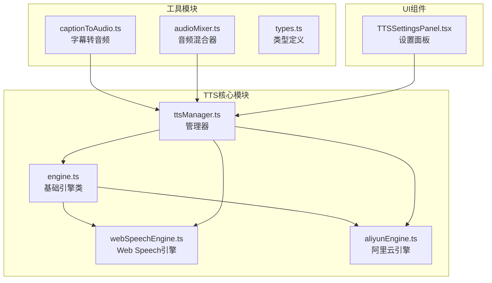
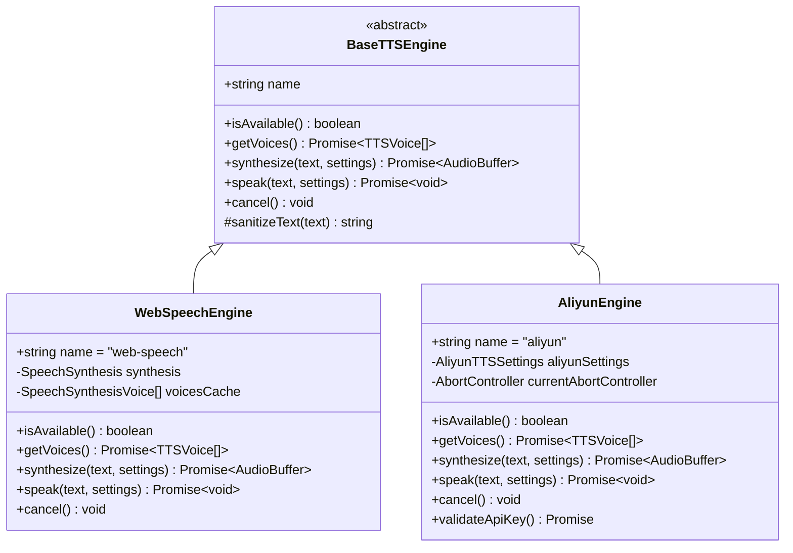
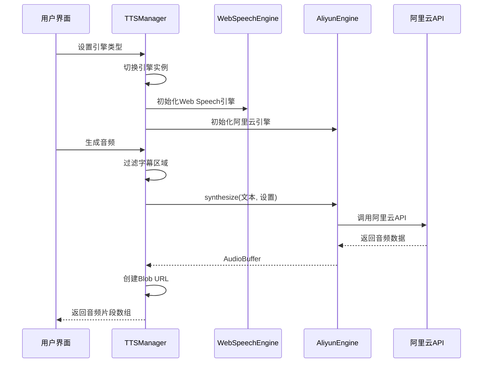
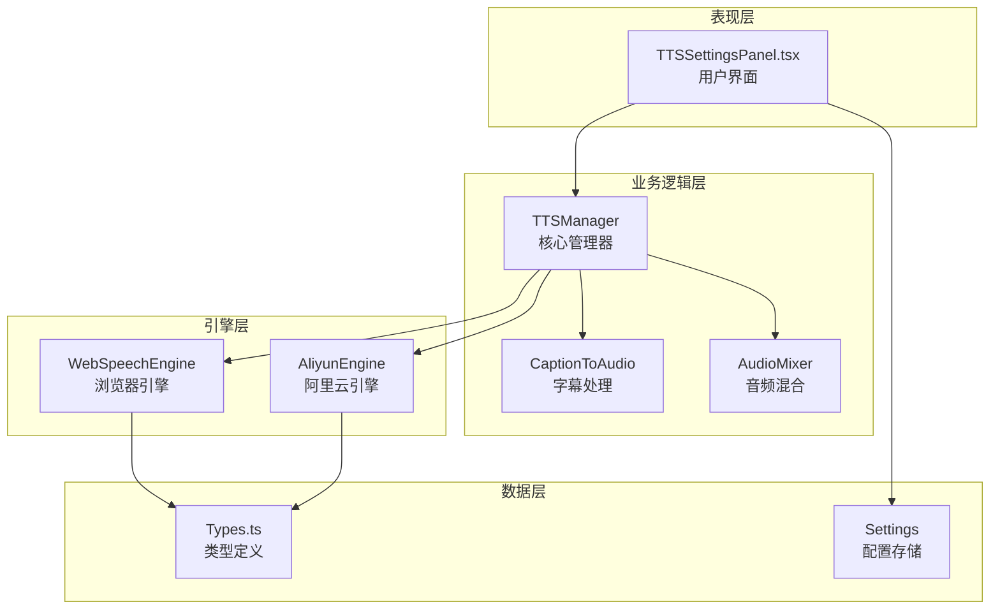
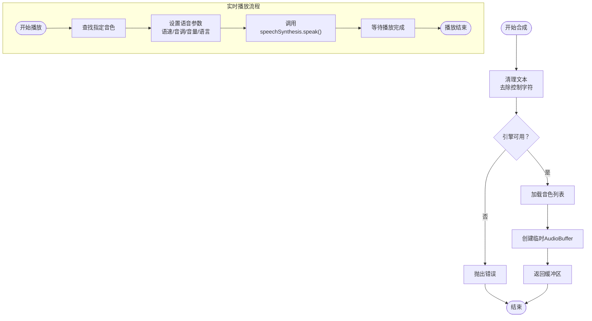
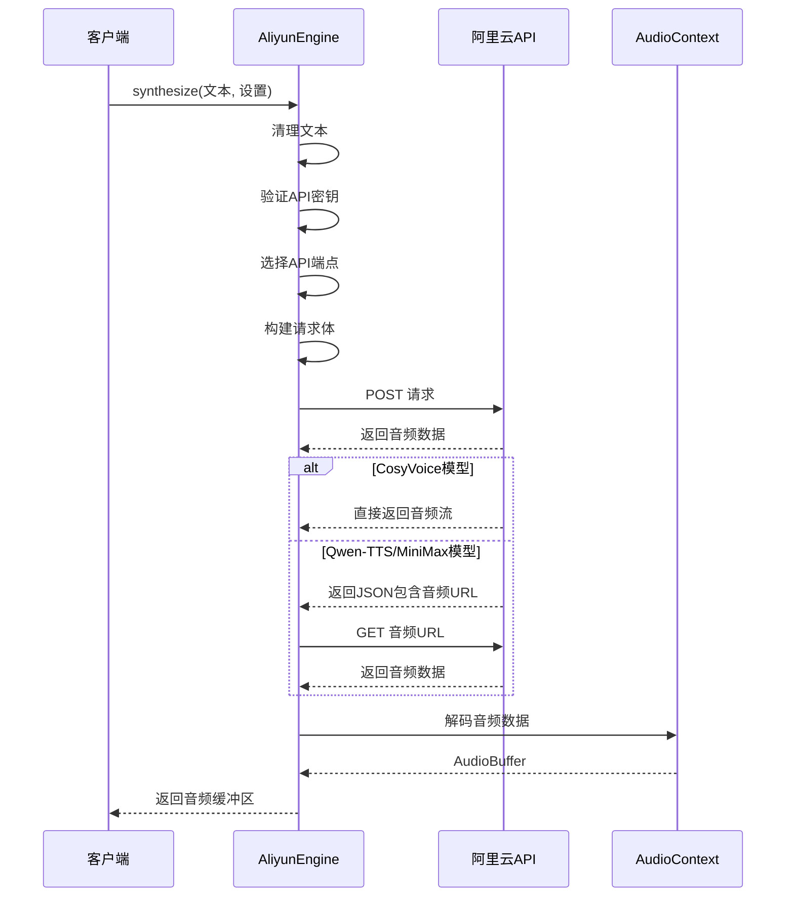
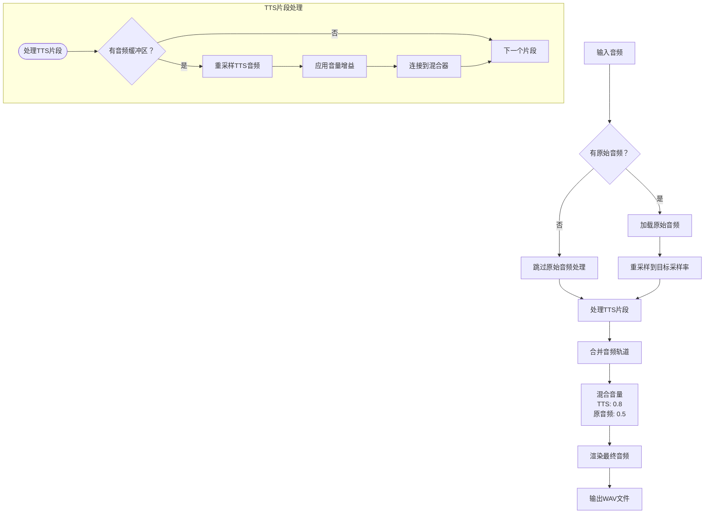
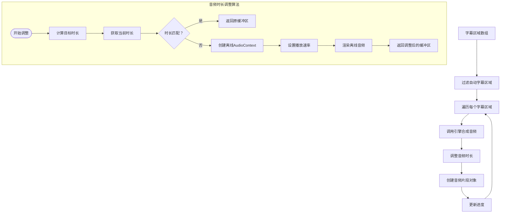
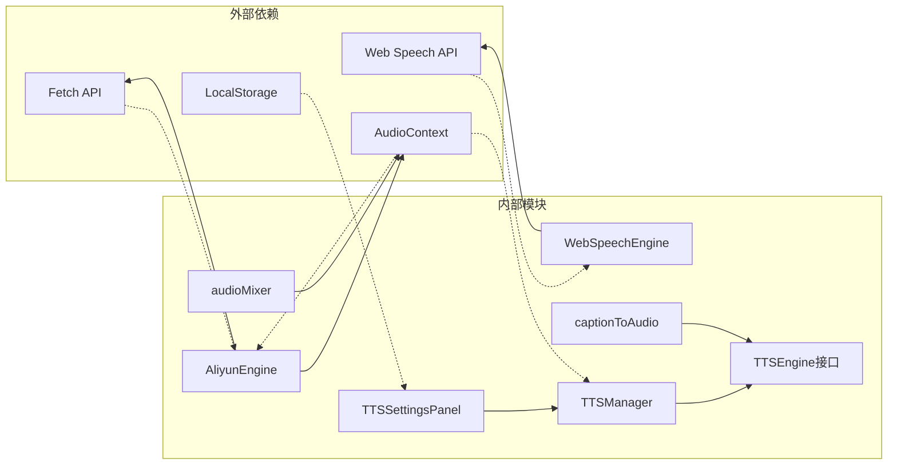

# TTS语音合成系统

<cite>
**本文档引用的文件**
- [engine.ts](file://src/lib/tts/engine.ts)
- [webSpeechEngine.ts](file://src/lib/tts/webSpeechEngine.ts)
- [aliyunEngine.ts](file://src/lib/tts/aliyunEngine.ts)
- [ttsManager.ts](file://src/lib/tts/ttsManager.ts)
- [types.ts](file://src/lib/tts/types.ts)
- [captionToAudio.ts](file://src/lib/tts/captionToAudio.ts)
- [audioMixer.ts](file://src/lib/tts/audioMixer.ts)
- [TTSSettingsPanel.tsx](file://src/components/video-editor/TTSSettingsPanel.tsx)
- [aliyun-tts-api.md](file://docs/dev/aliyun-tts-api.md)
</cite>

## 目录
1. [简介](#简介)
2. [项目结构](#项目结构)
3. [核心组件](#核心组件)
4. [架构概览](#架构概览)
5. [详细组件分析](#详细组件分析)
6. [依赖关系分析](#依赖关系分析)
7. [性能考虑](#性能考虑)
8. [故障排除指南](#故障排除指南)
9. [结论](#结论)

## 简介

OpenScreen的TTS语音合成系统是一个功能完整的文本转语音解决方案，支持多种语音合成引擎和音色选择。该系统提供了两种主要的语音合成方式：基于浏览器的Web Speech API和基于阿里云的高质量语音合成服务。

系统的核心特性包括：
- 支持Web Speech API和阿里云TTS引擎
- 多种音色选择（支持中文、英文等多语言）
- 实时预览和批量生成音频
- 音频混合和时间轴集成
- 完整的用户界面控制面板

## 项目结构

TTS系统采用模块化设计，主要文件组织如下：

**图表来源**
- [engine.ts:1-21](file://src/lib/tts/engine.ts#L1-L21)
- [webSpeechEngine.ts:1-154](file://src/lib/tts/webSpeechEngine.ts#L1-L154)
- [aliyunEngine.ts:1-481](file://src/lib/tts/aliyunEngine.ts#L1-L481)
- [ttsManager.ts:1-325](file://src/lib/tts/ttsManager.ts#L1-L325)

**章节来源**
- [engine.ts:1-21](file://src/lib/tts/engine.ts#L1-L21)
- [types.ts:1-53](file://src/lib/tts/types.ts#L1-L53)

## 核心组件

### 引擎抽象层

系统采用抽象工厂模式，通过BaseTTSEngine基类定义统一的接口规范：

**图表来源**
- [engine.ts:3-20](file://src/lib/tts/engine.ts#L3-L20)
- [webSpeechEngine.ts:4-154](file://src/lib/tts/webSpeechEngine.ts#L4-L154)
- [aliyunEngine.ts:174-481](file://src/lib/tts/aliyunEngine.ts#L174-L481)

### 管理器组件

TTSManager作为核心协调器，负责引擎切换、配置管理和音频处理：

**图表来源**
- [ttsManager.ts:23-157](file://src/lib/tts/ttsManager.ts#L23-L157)
- [aliyunEngine.ts:326-388](file://src/lib/tts/aliyunEngine.ts#L326-L388)

**章节来源**
- [ttsManager.ts:12-325](file://src/lib/tts/ttsManager.ts#L12-L325)

## 架构概览

系统采用分层架构设计，从底层引擎到上层UI组件形成清晰的职责分离：

**图表来源**
- [TTSSettingsPanel.tsx:88-309](file://src/components/video-editor/TTSSettingsPanel.tsx#L88-L309)
- [ttsManager.ts:23-28](file://src/lib/tts/ttsManager.ts#L23-L28)

## 详细组件分析

### Web Speech引擎

Web Speech引擎提供浏览器内置的语音合成能力，无需外部API密钥：

**图表来源**
- [webSpeechEngine.ts:68-96](file://src/lib/tts/webSpeechEngine.ts#L68-L96)
- [webSpeechEngine.ts:98-148](file://src/lib/tts/webSpeechEngine.ts#L98-L148)

### 阿里云引擎

阿里云引擎提供高质量的云端语音合成服务，支持多种音色和模型：

**图表来源**
- [aliyunEngine.ts:326-388](file://src/lib/tts/aliyunEngine.ts#L326-L388)
- [aliyunEngine.ts:403-427](file://src/lib/tts/aliyunEngine.ts#L403-L427)

### 音频混合器

AudioMixer负责将TTS音频与原始视频音频进行混合处理：

**图表来源**
- [audioMixer.ts:6-68](file://src/lib/tts/audioMixer.ts#L6-L68)
- [audioMixer.ts:80-100](file://src/lib/tts/audioMixer.ts#L80-L100)

### 字幕到音频转换

系统提供专门的工具函数将字幕区域转换为可播放的音频片段：

**图表来源**
- [captionToAudio.ts:4-45](file://src/lib/tts/captionToAudio.ts#L4-L45)
- [captionToAudio.ts:47-74](file://src/lib/tts/captionToAudio.ts#L47-L74)

**章节来源**
- [webSpeechEngine.ts:1-154](file://src/lib/tts/webSpeechEngine.ts#L1-L154)
- [aliyunEngine.ts:1-481](file://src/lib/tts/aliyunEngine.ts#L1-L481)
- [audioMixer.ts:1-161](file://src/lib/tts/audioMixer.ts#L1-L161)
- [captionToAudio.ts:1-160](file://src/lib/tts/captionToAudio.ts#L1-L160)

## 依赖关系分析

系统采用松耦合的设计，各组件之间的依赖关系清晰明确：

**图表来源**
- [types.ts:40-47](file://src/lib/tts/types.ts#L40-L47)
- [TTSSettingsPanel.tsx:27-36](file://src/components/video-editor/TTSSettingsPanel.tsx#L27-L36)

**章节来源**
- [types.ts:1-53](file://src/lib/tts/types.ts#L1-L53)
- [TTSSettingsPanel.tsx:1-773](file://src/components/video-editor/TTSSettingsPanel.tsx#L1-L773)

## 性能考虑

### 内存管理

系统在音频处理过程中采用了多项内存优化策略：

1. **及时释放资源**：所有AudioContext在使用后都会被正确关闭
2. **缓冲区复用**：重采样操作使用离线AudioContext避免重复创建
3. **渐进式处理**：字幕音频生成支持进度回调，避免长时间阻塞UI

### 网络优化

阿里云引擎实现了智能的网络请求优化：

1. **请求取消**：支持AbortController取消正在进行的请求
2. **缓存机制**：音色列表和API密钥验证结果会被缓存
3. **错误重试**：对网络异常提供适当的错误处理

### 音频质量

系统在保证音质的同时优化了处理效率：

1. **采样率适配**：自动将不同源的音频重采样到统一标准
2. **音量平衡**：提供TTS和原音频的独立音量控制
3. **格式转换**：统一输出WAV格式便于后续处理

## 故障排除指南

### 常见问题及解决方案

#### Web Speech引擎不可用
- **症状**：引擎状态显示不可用
- **原因**：浏览器不支持speechSynthesis或运行环境非浏览器
- **解决**：切换到阿里云引擎或在支持的浏览器中使用

#### 阿里云API密钥验证失败
- **症状**：API Key验证返回错误
- **原因**：密钥无效或网络连接问题
- **解决**：检查密钥有效性，确认网络连接正常

#### 音频合成超时
- **症状**：音频生成长时间无响应
- **原因**：网络延迟或API服务繁忙
- **解决**：增加超时时间，检查网络状况

#### 音频质量不佳
- **症状**：合成音频音质差或有杂音
- **原因**：采样率不匹配或音量设置不当
- **解决**：调整采样率设置，优化音量平衡

**章节来源**
- [aliyunEngine.ts:206-245](file://src/lib/tts/aliyunEngine.ts#L206-L245)
- [ttsManager.ts:302-320](file://src/lib/tts/ttsManager.ts#L302-L320)

## 结论

OpenScreen的TTS语音合成系统展现了优秀的软件架构设计，通过模块化和分层架构实现了高度的可扩展性和可维护性。系统的主要优势包括：

1. **灵活的引擎选择**：支持多种语音合成引擎，满足不同场景需求
2. **完善的UI集成**：提供直观易用的用户界面和丰富的配置选项
3. **高效的音频处理**：优化的音频混合和处理算法确保良好的用户体验
4. **健壮的错误处理**：全面的错误处理和恢复机制提升系统稳定性

该系统为视频编辑应用提供了强大的语音合成能力，能够满足从简单字幕配音到复杂音频混合的各种需求。通过持续的优化和扩展，该系统有望成为视频内容创作领域的重要工具。