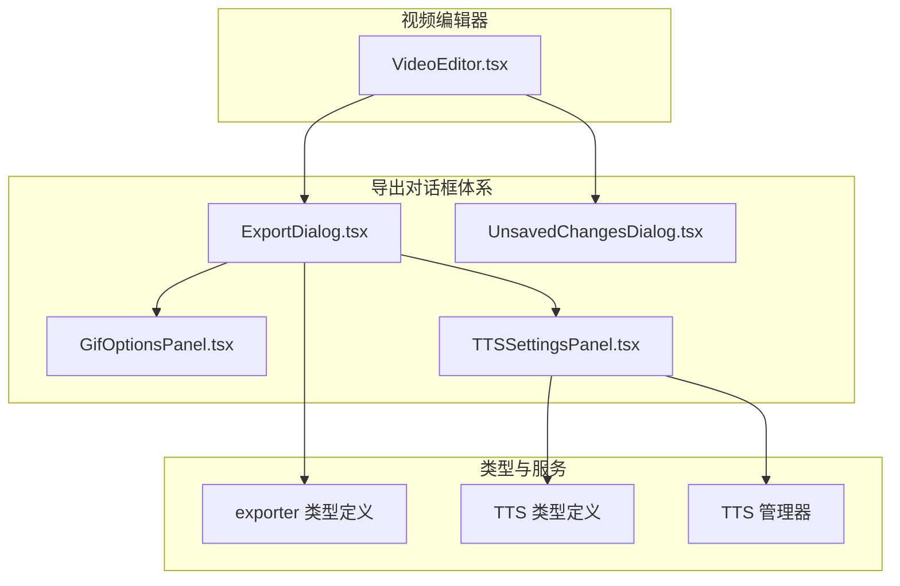
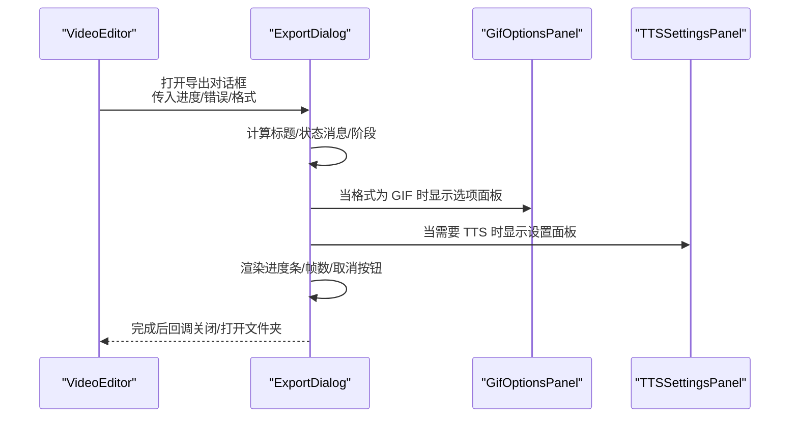
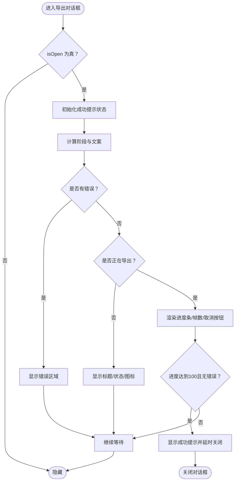
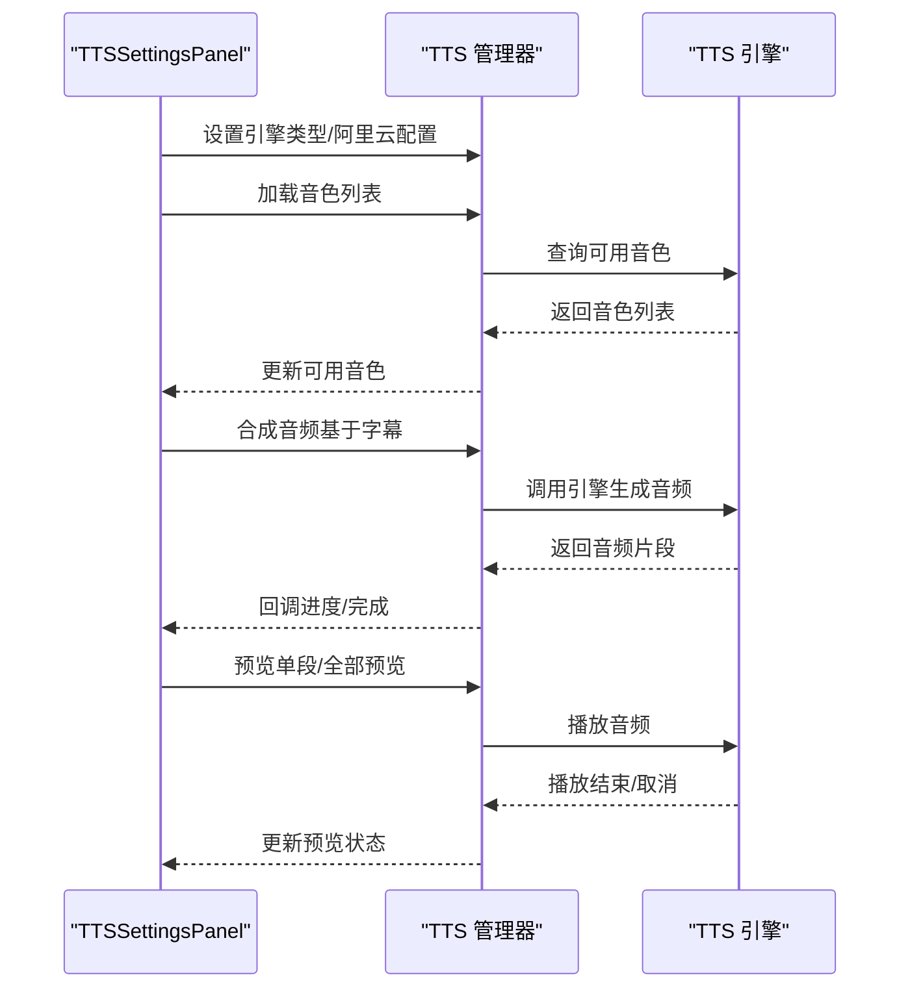
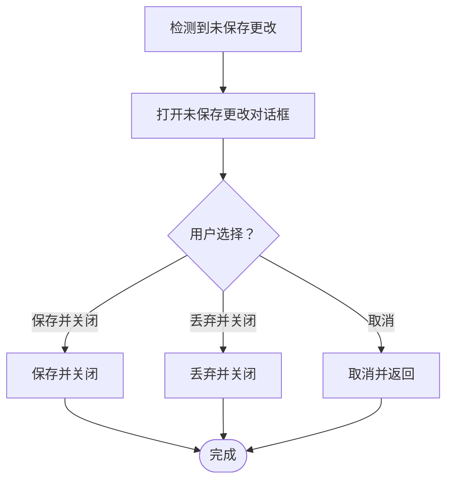
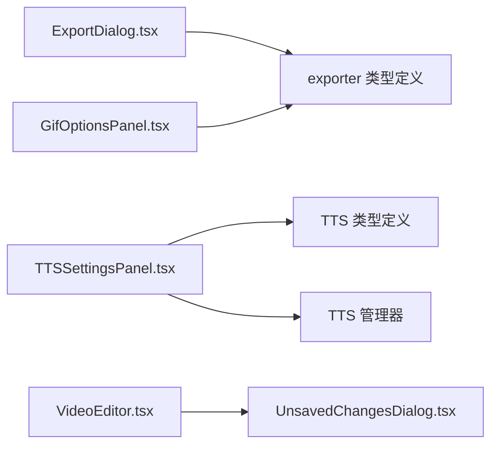

# 导出对话框

<cite>
**本文引用的文件**
- [ExportDialog.tsx](file://src/components/video-editor/ExportDialog.tsx)
- [GifOptionsPanel.tsx](file://src/components/video-editor/GifOptionsPanel.tsx)
- [TTSSettingsPanel.tsx](file://src/components/video-editor/TTSSettingsPanel.tsx)
- [UnsavedChangesDialog.tsx](file://src/components/video-editor/UnsavedChangesDialog.tsx)
- [VideoEditor.tsx](file://src/components/video-editor/VideoEditor.tsx)
- [exporter 类型定义](file://src/lib/exporter/types.ts)
- [TTS 类型定义](file://src/lib/tts/types.ts)
- [TTS 管理器](file://src/lib/tts/index.ts)
</cite>

## 目录
1. [简介](#简介)
2. [项目结构](#项目结构)
3. [核心组件](#核心组件)
4. [架构总览](#架构总览)
5. [详细组件分析](#详细组件分析)
6. [依赖关系分析](#依赖关系分析)
7. [性能考虑](#性能考虑)
8. [故障排查指南](#故障排查指南)
9. [结论](#结论)
10. [附录](#附录)

## 简介
本文件面向 OpenScreen 的“导出对话框”功能，系统化阐述其界面设计、交互流程与技术实现，覆盖以下主题：
- 导出对话框的界面与状态管理：导出选项配置、进度显示、错误处理与完成提示
- GIF 导出选项面板：帧率、尺寸预设、循环控制与输出尺寸展示
- TTS 设置面板：引擎选择（Web Speech / 阿里云）、语音选择、语速/音高/音量调节、音频生成与预览、分段添加到时间轴
- 未保存更改对话框：数据保护、确认流程与取消处理
- 导出过程的状态管理、进度跟踪与中断处理
- 性能优化、内存管理与大文件处理策略
- 扩展开发与自定义导出格式的实现指南

## 项目结构
导出相关功能主要由四个 React 组件构成，分别负责不同阶段与维度的交互：
- 导出对话框：统一承载导出流程的 UI 与状态
- GIF 选项面板：配置 GIF 导出参数
- TTS 设置面板：配置文本转语音参数与生成音频
- 未保存更改对话框：在关闭/新建/加载项目前保护用户数据



图表来源
- [ExportDialog.tsx:1-276](file://src/components/video-editor/ExportDialog.tsx#L1-L276)
- [GifOptionsPanel.tsx:1-112](file://src/components/video-editor/GifOptionsPanel.tsx#L1-L112)
- [TTSSettingsPanel.tsx:1-618](file://src/components/video-editor/TTSSettingsPanel.tsx#L1-L618)
- [UnsavedChangesDialog.tsx:1-97](file://src/components/video-editor/UnsavedChangesDialog.tsx#L1-L97)
- [VideoEditor.tsx](file://src/components/video-editor/VideoEditor.tsx)
- [exporter 类型定义](file://src/lib/exporter/types.ts)
- [TTS 类型定义](file://src/lib/tts/types.ts)
- [TTS 管理器](file://src/lib/tts/index.ts)

章节来源
- [ExportDialog.tsx:1-276](file://src/components/video-editor/ExportDialog.tsx#L1-L276)
- [GifOptionsPanel.tsx:1-112](file://src/components/video-editor/GifOptionsPanel.tsx#L1-L112)
- [TTSSettingsPanel.tsx:1-618](file://src/components/video-editor/TTSSettingsPanel.tsx#L1-L618)
- [UnsavedChangesDialog.tsx:1-97](file://src/components/video-editor/UnsavedChangesDialog.tsx#L1-L97)
- [VideoEditor.tsx](file://src/components/video-editor/VideoEditor.tsx)

## 核心组件
- 导出对话框（ExportDialog）：集中展示导出标题、状态消息、进度条、帧数统计、取消按钮与成功提示；根据导出格式与阶段动态切换文案与 UI 表现
- GIF 选项面板（GifOptionsPanel）：提供帧率、输出尺寸预设与循环开关，实时显示输出宽高
- TTS 设置面板（TTSSettingsPanel）：支持引擎切换、阿里云 API Key 验证、音色列表加载、语速/音高/音量调节、音频生成与预览、分段管理与添加到时间轴
- 未保存更改对话框（UnsavedChangesDialog）：在关闭/新建/加载项目前弹窗，提供“保存并关闭/丢弃并关闭/取消”三选

章节来源
- [ExportDialog.tsx:19-276](file://src/components/video-editor/ExportDialog.tsx#L19-L276)
- [GifOptionsPanel.tsx:16-112](file://src/components/video-editor/GifOptionsPanel.tsx#L16-L112)
- [TTSSettingsPanel.tsx:20-618](file://src/components/video-editor/TTSSettingsPanel.tsx#L20-L618)
- [UnsavedChangesDialog.tsx:11-97](file://src/components/video-editor/UnsavedChangesDialog.tsx#L11-L97)

## 架构总览
导出对话框围绕“状态驱动”的 React 组件展开，通过 props 传递导出进度、错误、格式等信息，内部通过副作用与条件渲染实现不同阶段的 UI 切换。TTS 面板通过 TTS 管理器与外部引擎交互，GIF 面板通过 exporter 类型常量与预设进行参数约束。



图表来源
- [ExportDialog.tsx:68-90](file://src/components/video-editor/ExportDialog.tsx#L68-L90)
- [GifOptionsPanel.tsx:27-36](file://src/components/video-editor/GifOptionsPanel.tsx#L27-L36)
- [TTSSettingsPanel.tsx:27-32](file://src/components/video-editor/TTSSettingsPanel.tsx#L27-L32)

## 详细组件分析

### 导出对话框（ExportDialog）
- 状态与生命周期
  - 通过 props 接收 isOpen、isExporting、progress、error、exportFormat、exportedFilePath 等关键状态
  - 在每次导出开始或对话框重新打开时重置成功提示状态
  - 当进度达到 100 且无错误时，进入短暂的成功提示并自动关闭
- 阶段与文案
  - 根据阶段区分“渲染帧”“编译 GIF/最终化 MP4”“最终化 MP4”，动态生成标题与状态描述
  - 编译阶段显示“编译中/等待编译/渲染进度百分比”
- 进度与 UI
  - 渲染进度条：按百分比展示；编译/最终化阶段若存在渲染进度则显示具体数值，否则使用动画条
  - 帧数统计：显示当前帧/总帧数
  - 取消按钮：仅在导出进行中可用
- 成功与错误
  - 成功：显示绿色对勾图标、完成标题与文件路径，可一键打开所在文件夹
  - 错误：以红色背景块显示错误信息，引导“重试”



图表来源
- [ExportDialog.tsx:33-56](file://src/components/video-editor/ExportDialog.tsx#L33-L56)
- [ExportDialog.tsx:68-90](file://src/components/video-editor/ExportDialog.tsx#L68-L90)
- [ExportDialog.tsx:171-263](file://src/components/video-editor/ExportDialog.tsx#L171-L263)

章节来源
- [ExportDialog.tsx:19-276](file://src/components/video-editor/ExportDialog.tsx#L19-L276)

### GIF 选项面板（GifOptionsPanel）
- 参数项
  - 帧率：从预设集合中选择，影响 GIF 动画流畅度与体积
  - 输出尺寸预设：提供常用尺寸标签，实际输出宽高在组件内以占位符展示
  - 循环开关：启用后 GIF 将连续播放
- 交互行为
  - 帧率与尺寸变更通过回调通知父组件
  - 支持禁用态，便于在导出进行中避免修改
- 数据来源
  - 帧率与尺寸预设来自 exporter 类型定义中的常量与枚举

```mermaid
classDiagram
class GifOptionsPanel {
+frameRate : GifFrameRate
+loop : boolean
+sizePreset : GifSizePreset
+outputDimensions : {width,height}
+onFrameRateChange(rate)
+onLoopChange(loop)
+onSizePresetChange(preset)
}
class ExporterTypes {
+GIF_FRAME_RATES
+GIF_SIZE_PRESETS
}
GifOptionsPanel --> ExporterTypes : "使用常量"
```

图表来源
- [GifOptionsPanel.tsx:16-36](file://src/components/video-editor/GifOptionsPanel.tsx#L16-L36)
- [exporter 类型定义](file://src/lib/exporter/types.ts)

章节来源
- [GifOptionsPanel.tsx:1-112](file://src/components/video-editor/GifOptionsPanel.tsx#L1-L112)
- [exporter 类型定义](file://src/lib/exporter/types.ts)

### TTS 设置面板（TTSSettingsPanel）
- 引擎与配置
  - 引擎类型：Web Speech API（浏览器内置）与阿里云（Aliyun）两种
  - 阿里云：支持 API Key 验证、模型选择（多款模型），验证通过后重新加载音色列表
- 语音与参数
  - 语音选择：从已加载音色列表中选择，默认音色优先
  - 语速、音高、音量：通过滑块调节，数值随调整即时更新
- 生成与预览
  - 从字幕注释生成音频片段，支持进度条与完成提示
  - 支持逐段预览与全部预览；预览过程中可取消
- 分段管理与集成
  - 展示已生成分段，支持单段预览与添加到时间轴
  - 提供“全部添加到时间轴”“清空”等操作



图表来源
- [TTSSettingsPanel.tsx:65-93](file://src/components/video-editor/TTSSettingsPanel.tsx#L65-L93)
- [TTSSettingsPanel.tsx:114-158](file://src/components/video-editor/TTSSettingsPanel.tsx#L114-L158)
- [TTSSettingsPanel.tsx:200-229](file://src/components/video-editor/TTSSettingsPanel.tsx#L200-L229)
- [TTSSettingsPanel.tsx:231-261](file://src/components/video-editor/TTSSettingsPanel.tsx#L231-L261)
- [TTS 类型定义](file://src/lib/tts/types.ts)
- [TTS 管理器](file://src/lib/tts/index.ts)

章节来源
- [TTSSettingsPanel.tsx:1-618](file://src/components/video-editor/TTSSettingsPanel.tsx#L1-L618)
- [TTS 类型定义](file://src/lib/tts/types.ts)
- [TTS 管理器](file://src/lib/tts/index.ts)

### 未保存更改对话框（UnsavedChangesDialog）
- 场景化文案
  - 关闭、新建项目、加载项目三种变体，分别映射不同的提示与按钮文案
- 交互流程
  - 保存并关闭：触发保存逻辑后再关闭
  - 丢弃并关闭：不保存直接关闭
  - 取消：返回原界面，不执行任何关闭动作
- 触发时机
  - 在 VideoEditor 中检测到有未保存更改时弹出该对话框



图表来源
- [UnsavedChangesDialog.tsx:29-47](file://src/components/video-editor/UnsavedChangesDialog.tsx#L29-L47)
- [UnsavedChangesDialog.tsx:48-96](file://src/components/video-editor/UnsavedChangesDialog.tsx#L48-L96)

章节来源
- [UnsavedChangesDialog.tsx:1-97](file://src/components/video-editor/UnsavedChangesDialog.tsx#L1-L97)
- [VideoEditor.tsx](file://src/components/video-editor/VideoEditor.tsx)

## 依赖关系分析
- 导出对话框依赖 exporter 类型定义提供的 GIF 帧率与尺寸预设，确保参数合法与一致
- TTS 面板依赖 TTS 类型定义与 TTS 管理器，实现引擎切换、音色加载、参数调节与音频生成
- 未保存更改对话框独立于导出流程，但与 VideoEditor 的状态变化耦合，用于保护用户数据



图表来源
- [ExportDialog.tsx:1-276](file://src/components/video-editor/ExportDialog.tsx#L1-L276)
- [GifOptionsPanel.tsx:1-112](file://src/components/video-editor/GifOptionsPanel.tsx#L1-L112)
- [TTSSettingsPanel.tsx:1-618](file://src/components/video-editor/TTSSettingsPanel.tsx#L1-L618)
- [UnsavedChangesDialog.tsx:1-97](file://src/components/video-editor/UnsavedChangesDialog.tsx#L1-L97)
- [exporter 类型定义](file://src/lib/exporter/types.ts)
- [TTS 类型定义](file://src/lib/tts/types.ts)
- [TTS 管理器](file://src/lib/tts/index.ts)
- [VideoEditor.tsx](file://src/components/video-editor/VideoEditor.tsx)

章节来源
- [exporter 类型定义](file://src/lib/exporter/types.ts)
- [TTS 类型定义](file://src/lib/tts/types.ts)
- [TTS 管理器](file://src/lib/tts/index.ts)

## 性能考虑
- 进度渲染优化
  - 使用受控进度条，避免频繁重绘；编译/最终化阶段优先使用已知渲染进度，否则采用动画条提升感知
- 内存管理
  - TTS 面板在卸载时销毁 TTS 管理器实例，防止内存泄漏
  - 导出对话框在每次新导出开始时重置成功提示状态，避免状态累积
- 大文件处理
  - GIF 导出建议合理设置帧率与尺寸预设，降低体积；MP4 导出建议在最终化阶段进行硬件加速或后台处理
- 并发与中断
  - TTS 预览支持取消；导出进行中提供取消按钮，避免长时间阻塞

章节来源
- [TTSSettingsPanel.tsx:188-191](file://src/components/video-editor/TTSSettingsPanel.tsx#L188-L191)
- [ExportDialog.tsx:33-56](file://src/components/video-editor/ExportDialog.tsx#L33-L56)
- [ExportDialog.tsx:251-261](file://src/components/video-editor/ExportDialog.tsx#L251-L261)

## 故障排查指南
- 导出失败
  - 检查错误区域提示，点击重试；若问题持续，尝试降低 GIF 帧率或尺寸预设
- TTS 无法加载音色
  - 确认引擎可用性；阿里云需先验证 API Key 并重新加载音色
- 预览异常
  - 浏览器环境差异可能导致 Web Speech 预览不稳定；可切换至阿里云引擎
- 未保存更改
  - 关闭/新建/加载项目前务必保存或确认；避免丢失工作成果

章节来源
- [ExportDialog.tsx:158-169](file://src/components/video-editor/ExportDialog.tsx#L158-L169)
- [TTSSettingsPanel.tsx:88-92](file://src/components/video-editor/TTSSettingsPanel.tsx#L88-L92)
- [TTSSettingsPanel.tsx:114-158](file://src/components/video-editor/TTSSettingsPanel.tsx#L114-L158)

## 结论
导出对话框通过清晰的状态机与阶段化 UI，有效提升了导出体验；GIF 选项面板与 TTS 面板分别覆盖了常见媒体导出需求与语音合成场景。配合未保存更改对话框，形成完整的工作流保护闭环。建议在实际部署中结合平台能力启用硬件加速与后台任务，进一步优化大文件导出性能。

## 附录
- 自定义导出格式扩展指南
  - 在 exporter 类型定义中新增格式常量与参数约束
  - 在导出对话框中增加对应阶段文案与 UI 显示逻辑
  - 若涉及第三方引擎（如 TTS），在 TTS 管理器中补充引擎适配与参数映射
  - 在 VideoEditor 中接入新的导出入口与回调处理

章节来源
- [exporter 类型定义](file://src/lib/exporter/types.ts)
- [TTS 管理器](file://src/lib/tts/index.ts)
- [VideoEditor.tsx](file://src/components/video-editor/VideoEditor.tsx)