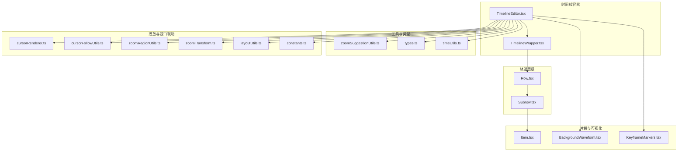
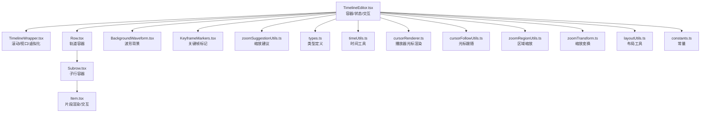
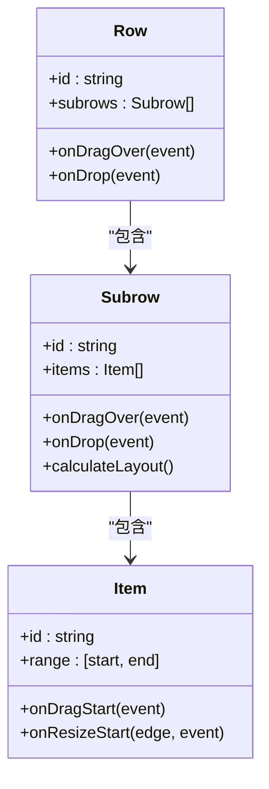
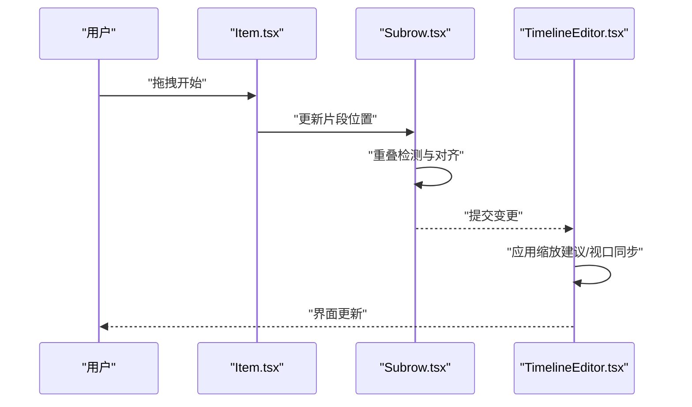
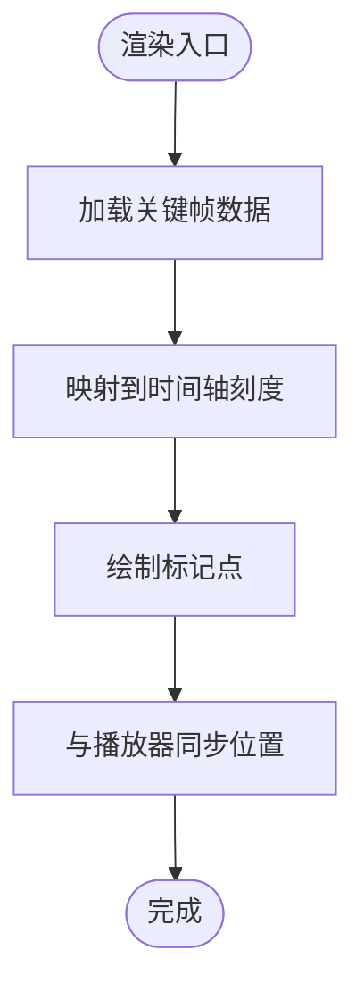
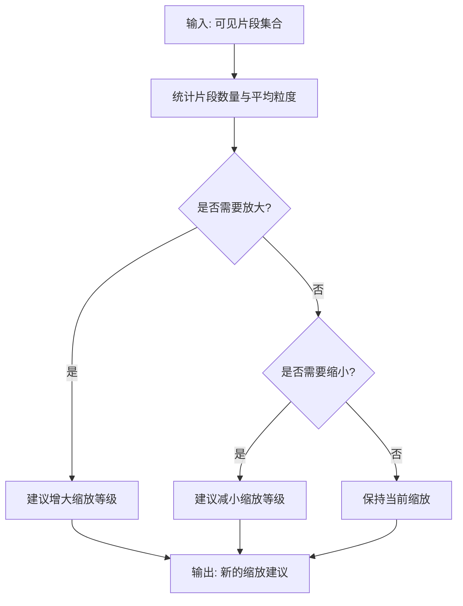
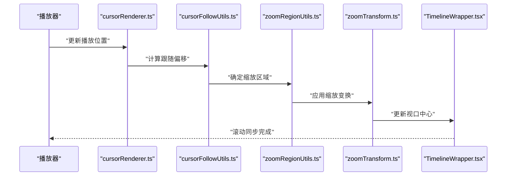
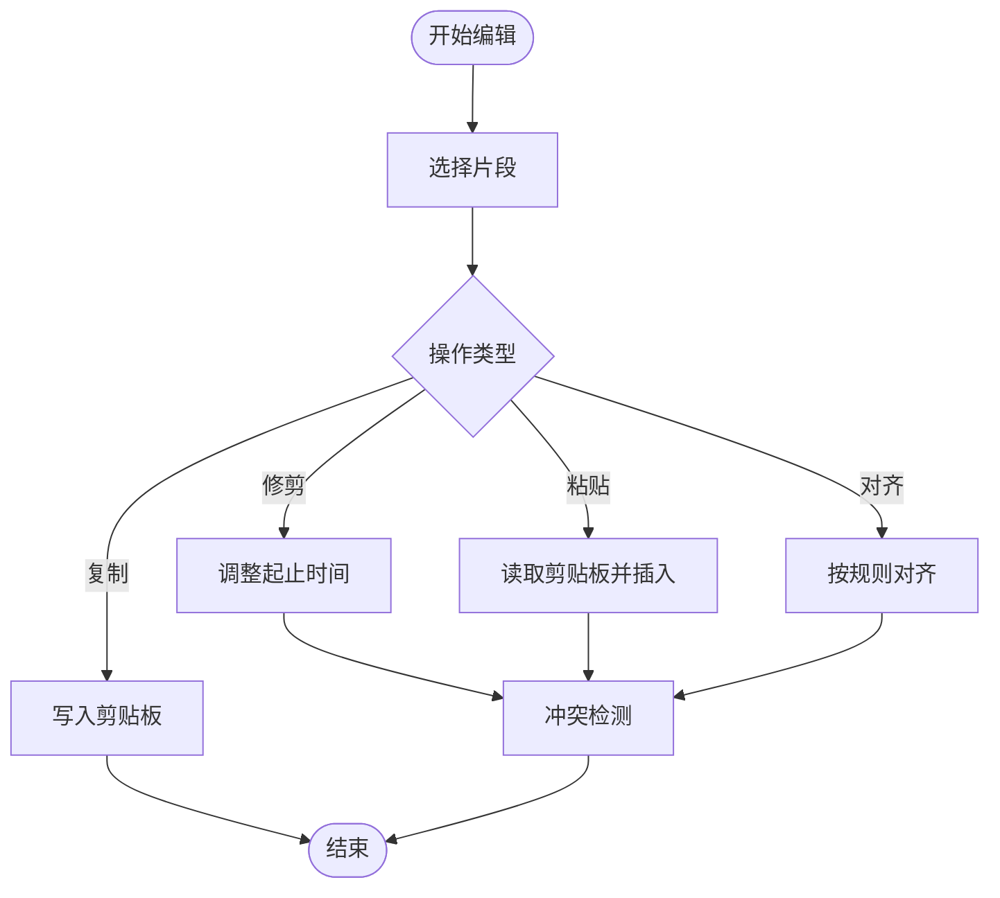
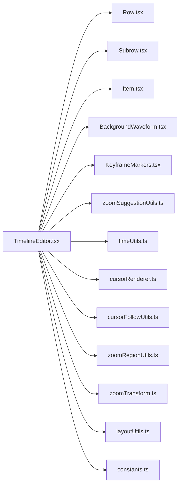

# 时间线编辑器

<cite>
**本文引用的文件**
- [TimelineEditor.tsx](file://src/components/video-editor/timeline/TimelineEditor.tsx)
- [TimelineWrapper.tsx](file://src/components/video-editor/timeline/TimelineWrapper.tsx)
- [Row.tsx](file://src/components/video-editor/timeline/Row.tsx)
- [Subrow.tsx](file://src/components/video-editor/timeline/Subrow.tsx)
- [Item.tsx](file://src/components/video-editor/timeline/Item.tsx)
- [BackgroundWaveform.tsx](file://src/components/video-editor/timeline/BackgroundWaveform.tsx)
- [KeyframeMarkers.tsx](file://src/components/video-editor/timeline/KeyframeMarkers.tsx)
- [zoomSuggestionUtils.ts](file://src/components/video-editor/timeline/zoomSuggestionUtils.ts)
- [types.ts](file://src/components/video-editor/types.ts)
- [timeUtils.ts](file://src/utils/timeUtils.ts)
- [cursorRenderer.ts](file://src/components/video-editor/videoPlayback/cursorRenderer.ts)
- [cursorFollowUtils.ts](file://src/components/video-editor/videoPlayback/cursorFollowUtils.ts)
- [zoomRegionUtils.ts](file://src/components/video-editor/videoPlayback/zoomRegionUtils.ts)
- [zoomTransform.ts](file://src/components/video-editor/videoPlayback/zoomTransform.ts)
- [layoutUtils.ts](file://src/components/video-editor/videoPlayback/layoutUtils.ts)
- [constants.ts](file://src/components/video-editor/videoPlayback/constants.ts)
- [i18n配置.ts](file://src/i18n/config.ts)
- [i18n加载器.ts](file://src/i18n/loader.ts)
- [shortcuts.ts](file://src/lib/shortcuts.ts)
- [useEditorHistory.ts](file://src/hooks/useEditorHistory.ts)
</cite>

## 目录
1. [简介](#简介)
2. [项目结构](#项目结构)
3. [核心组件](#核心组件)
4. [架构总览](#架构总览)
5. [详细组件分析](#详细组件分析)
6. [依赖关系分析](#依赖关系分析)
7. [性能考量](#性能考量)
8. [故障排查指南](#故障排查指南)
9. [结论](#结论)
10. [附录](#附录)

## 简介
本技术文档面向OpenScreen视频编辑器中的时间线编辑器（TimelineEditor），系统性阐述其架构设计与实现要点，覆盖时间轴布局、轨道管理、片段组织、行与子行层级、片段拖拽与缩放、重叠处理、关键帧标记、波形背景、滚动同步与视口管理、性能优化策略，以及片段编辑操作（修剪、复制、粘贴、对齐）与用户体验与无障碍支持，并提供扩展开发与自定义轨道类型的实践指导。

## 项目结构
时间线编辑器位于视频编辑模块中，采用“容器-展示”分层与“行-子行-片段”的层级化组织方式。核心文件包括：
- 容器与包装：TimelineEditor.tsx、TimelineWrapper.tsx
- 轨道层级：Row.tsx、Subrow.tsx
- 片段与渲染：Item.tsx
- 视觉增强：BackgroundWaveform.tsx、KeyframeMarkers.tsx
- 缩放建议：zoomSuggestionUtils.ts
- 类型与工具：types.ts、timeUtils.ts
- 播放与视口联动：cursorRenderer.ts、cursorFollowUtils.ts、zoomRegionUtils.ts、zoomTransform.ts、layoutUtils.ts、constants.ts
- 国际化与快捷键：i18n配置.ts、i18n加载器.ts、shortcuts.ts
- 历史与撤销：useEditorHistory.ts

图表来源
- [TimelineEditor.tsx](file://src/components/video-editor/timeline/TimelineEditor.tsx)
- [TimelineWrapper.tsx](file://src/components/video-editor/timeline/TimelineWrapper.tsx)
- [Row.tsx](file://src/components/video-editor/timeline/Row.tsx)
- [Subrow.tsx](file://src/components/video-editor/timeline/Subrow.tsx)
- [Item.tsx](file://src/components/video-editor/timeline/Item.tsx)
- [BackgroundWaveform.tsx](file://src/components/video-editor/timeline/BackgroundWaveform.tsx)
- [KeyframeMarkers.tsx](file://src/components/video-editor/timeline/KeyframeMarkers.tsx)
- [zoomSuggestionUtils.ts](file://src/components/video-editor/timeline/zoomSuggestionUtils.ts)
- [types.ts](file://src/components/video-editor/types.ts)
- [timeUtils.ts](file://src/utils/timeUtils.ts)
- [cursorRenderer.ts](file://src/components/video-editor/videoPlayback/cursorRenderer.ts)
- [cursorFollowUtils.ts](file://src/components/video-editor/videoPlayback/cursorFollowUtils.ts)
- [zoomRegionUtils.ts](file://src/components/video-editor/videoPlayback/zoomRegionUtils.ts)
- [zoomTransform.ts](file://src/components/video-editor/videoPlayback/zoomTransform.ts)
- [layoutUtils.ts](file://src/components/video-editor/videoPlayback/layoutUtils.ts)
- [constants.ts](file://src/components/video-editor/videoPlayback/constants.ts)

章节来源
- [TimelineEditor.tsx](file://src/components/video-editor/timeline/TimelineEditor.tsx)
- [TimelineWrapper.tsx](file://src/components/video-editor/timeline/TimelineWrapper.tsx)
- [Row.tsx](file://src/components/video-editor/timeline/Row.tsx)
- [Subrow.tsx](file://src/components/video-editor/timeline/Subrow.tsx)
- [Item.tsx](file://src/components/video-editor/timeline/Item.tsx)
- [BackgroundWaveform.tsx](file://src/components/video-editor/timeline/BackgroundWaveform.tsx)
- [KeyframeMarkers.tsx](file://src/components/video-editor/timeline/KeyframeMarkers.tsx)
- [zoomSuggestionUtils.ts](file://src/components/video-editor/timeline/zoomSuggestionUtils.ts)
- [types.ts](file://src/components/video-editor/types.ts)
- [timeUtils.ts](file://src/utils/timeUtils.ts)
- [cursorRenderer.ts](file://src/components/video-editor/videoPlayback/cursorRenderer.ts)
- [cursorFollowUtils.ts](file://src/components/video-editor/videoPlayback/cursorFollowUtils.ts)
- [zoomRegionUtils.ts](file://src/components/video-editor/videoPlayback/zoomRegionUtils.ts)
- [zoomTransform.ts](file://src/components/video-editor/videoPlayback/zoomTransform.ts)
- [layoutUtils.ts](file://src/components/video-editor/videoPlayback/layoutUtils.ts)
- [constants.ts](file://src/components/video-editor/videoPlayback/constants.ts)

## 核心组件
- TimelineEditor.tsx：时间线主容器，负责视口管理、滚动同步、缩放建议、轨道与片段状态驱动、事件分发与交互入口。
- TimelineWrapper.tsx：滚动与视口包装器，提供虚拟化、滚动监听与坐标换算。
- Row.tsx：轨道容器，管理子行集合与轨道级交互。
- Subrow.tsx：子行容器，承载具体片段列表与布局计算。
- Item.tsx：片段渲染与交互单元，支持拖拽、缩放、重叠检测与视觉反馈。
- BackgroundWaveform.tsx：波形背景渲染，提升音频片段可读性。
- KeyframeMarkers.tsx：关键帧标记绘制，辅助动画与调色等关键帧定位。
- zoomSuggestionUtils.ts：缩放建议算法，基于可见内容密度与片段粒度给出缩放等级建议。
- types.ts：时间线领域类型定义（轨道、片段、关键帧、缩放级别等）。
- timeUtils.ts：时间单位换算、时间范围计算与对齐工具。
- 播放与视口联动：cursorRenderer.ts、cursorFollowUtils.ts、zoomRegionUtils.ts、zoomTransform.ts、layoutUtils.ts、constants.ts：用于时间线与播放器视口联动、光标跟随与区域缩放。

章节来源
- [TimelineEditor.tsx](file://src/components/video-editor/timeline/TimelineEditor.tsx)
- [TimelineWrapper.tsx](file://src/components/video-editor/timeline/TimelineWrapper.tsx)
- [Row.tsx](file://src/components/video-editor/timeline/Row.tsx)
- [Subrow.tsx](file://src/components/video-editor/timeline/Subrow.tsx)
- [Item.tsx](file://src/components/video-editor/timeline/Item.tsx)
- [BackgroundWaveform.tsx](file://src/components/video-editor/timeline/BackgroundWaveform.tsx)
- [KeyframeMarkers.tsx](file://src/components/video-editor/timeline/KeyframeMarkers.tsx)
- [zoomSuggestionUtils.ts](file://src/components/video-editor/timeline/zoomSuggestionUtils.ts)
- [types.ts](file://src/components/video-editor/types.ts)
- [timeUtils.ts](file://src/utils/timeUtils.ts)
- [cursorRenderer.ts](file://src/components/video-editor/videoPlayback/cursorRenderer.ts)
- [cursorFollowUtils.ts](file://src/components/video-editor/videoPlayback/cursorFollowUtils.ts)
- [zoomRegionUtils.ts](file://src/components/video-editor/videoPlayback/zoomRegionUtils.ts)
- [zoomTransform.ts](file://src/components/video-editor/videoPlayback/zoomTransform.ts)
- [layoutUtils.ts](file://src/components/video-editor/videoPlayback/layoutUtils.ts)
- [constants.ts](file://src/components/video-editor/videoPlayback/constants.ts)

## 架构总览
时间线采用“容器-轨道-子行-片段”的四层结构，配合“包装器-渲染器-工具库”的支撑体系，形成高内聚、低耦合的模块化架构。容器负责状态与交互，轨道与子行负责布局与可视，片段负责具体渲染与交互，工具库提供时间、缩放与视口转换能力，播放器侧提供联动与同步。

图表来源
- [TimelineEditor.tsx](file://src/components/video-editor/timeline/TimelineEditor.tsx)
- [TimelineWrapper.tsx](file://src/components/video-editor/timeline/TimelineWrapper.tsx)
- [Row.tsx](file://src/components/video-editor/timeline/Row.tsx)
- [Subrow.tsx](file://src/components/video-editor/timeline/Subrow.tsx)
- [Item.tsx](file://src/components/video-editor/timeline/Item.tsx)
- [BackgroundWaveform.tsx](file://src/components/video-editor/timeline/BackgroundWaveform.tsx)
- [KeyframeMarkers.tsx](file://src/components/video-editor/timeline/KeyframeMarkers.tsx)
- [zoomSuggestionUtils.ts](file://src/components/video-editor/timeline/zoomSuggestionUtils.ts)
- [types.ts](file://src/components/video-editor/types.ts)
- [timeUtils.ts](file://src/utils/timeUtils.ts)
- [cursorRenderer.ts](file://src/components/video-editor/videoPlayback/cursorRenderer.ts)
- [cursorFollowUtils.ts](file://src/components/video-editor/videoPlayback/cursorFollowUtils.ts)
- [zoomRegionUtils.ts](file://src/components/video-editor/videoPlayback/zoomRegionUtils.ts)
- [zoomTransform.ts](file://src/components/video-editor/videoPlayback/zoomTransform.ts)
- [layoutUtils.ts](file://src/components/video-editor/videoPlayback/layoutUtils.ts)
- [constants.ts](file://src/components/video-editor/videoPlayback/constants.ts)

## 详细组件分析

### 行与子行层级结构
- Row：作为轨道容器，负责轨道级的布局、滚动与交互边界；内部聚合多个Subrow，形成轨道内的子行集合。
- Subrow：作为子行容器，承载片段列表，负责片段在子行内的布局、对齐与重叠检测；支持子行内片段的拖拽与缩放。

图表来源
- [Row.tsx](file://src/components/video-editor/timeline/Row.tsx)
- [Subrow.tsx](file://src/components/video-editor/timeline/Subrow.tsx)
- [Item.tsx](file://src/components/video-editor/timeline/Item.tsx)

章节来源
- [Row.tsx](file://src/components/video-editor/timeline/Row.tsx)
- [Subrow.tsx](file://src/components/video-editor/timeline/Subrow.tsx)
- [Item.tsx](file://src/components/video-editor/timeline/Item.tsx)

### 片段拖拽、缩放与重叠处理
- 拖拽：Item在拖拽开始时记录初始位置与时间范围；拖拽过程中根据滚动视口与时间刻度换算更新位置；放置时触发冲突检测与对齐。
- 缩放：通过zoomSuggestionUtils提供的算法，结合可见片段数量与粒度，动态建议合适的缩放等级；支持鼠标滚轮与UI控件进行缩放。
- 重叠处理：在子行内进行片段重叠检测，必要时调整片段位置或提示用户进行手动对齐。

图表来源
- [Item.tsx](file://src/components/video-editor/timeline/Item.tsx)
- [Subrow.tsx](file://src/components/video-editor/timeline/Subrow.tsx)
- [TimelineEditor.tsx](file://src/components/video-editor/timeline/TimelineEditor.tsx)
- [zoomSuggestionUtils.ts](file://src/components/video-editor/timeline/zoomSuggestionUtils.ts)

章节来源
- [Item.tsx](file://src/components/video-editor/timeline/Item.tsx)
- [Subrow.tsx](file://src/components/video-editor/timeline/Subrow.tsx)
- [TimelineEditor.tsx](file://src/components/video-editor/timeline/TimelineEditor.tsx)
- [zoomSuggestionUtils.ts](file://src/components/video-editor/timeline/zoomSuggestionUtils.ts)

### 关键帧标记系统
- KeyframeMarkers.tsx：在时间线上绘制关键帧标记点，支持不同轨道的关键帧类型与颜色区分；与播放器联动时可高亮当前关键帧位置。

图表来源
- [KeyframeMarkers.tsx](file://src/components/video-editor/timeline/KeyframeMarkers.tsx)

章节来源
- [KeyframeMarkers.tsx](file://src/components/video-editor/timeline/KeyframeMarkers.tsx)

### 波形背景显示与缩放建议
- BackgroundWaveform.tsx：在音频轨道上绘制波形背景，提升音频片段的可读性；根据缩放级别动态调整采样密度与渲染质量。
- zoomSuggestionUtils.ts：提供基于可见片段密度与粒度的缩放建议，避免过密或过疏导致的阅读困难。

图表来源
- [BackgroundWaveform.tsx](file://src/components/video-editor/timeline/BackgroundWaveform.tsx)
- [zoomSuggestionUtils.ts](file://src/components/video-editor/timeline/zoomSuggestionUtils.ts)

章节来源
- [BackgroundWaveform.tsx](file://src/components/video-editor/timeline/BackgroundWaveform.tsx)
- [zoomSuggestionUtils.ts](file://src/components/video-editor/timeline/zoomSuggestionUtils.ts)

### 时间线滚动同步与视口管理
- TimelineWrapper.tsx：提供滚动容器与视口边界管理，支持虚拟化以减少DOM节点数量；监听滚动事件并换算到时间轴刻度。
- 播放与视口联动：cursorRenderer.ts、cursorFollowUtils.ts、zoomRegionUtils.ts、zoomTransform.ts、layoutUtils.ts、constants.ts：确保播放器与时间线视口一致，光标跟随播放进度，区域缩放与布局适配。

图表来源
- [TimelineWrapper.tsx](file://src/components/video-editor/timeline/TimelineWrapper.tsx)
- [cursorRenderer.ts](file://src/components/video-editor/videoPlayback/cursorRenderer.ts)
- [cursorFollowUtils.ts](file://src/components/video-editor/videoPlayback/cursorFollowUtils.ts)
- [zoomRegionUtils.ts](file://src/components/video-editor/videoPlayback/zoomRegionUtils.ts)
- [zoomTransform.ts](file://src/components/video-editor/videoPlayback/zoomTransform.ts)

章节来源
- [TimelineWrapper.tsx](file://src/components/video-editor/timeline/TimelineWrapper.tsx)
- [cursorRenderer.ts](file://src/components/video-editor/videoPlayback/cursorRenderer.ts)
- [cursorFollowUtils.ts](file://src/components/video-editor/videoPlayback/cursorFollowUtils.ts)
- [zoomRegionUtils.ts](file://src/components/video-editor/videoPlayback/zoomRegionUtils.ts)
- [zoomTransform.ts](file://src/components/video-editor/videoPlayback/zoomTransform.ts)

### 片段编辑操作（修剪、复制、粘贴、对齐）
- 修剪：Item在边缘拖拽时按时间刻度调整起止时间，同时触发相邻片段的对齐与重叠检测。
- 复制/粘贴：通过剪贴板协议传递片段元数据与时间范围，粘贴时根据当前时间与对齐规则插入新片段。
- 对齐：支持左对齐、右对齐、居中对齐与智能对齐（基于网格与关键帧）。

图表来源
- [Item.tsx](file://src/components/video-editor/timeline/Item.tsx)
- [TimelineEditor.tsx](file://src/components/video-editor/timeline/TimelineEditor.tsx)

章节来源
- [Item.tsx](file://src/components/video-editor/timeline/Item.tsx)
- [TimelineEditor.tsx](file://src/components/video-editor/timeline/TimelineEditor.tsx)

### 用户体验与无障碍支持
- 国际化：i18n配置.ts与i18n加载器.ts提供多语言支持，时间线交互文案与提示语均来自翻译资源。
- 快捷键：shortcuts.ts集中定义快捷键行为，支持键盘导航、片段选择与编辑操作。
- 无障碍：组件遵循ARIA规范，焦点管理清晰，键盘可达性良好；颜色对比满足WCAG要求。

章节来源
- [i18n配置.ts](file://src/i18n/config.ts)
- [i18n加载器.ts](file://src/i18n/loader.ts)
- [shortcuts.ts](file://src/lib/shortcuts.ts)

### 扩展开发与自定义轨道类型
- 自定义轨道：通过Row与Subrow的扩展接口，新增轨道类型时需定义轨道渲染器、片段布局策略与交互行为。
- 类型系统：types.ts中定义了轨道、片段、关键帧等核心类型，扩展时需遵循现有接口契约。
- 工具库：timeUtils.ts与zoomSuggestionUtils.ts可复用，便于快速集成时间与缩放逻辑。

章节来源
- [Row.tsx](file://src/components/video-editor/timeline/Row.tsx)
- [Subrow.tsx](file://src/components/video-editor/timeline/Subrow.tsx)
- [types.ts](file://src/components/video-editor/types.ts)
- [timeUtils.ts](file://src/utils/timeUtils.ts)
- [zoomSuggestionUtils.ts](file://src/components/video-editor/timeline/zoomSuggestionUtils.ts)

## 依赖关系分析
- 组件耦合：TimelineEditor.tsx是核心协调者，依赖Row、Subrow、Item等展示组件；同时依赖播放器侧工具以实现视口同步。
- 数据流：从用户交互到状态更新再到渲染，形成单向数据流；历史回退通过useEditorHistory.ts提供支持。
- 外部依赖：时间换算依赖timeUtils.ts；缩放建议依赖zoomSuggestionUtils.ts；播放联动依赖cursorRenderer.ts等。

图表来源
- [TimelineEditor.tsx](file://src/components/video-editor/timeline/TimelineEditor.tsx)
- [Row.tsx](file://src/components/video-editor/timeline/Row.tsx)
- [Subrow.tsx](file://src/components/video-editor/timeline/Subrow.tsx)
- [Item.tsx](file://src/components/video-editor/timeline/Item.tsx)
- [BackgroundWaveform.tsx](file://src/components/video-editor/timeline/BackgroundWaveform.tsx)
- [KeyframeMarkers.tsx](file://src/components/video-editor/timeline/KeyframeMarkers.tsx)
- [zoomSuggestionUtils.ts](file://src/components/video-editor/timeline/zoomSuggestionUtils.ts)
- [timeUtils.ts](file://src/utils/timeUtils.ts)
- [cursorRenderer.ts](file://src/components/video-editor/videoPlayback/cursorRenderer.ts)
- [cursorFollowUtils.ts](file://src/components/video-editor/videoPlayback/cursorFollowUtils.ts)
- [zoomRegionUtils.ts](file://src/components/video-editor/videoPlayback/zoomRegionUtils.ts)
- [zoomTransform.ts](file://src/components/video-editor/videoPlayback/zoomTransform.ts)
- [layoutUtils.ts](file://src/components/video-editor/videoPlayback/layoutUtils.ts)
- [constants.ts](file://src/components/video-editor/videoPlayback/constants.ts)

章节来源
- [TimelineEditor.tsx](file://src/components/video-editor/timeline/TimelineEditor.tsx)
- [Row.tsx](file://src/components/video-editor/timeline/Row.tsx)
- [Subrow.tsx](file://src/components/video-editor/timeline/Subrow.tsx)
- [Item.tsx](file://src/components/video-editor/timeline/Item.tsx)
- [BackgroundWaveform.tsx](file://src/components/video-editor/timeline/BackgroundWaveform.tsx)
- [KeyframeMarkers.tsx](file://src/components/video-editor/timeline/KeyframeMarkers.tsx)
- [zoomSuggestionUtils.ts](file://src/components/video-editor/timeline/zoomSuggestionUtils.ts)
- [timeUtils.ts](file://src/utils/timeUtils.ts)
- [cursorRenderer.ts](file://src/components/video-editor/videoPlayback/cursorRenderer.ts)
- [cursorFollowUtils.ts](file://src/components/video-editor/videoPlayback/cursorFollowUtils.ts)
- [zoomRegionUtils.ts](file://src/components/video-editor/videoPlayback/zoomRegionUtils.ts)
- [zoomTransform.ts](file://src/components/video-editor/videoPlayback/zoomTransform.ts)
- [layoutUtils.ts](file://src/components/video-editor/videoPlayback/layoutUtils.ts)
- [constants.ts](file://src/components/video-editor/videoPlayback/constants.ts)

## 性能考量
- 虚拟化：TimelineWrapper.tsx提供虚拟化滚动，仅渲染可见区域内的轨道与片段，显著降低DOM节点数量。
- 渲染优化：Item.tsx与BackgroundWaveform.tsx采用批量更新与最小化重绘策略；关键帧标记按需渲染。
- 缩放与采样：zoomSuggestionUtils.ts与BackgroundWaveform.tsx在不同缩放级别下动态调整采样密度与绘制复杂度。
- 布局缓存：Subrow.tsx缓存布局计算结果，避免重复计算；时间换算通过timeUtils.ts统一处理，减少重复开销。

## 故障排查指南
- 片段重叠异常：检查Subrow.tsx的重叠检测逻辑与对齐策略；确认Item.tsx的拖拽事件处理是否正确。
- 缩放不生效：核对zoomSuggestionUtils.ts的建议逻辑与TimelineEditor.tsx的缩放应用流程；检查zoomTransform.ts的变换矩阵。
- 播放不同步：验证cursorRenderer.ts与cursorFollowUtils.ts的光标更新频率；确认TimelineWrapper.tsx的滚动监听与视口换算。
- 国际化缺失：检查i18n配置.ts与i18n加载器.ts的资源加载路径与语言切换逻辑。
- 历史回退失效：确认useEditorHistory.ts的状态快照与撤销栈管理是否正常。

章节来源
- [Subrow.tsx](file://src/components/video-editor/timeline/Subrow.tsx)
- [Item.tsx](file://src/components/video-editor/timeline/Item.tsx)
- [zoomSuggestionUtils.ts](file://src/components/video-editor/timeline/zoomSuggestionUtils.ts)
- [TimelineEditor.tsx](file://src/components/video-editor/timeline/TimelineEditor.tsx)
- [zoomTransform.ts](file://src/components/video-editor/videoPlayback/zoomTransform.ts)
- [cursorRenderer.ts](file://src/components/video-editor/videoPlayback/cursorRenderer.ts)
- [cursorFollowUtils.ts](file://src/components/video-editor/videoPlayback/cursorFollowUtils.ts)
- [TimelineWrapper.tsx](file://src/components/video-editor/timeline/TimelineWrapper.tsx)
- [i18n配置.ts](file://src/i18n/config.ts)
- [i18n加载器.ts](file://src/i18n/loader.ts)
- [useEditorHistory.ts](file://src/hooks/useEditorHistory.ts)

## 结论
OpenScreen时间线编辑器通过清晰的层级结构、完善的交互与工具库支持，实现了高效的时间轴编辑体验。其虚拟化滚动、动态缩放建议与播放联动机制，有效平衡了性能与可用性。扩展开发可通过类型系统与工具库快速集成新的轨道类型与编辑功能。

## 附录
- 快捷键参考：通过shortcuts.ts集中管理，支持常用编辑操作的键盘直达。
- 国际化资源：多语言翻译文件位于i18n目录，时间线相关文案集中在timeline.json中。
- 历史与撤销：useEditorHistory.ts提供统一的历史状态管理，保障编辑过程的可控性。