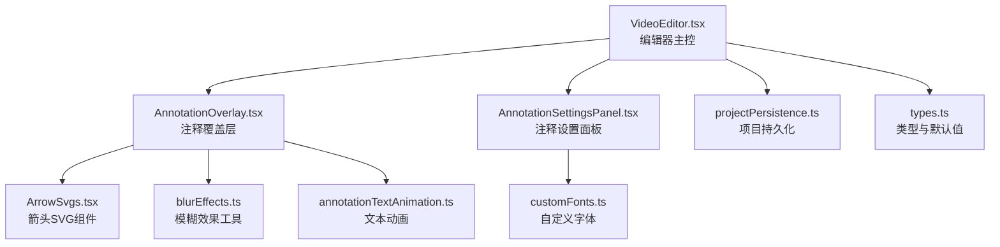
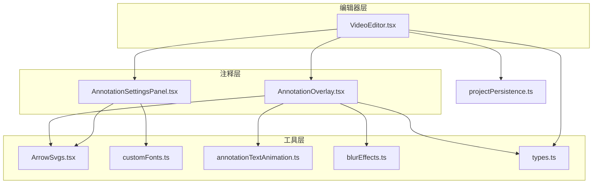
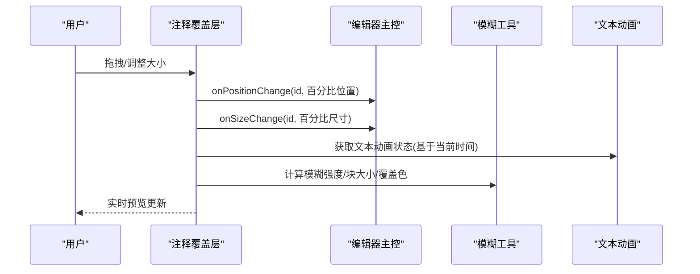
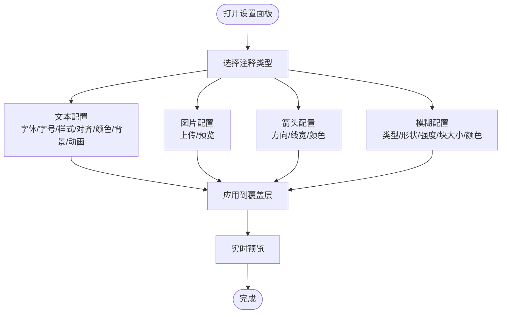
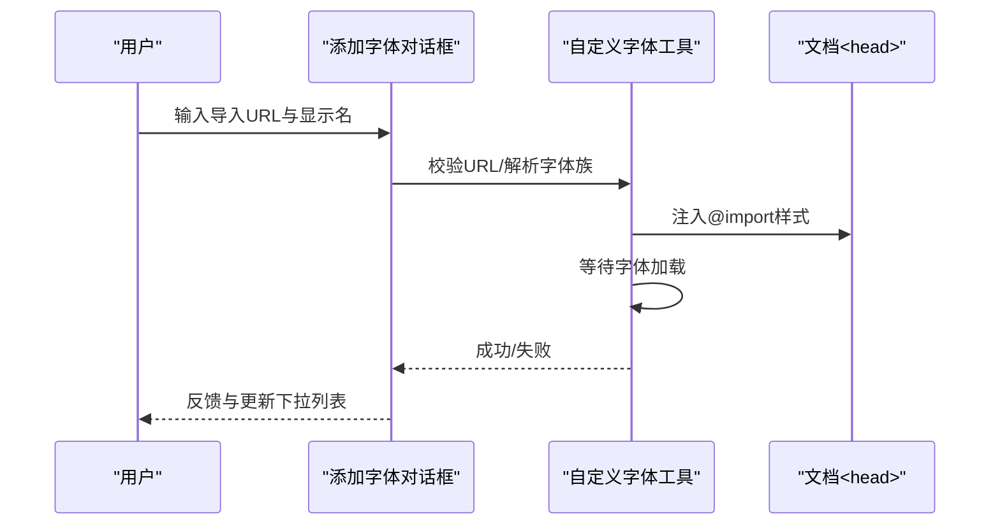
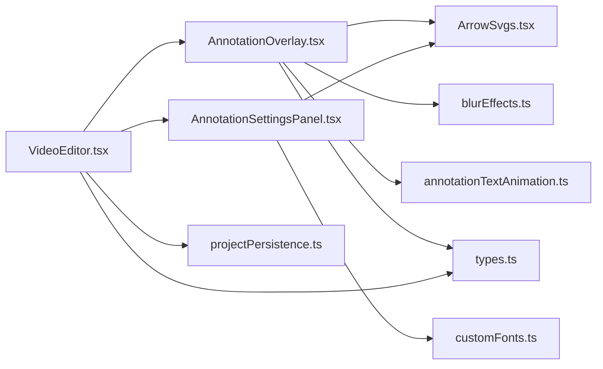

# 注释系统

<cite>
**本文引用的文件**
- [AnnotationOverlay.tsx](file://src/components/video-editor/AnnotationOverlay.tsx)
- [AnnotationSettingsPanel.tsx](file://src/components/video-editor/AnnotationSettingsPanel.tsx)
- [ArrowSvgs.tsx](file://src/components/video-editor/ArrowSvgs.tsx)
- [customFonts.ts](file://src/lib/customFonts.ts)
- [annotationTextAnimation.ts](file://src/lib/annotationTextAnimation.ts)
- [types.ts](file://src/components/video-editor/types.ts)
- [AddCustomFontDialog.tsx](file://src/components/video-editor/AddCustomFontDialog.tsx)
- [blurEffects.ts](file://src/lib/blurEffects.ts)
- [VideoEditor.tsx](file://src/components/video-editor/VideoEditor.tsx)
- [projectPersistence.ts](file://src/components/video-editor/projectPersistence.ts)
</cite>

## 目录
1. [简介](#简介)
2. [项目结构](#项目结构)
3. [核心组件](#核心组件)
4. [架构总览](#架构总览)
5. [详细组件分析](#详细组件分析)
6. [依赖关系分析](#依赖关系分析)
7. [性能考量](#性能考量)
8. [故障排查指南](#故障排查指南)
9. [结论](#结论)
10. [附录](#附录)

## 简介
本文件面向OpenScreen视频编辑器中的注释系统，围绕注释覆盖层（AnnotationOverlay）与注释设置面板（AnnotationSettingsPanel）展开，系统性阐述以下主题：
- 注释覆盖层的Canvas渲染、坐标变换与交互处理
- 注释设置面板：文本编辑、字体选择、颜色配置与动画效果
- 自定义字体添加机制、箭头图标系统与注释样式管理
- 注释的实时预览、保存序列化与加载恢复
- 注释绘制算法、碰撞检测与层级管理
- 性能优化、批量操作与批量删除
- 扩展开发与自定义注释类型的实现指南

## 项目结构
注释系统主要由以下模块构成：
- 视频编辑器主界面：负责注释区域的创建、更新、层级管理与持久化
- 注释覆盖层：基于可拖拽容器渲染各类注释内容，并在自由手绘模糊时进行Canvas采样与像素化
- 注释设置面板：提供文本、图像、箭头与模糊等注释类型的参数配置
- 图标与样式：箭头SVG组件与模糊效果工具函数
- 字体与动画：自定义字体加载与文本动画状态计算
- 类型定义：统一的注释数据结构与默认值

图表来源
- [VideoEditor.tsx](file://src/components/video-editor/VideoEditor.tsx)
- [AnnotationOverlay.tsx](file://src/components/video-editor/AnnotationOverlay.tsx)
- [AnnotationSettingsPanel.tsx](file://src/components/video-editor/AnnotationSettingsPanel.tsx)
- [ArrowSvgs.tsx](file://src/components/video-editor/ArrowSvgs.tsx)
- [blurEffects.ts](file://src/lib/blurEffects.ts)
- [customFonts.ts](file://src/lib/customFonts.ts)
- [annotationTextAnimation.ts](file://src/lib/annotationTextAnimation.ts)
- [projectPersistence.ts](file://src/components/video-editor/projectPersistence.ts)
- [types.ts](file://src/components/video-editor/types.ts)

章节来源
- [VideoEditor.tsx](file://src/components/video-editor/VideoEditor.tsx)
- [AnnotationOverlay.tsx](file://src/components/video-editor/AnnotationOverlay.tsx)
- [AnnotationSettingsPanel.tsx](file://src/components/video-editor/AnnotationSettingsPanel.tsx)
- [ArrowSvgs.tsx](file://src/components/video-editor/ArrowSvgs.tsx)
- [blurEffects.ts](file://src/lib/blurEffects.ts)
- [customFonts.ts](file://src/lib/customFonts.ts)
- [annotationTextAnimation.ts](file://src/lib/annotationTextAnimation.ts)
- [projectPersistence.ts](file://src/components/video-editor/projectPersistence.ts)
- [types.ts](file://src/components/video-editor/types.ts)

## 核心组件
- 注释覆盖层（AnnotationOverlay）
  - 负责根据注释类型渲染文本、图片、箭头与模糊区域；支持拖拽移动与调整大小；在模糊模式下使用Canvas进行像素化采样；自由手绘模糊通过指针事件采样点集并生成路径或裁剪区域。
- 注释设置面板（AnnotationSettingsPanel）
  - 提供注释类型切换（文本/图片/箭头），文本样式（字体、字号、加粗/斜体/下划线、对齐）、颜色与背景、文本动画；图片上传；箭头方向、宽度与颜色；复制与删除。
- 箭头图标系统（ArrowSvgs）
  - 内联SVG箭头组件，覆盖8个方向，便于导出与复用。
- 自定义字体（customFonts）
  - 基于Google Fonts的导入URL，动态注入样式并等待字体加载，存储在本地持久化中，支持移除与批量加载。
- 文本动画（annotationTextAnimation）
  - 定义多种文本动画类型与缓动曲线，计算逐帧动画状态（透明度、缩放、位移、打字机进度）。
- 模糊效果（blurEffects）
  - 规范化模糊强度与块尺寸，生成覆盖色与网格色，提供像素化采样算法（ImageData处理）。
- 类型与默认值（types）
  - 统一的注释区域、样式、模糊数据、箭头方向、文本动画等类型定义与默认值。

章节来源
- [AnnotationOverlay.tsx](file://src/components/video-editor/AnnotationOverlay.tsx)
- [AnnotationSettingsPanel.tsx](file://src/components/video-editor/AnnotationSettingsPanel.tsx)
- [ArrowSvgs.tsx](file://src/components/video-editor/ArrowSvgs.tsx)
- [customFonts.ts](file://src/lib/customFonts.ts)
- [annotationTextAnimation.ts](file://src/lib/annotationTextAnimation.ts)
- [blurEffects.ts](file://src/lib/blurEffects.ts)
- [types.ts](file://src/components/video-editor/types.ts)

## 架构总览
注释系统采用“主控-覆盖层-设置面板-工具库”的分层设计：
- 主控（VideoEditor）维护注释集合与层级，触发渲染与持久化
- 覆盖层（AnnotationOverlay）负责UI呈现与交互，必要时调用工具库
- 设置面板（AnnotationSettingsPanel）负责参数变更与即时预览
- 工具库（ArrowSvgs、customFonts、annotationTextAnimation、blurEffects）提供可复用能力

图表来源
- [VideoEditor.tsx](file://src/components/video-editor/VideoEditor.tsx)
- [AnnotationOverlay.tsx](file://src/components/video-editor/AnnotationOverlay.tsx)
- [AnnotationSettingsPanel.tsx](file://src/components/video-editor/AnnotationSettingsPanel.tsx)
- [ArrowSvgs.tsx](file://src/components/video-editor/ArrowSvgs.tsx)
- [customFonts.ts](file://src/lib/customFonts.ts)
- [annotationTextAnimation.ts](file://src/lib/annotationTextAnimation.ts)
- [blurEffects.ts](file://src/lib/blurEffects.ts)
- [projectPersistence.ts](file://src/components/video-editor/projectPersistence.ts)
- [types.ts](file://src/components/video-editor/types.ts)

## 详细组件分析

### 注释覆盖层（AnnotationOverlay）
- 渲染策略
  - 文本：根据样式与动画状态生成CSS属性，支持打字机裁剪与多态变换
  - 图片：支持data URL直显
  - 箭头：通过ArrowSvgs按方向渲染内联SVG
  - 模糊：矩形/椭圆/自由手绘三种形状；自由手绘通过指针事件采样点集构建路径与裁剪区域；矩形/椭圆通过mask与backdrop-filter实现模糊或像素化叠加
- Canvas像素化流程
  - 计算源画布与目标画布的缩放比例，按块大小对源区域进行降采样，再以像素风格绘制回目标Canvas，叠加网格与半透明覆盖色
- 坐标变换
  - 将百分比位置与尺寸转换为绝对像素，保证在不同容器尺寸下的正确布局
- 交互处理
  - 使用可拖拽容器实现移动与调整大小；在拖拽停止时回调父组件更新百分比位置与尺寸
  - 自由手绘模糊：按下开始采样，移动持续追加点，抬起完成闭合路径并提交数据
- 实时预览
  - 通过当前时间戳驱动文本动画状态；模糊区域随帧版本变化重绘Canvas

图表来源
- [AnnotationOverlay.tsx](file://src/components/video-editor/AnnotationOverlay.tsx)
- [annotationTextAnimation.ts](file://src/lib/annotationTextAnimation.ts)
- [blurEffects.ts](file://src/lib/blurEffects.ts)

章节来源
- [AnnotationOverlay.tsx](file://src/components/video-editor/AnnotationOverlay.tsx)
- [blurEffects.ts](file://src/lib/blurEffects.ts)
- [annotationTextAnimation.ts](file://src/lib/annotationTextAnimation.ts)

### 注释设置面板（AnnotationSettingsPanel）
- 文本注释
  - 内容编辑、字体族与字号、加粗/斜体/下划线、对齐方式
  - 颜色与背景色（支持透明背景）
  - 文本动画选项（淡入、上升、弹出、滑入、打字机、脉冲）
- 图像注释
  - 文件上传（限制图片格式），预览data URL
- 箭头注释
  - 方向选择（8方向）、线宽调节、颜色选择
- 自定义字体
  - 通过对话框输入Google Fonts导入URL与显示名称，自动解析字体族并验证加载，成功后写入本地存储并在应用中可用
- 复制与删除
  - 支持克隆当前注释，或删除注释

图表来源
- [AnnotationSettingsPanel.tsx](file://src/components/video-editor/AnnotationSettingsPanel.tsx)
- [AddCustomFontDialog.tsx](file://src/components/video-editor/AddCustomFontDialog.tsx)
- [customFonts.ts](file://src/lib/customFonts.ts)

章节来源
- [AnnotationSettingsPanel.tsx](file://src/components/video-editor/AnnotationSettingsPanel.tsx)
- [AddCustomFontDialog.tsx](file://src/components/video-editor/AddCustomFontDialog.tsx)
- [customFonts.ts](file://src/lib/customFonts.ts)

### 箭头图标系统（ArrowSvgs）
- 提供8个方向的内联SVG箭头组件，统一滤镜与描边风格，便于在导出与运行时保持一致视觉
- 通过方向枚举映射到具体组件

章节来源
- [ArrowSvgs.tsx](file://src/components/video-editor/ArrowSvgs.tsx)

### 自定义字体添加机制
- 输入校验：URL合法性与字体族提取
- 加载验证：注入style标签并等待字体可用
- 存储与应用：写入localStorage，页面初始化时批量加载

图表来源
- [AddCustomFontDialog.tsx](file://src/components/video-editor/AddCustomFontDialog.tsx)
- [customFonts.ts](file://src/lib/customFonts.ts)

章节来源
- [AddCustomFontDialog.tsx](file://src/components/video-editor/AddCustomFontDialog.tsx)
- [customFonts.ts](file://src/lib/customFonts.ts)

### 注释样式管理与层级
- 样式字段：颜色、背景色、字体、字号、字重、样式、装饰、对齐、动画
- 层级管理：编辑器为每个注释分配zIndex，选中时提升层级确保可编辑；渲染时按zIndex排序

章节来源
- [types.ts](file://src/components/video-editor/types.ts)
- [VideoEditor.tsx](file://src/components/video-editor/VideoEditor.tsx)

### 注释绘制算法、碰撞检测与层级管理
- 绘制算法
  - 文本：基于样式与动画状态生成CSS属性
  - 模糊：矩形/椭圆使用mask与backdrop-filter；自由手绘使用SVG路径与polygon裁剪
  - Canvas像素化：按块大小降采样并填充平均色
- 碰撞检测
  - 当前未见显式的注释间碰撞检测逻辑；注释通过zIndex与指针事件控制交互
- 层级管理
  - 选中注释zIndex提升；渲染时按zIndex升序绘制

章节来源
- [AnnotationOverlay.tsx](file://src/components/video-editor/AnnotationOverlay.tsx)
- [blurEffects.ts](file://src/lib/blurEffects.ts)
- [VideoEditor.tsx](file://src/components/video-editor/VideoEditor.tsx)

### 实时预览、保存与加载恢复
- 实时预览
  - 文本动画：基于当前时间戳与动画时长计算状态
  - 模糊Canvas：依赖帧版本变化重绘
- 保存与加载
  - 项目持久化：统一的版本号与字段规范化，包含注释区域数组
  - 导入时进行字段归一化与边界约束

章节来源
- [annotationTextAnimation.ts](file://src/lib/annotationTextAnimation.ts)
- [AnnotationOverlay.tsx](file://src/components/video-editor/AnnotationOverlay.tsx)
- [projectPersistence.ts](file://src/components/video-editor/projectPersistence.ts)

### 批量操作与批量删除
- 批量复制：设置面板提供复制按钮，编辑器侧可据此生成新注释并分配zIndex
- 批量删除：设置面板提供删除按钮，编辑器侧移除对应注释

章节来源
- [AnnotationSettingsPanel.tsx](file://src/components/video-editor/AnnotationSettingsPanel.tsx)
- [VideoEditor.tsx](file://src/components/video-editor/VideoEditor.tsx)

### 扩展开发与自定义注释类型
- 新增类型步骤
  - 在类型定义中扩展注释类型枚举与默认值
  - 在覆盖层中新增渲染分支与交互逻辑
  - 在设置面板中新增配置项与校验
  - 在持久化与导入流程中进行规范化处理
- 推荐遵循
  - 使用统一的样式接口与默认值
  - 保持交互一致性（拖拽、调整大小、选中高亮）
  - 对Canvas绘制进行性能优化（按需重绘、缩略采样）

章节来源
- [types.ts](file://src/components/video-editor/types.ts)
- [AnnotationOverlay.tsx](file://src/components/video-editor/AnnotationOverlay.tsx)
- [AnnotationSettingsPanel.tsx](file://src/components/video-editor/AnnotationSettingsPanel.tsx)
- [projectPersistence.ts](file://src/components/video-editor/projectPersistence.ts)

## 依赖关系分析
- 组件耦合
  - AnnotationOverlay依赖ArrowSvgs、blurEffects、annotationTextAnimation与types
  - AnnotationSettingsPanel依赖customFonts、ArrowSvgs与types
  - VideoEditor作为主控协调二者并与持久化交互
- 外部依赖
  - Canvas与ImageData用于像素化模糊
  - localStorage用于自定义字体持久化
  - Google Fonts导入URL用于字体加载

图表来源
- [AnnotationOverlay.tsx](file://src/components/video-editor/AnnotationOverlay.tsx)
- [AnnotationSettingsPanel.tsx](file://src/components/video-editor/AnnotationSettingsPanel.tsx)
- [ArrowSvgs.tsx](file://src/components/video-editor/ArrowSvgs.tsx)
- [blurEffects.ts](file://src/lib/blurEffects.ts)
- [annotationTextAnimation.ts](file://src/lib/annotationTextAnimation.ts)
- [customFonts.ts](file://src/lib/customFonts.ts)
- [VideoEditor.tsx](file://src/components/video-editor/VideoEditor.tsx)
- [projectPersistence.ts](file://src/components/video-editor/projectPersistence.ts)
- [types.ts](file://src/components/video-editor/types.ts)

## 性能考量
- Canvas像素化
  - 降采样块大小与绘制尺寸需平衡质量与性能；建议按设备像素比与容器可视区域动态调整
- 文本动画
  - 动画状态计算为纯数学运算，开销较低；避免在高频重排场景中重复计算
- 模糊重绘
  - 仅在帧版本变化或参数变更时重绘Canvas；对自由手绘路径可做采样密度控制
- 字体加载
  - 首次加载耗时较长，建议在应用启动阶段预加载常用字体

## 故障排查指南
- 自定义字体无法显示
  - 检查导入URL是否有效与字体族解析结果；确认浏览器字体加载API可用或等待超时
- 模糊Canvas不生效
  - 确认源画布尺寸与client尺寸非零；检查块大小与缩放比例计算
- 文本动画异常
  - 检查起始时间戳与当前时间差；确认动画类型与缓动函数
- 注释层级错乱
  - 确认zIndex分配逻辑与选中提升策略；渲染时按zIndex排序

章节来源
- [customFonts.ts](file://src/lib/customFonts.ts)
- [blurEffects.ts](file://src/lib/blurEffects.ts)
- [annotationTextAnimation.ts](file://src/lib/annotationTextAnimation.ts)
- [VideoEditor.tsx](file://src/components/video-editor/VideoEditor.tsx)

## 结论
OpenScreen的注释系统通过清晰的分层设计实现了高质量的注释体验：覆盖层负责渲染与交互，设置面板提供丰富的样式与动画配置，工具库支撑字体与模糊等关键能力。系统在实时预览、持久化与扩展性方面具备良好基础，建议在大规模注释场景中进一步引入碰撞检测与更精细的Canvas优化策略。

## 附录
- 关键API与数据流
  - 注释区域：包含类型、内容、样式、位置、尺寸、zIndex与特定类型数据（箭头/模糊）
  - 默认值：集中于类型定义文件，确保一致性
  - 导出/导入：项目持久化模块负责版本与字段规范化

章节来源
- [types.ts](file://src/components/video-editor/types.ts)
- [projectPersistence.ts](file://src/components/video-editor/projectPersistence.ts)