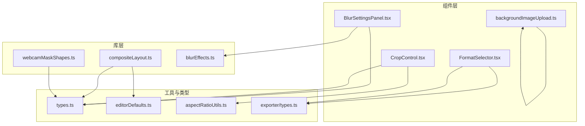
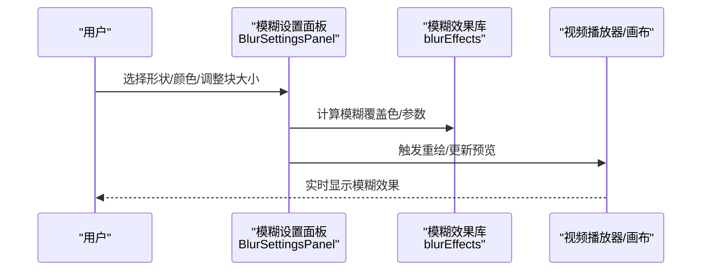
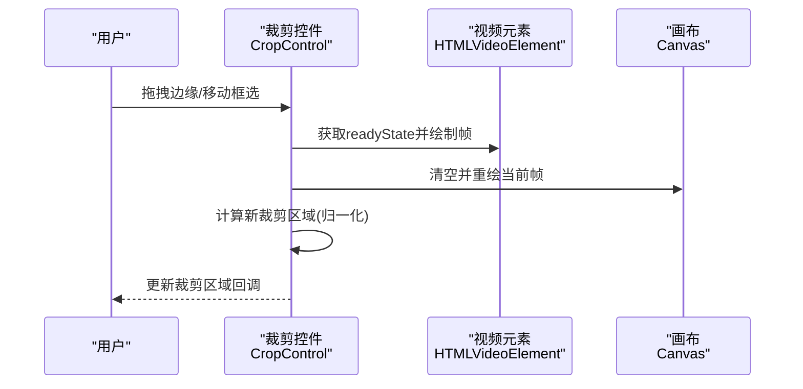
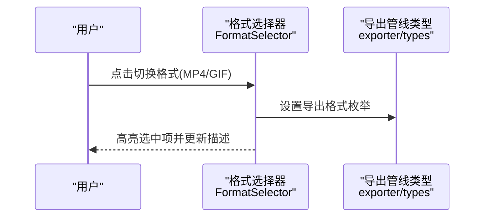
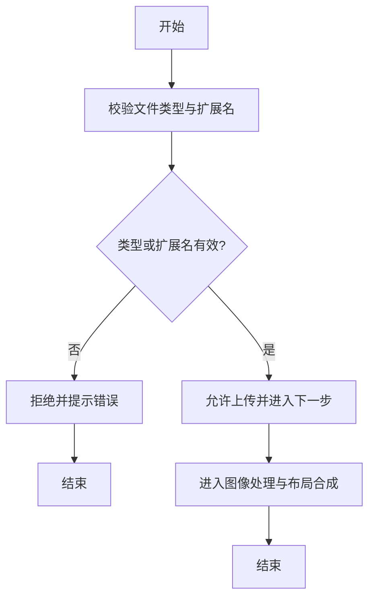
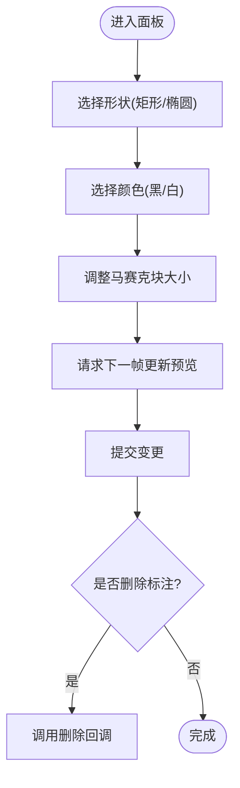
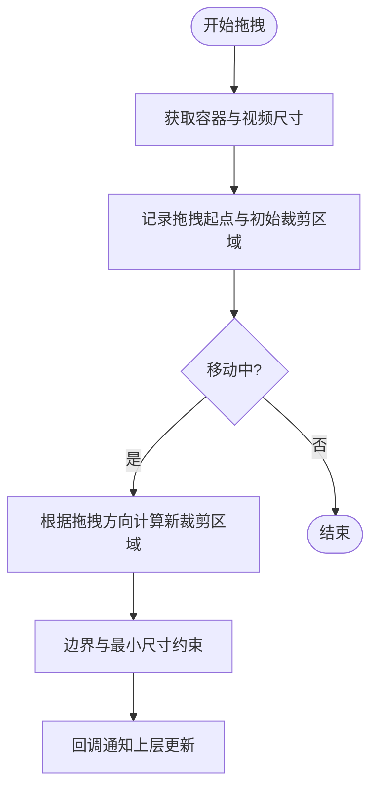
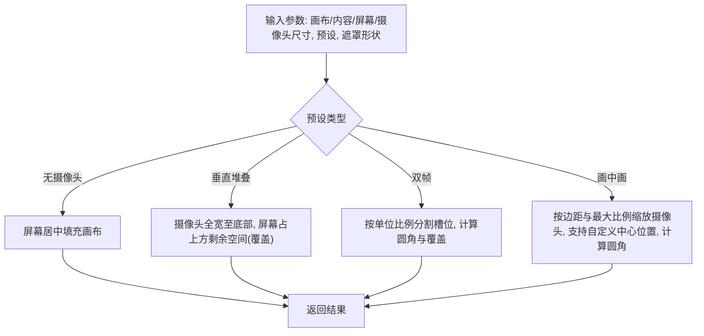
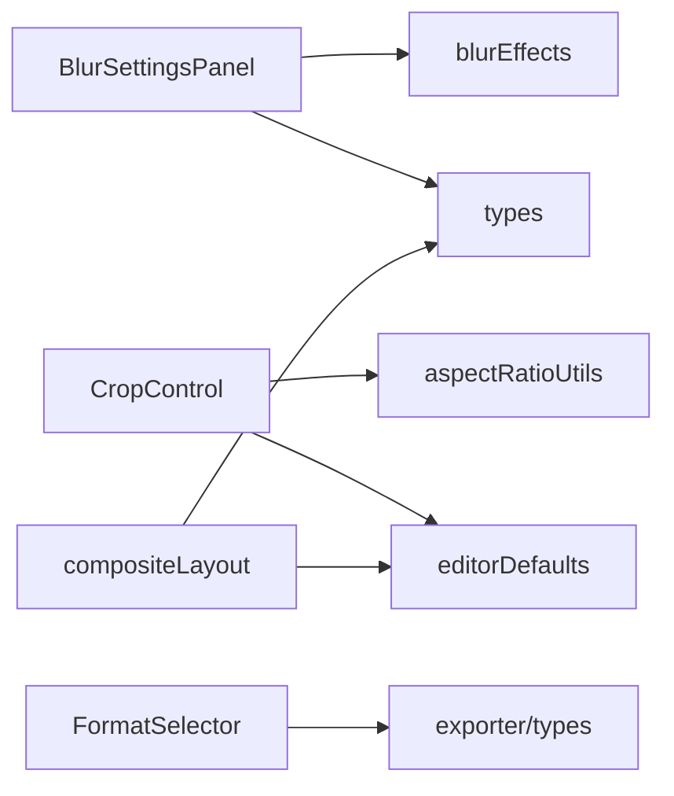

# 视觉效果系统

<cite>
**本文引用的文件**
- [BlurSettingsPanel.tsx](file://src/components/video-editor/BlurSettingsPanel.tsx)
- [CropControl.tsx](file://src/components/video-editor/CropControl.tsx)
- [FormatSelector.tsx](file://src/components/video-editor/FormatSelector.tsx)
- [backgroundImageUpload.ts](file://src/components/video-editor/backgroundImageUpload.ts)
- [compositeLayout.ts](file://src/lib/compositeLayout.ts)
- [webcamMaskShapes.ts](file://src/lib/webcamMaskShapes.ts)
- [types.ts](file://src/components/video-editor/types.ts)
- [editorDefaults.ts](file://src/components/video-editor/editorDefaults.ts)
- [aspectRatioUtils.ts](file://src/utils/aspectRatioUtils.ts)
- [blurEffects.ts](file://src/lib/blurEffects.ts)
- [exporter/types.ts](file://src/lib/exporter/types.ts)
</cite>

## 目录
1. [简介](#简介)
2. [项目结构](#项目结构)
3. [核心组件](#核心组件)
4. [架构总览](#架构总览)
5. [详细组件分析](#详细组件分析)
6. [依赖关系分析](#依赖关系分析)
7. [性能考虑](#性能考虑)
8. [故障排查指南](#故障排查指南)
9. [结论](#结论)
10. [附录](#附录)

## 简介
本文件面向OpenScreen的视频编辑与导出子系统，聚焦“视觉效果”能力，覆盖以下主题：
- 模糊效果设置面板：高斯模糊算法、实时预览与参数调节（马赛克模糊）。
- 裁剪控件：比例锁定、自由裁剪与预设尺寸。
- 格式选择器：输出格式配置与质量设置入口。
- 背景图像上传机制：类型校验、图像处理与布局合成。
- 复合布局系统：屏幕与摄像头叠加、遮罩形状与视觉元素组合。
- 实时渲染、性能优化与GPU加速利用策略。
- 扩展开发与自定义效果类型的实现指南。

## 项目结构
视觉效果相关代码主要分布在两个区域：
- 组件层（UI与交互）：位于 src/components/video-editor 下，包含模糊设置面板、裁剪控件、格式选择器、背景图上传工具等。
- 库层（算法与布局）：位于 src/lib 下，包含复合布局计算、遮罩形状、模糊效果辅助等。

图表来源
- [BlurSettingsPanel.tsx:1-194](file://src/components/video-editor/BlurSettingsPanel.tsx#L1-L194)
- [CropControl.tsx:1-254](file://src/components/video-editor/CropControl.tsx#L1-L254)
- [FormatSelector.tsx:1-70](file://src/components/video-editor/FormatSelector.tsx#L1-L70)
- [backgroundImageUpload.ts:1-21](file://src/components/video-editor/backgroundImageUpload.ts#L1-L21)
- [compositeLayout.ts:1-429](file://src/lib/compositeLayout.ts#L1-L429)
- [webcamMaskShapes.ts](file://src/lib/webcamMaskShapes.ts)
- [types.ts](file://src/components/video-editor/types.ts)
- [editorDefaults.ts](file://src/components/video-editor/editorDefaults.ts)
- [aspectRatioUtils.ts](file://src/utils/aspectRatioUtils.ts)
- [exporter/types.ts](file://src/lib/exporter/types.ts)

章节来源
- [BlurSettingsPanel.tsx:1-194](file://src/components/video-editor/BlurSettingsPanel.tsx#L1-L194)
- [CropControl.tsx:1-254](file://src/components/video-editor/CropControl.tsx#L1-L254)
- [FormatSelector.tsx:1-70](file://src/components/video-editor/FormatSelector.tsx#L1-L70)
- [backgroundImageUpload.ts:1-21](file://src/components/video-editor/backgroundImageUpload.ts#L1-L21)
- [compositeLayout.ts:1-429](file://src/lib/compositeLayout.ts#L1-L429)

## 核心组件
- 模糊设置面板：提供模糊类型（马赛克）、形状（矩形/椭圆）、颜色（黑/白）与马赛克块大小滑条，并支持删除标注。
- 裁剪控件：基于Canvas绘制视频帧，使用SVG遮罩与拖拽手柄实现自由裁剪；支持移动与四边拖拽调整。
- 格式选择器：在MP4与GIF之间切换，提供标签与描述文本。
- 背景图像上传：限制图片类型与扩展名，提供accept字符串与类型判断函数。
- 复合布局：根据画布、内容尺寸、屏幕尺寸、摄像头尺寸与布局预设，计算屏幕与摄像头的矩形位置、圆角与遮罩形状。

章节来源
- [BlurSettingsPanel.tsx:18-194](file://src/components/video-editor/BlurSettingsPanel.tsx#L18-L194)
- [CropControl.tsx:13-254](file://src/components/video-editor/CropControl.tsx#L13-L254)
- [FormatSelector.tsx:6-70](file://src/components/video-editor/FormatSelector.tsx#L6-L70)
- [backgroundImageUpload.ts:1-21](file://src/components/video-editor/backgroundImageUpload.ts#L1-L21)
- [compositeLayout.ts:66-388](file://src/lib/compositeLayout.ts#L66-L388)

## 架构总览
视觉效果系统的数据流与控制流如下：

图表来源
- [BlurSettingsPanel.tsx:33-179](file://src/components/video-editor/BlurSettingsPanel.tsx#L33-L179)
- [blurEffects.ts](file://src/lib/blurEffects.ts)

图表来源
- [CropControl.tsx:29-122](file://src/components/video-editor/CropControl.tsx#L29-L122)

图表来源
- [FormatSelector.tsx:12-67](file://src/components/video-editor/FormatSelector.tsx#L12-L67)
- [exporter/types.ts](file://src/lib/exporter/types.ts)

图表来源
- [backgroundImageUpload.ts:6-20](file://src/components/video-editor/backgroundImageUpload.ts#L6-L20)

## 详细组件分析

### 模糊设置面板
- 功能要点
  - 形状选择：矩形与椭圆两种马赛克形状。
  - 颜色选择：黑/白两种覆盖色。
  - 参数调节：马赛克块大小滑条，范围由常量约束。
  - 实时预览：每次变更通过requestAnimationFrame触发提交，确保UI流畅。
  - 删除标注：提供删除按钮，便于撤销操作。
- 数据模型
  - 使用注解区域中的模糊数据结构，包含类型、形状、颜色与块大小等字段。
  - 默认值与边界值由类型文件提供，保证参数合法性。
- 算法与实现
  - 颜色计算：通过模糊效果库函数生成覆盖色，用于UI展示与实际渲染。
  - 参数提交：滑条变更后立即更新状态并在下一帧提交，避免频繁重绘。
- 性能与体验
  - 使用CSS类与内联样式控制高亮态，减少不必要的重排。
  - 滑条使用统一配色，提升一致性与可访问性。

图表来源
- [BlurSettingsPanel.tsx:33-179](file://src/components/video-editor/BlurSettingsPanel.tsx#L33-L179)
- [blurEffects.ts](file://src/lib/blurEffects.ts)

章节来源
- [BlurSettingsPanel.tsx:18-194](file://src/components/video-editor/BlurSettingsPanel.tsx#L18-L194)
- [types.ts](file://src/components/video-editor/types.ts)

### 裁剪控件
- 功能要点
  - 自由裁剪：支持上下左右四条边与整体移动拖拽。
  - 边界约束：防止裁剪区域越界，最小尺寸限制为10%。
  - 实时预览：基于Canvas绘制视频帧，SVG遮罩实现半透明蒙版。
  - 比例锁定：当前实现为自由裁剪，未内置比例锁定逻辑；可通过外部逻辑在调用方处追加比例约束。
- 交互流程
  - 捕获指针事件，记录初始状态与起始点。
  - 根据拖拽方向计算新的裁剪区域，归一化到[0,1]区间。
  - 回调通知上层更新裁剪区域。
- 布局与渲染
  - Canvas绘制视频帧，SVG遮罩实现非裁剪区域的暗化。
  - 四个拖拽手柄与移动区域使用绝对定位与指针光标提示。

图表来源
- [CropControl.tsx:57-122](file://src/components/video-editor/CropControl.tsx#L57-L122)

章节来源
- [CropControl.tsx:13-254](file://src/components/video-editor/CropControl.tsx#L13-L254)
- [aspectRatioUtils.ts](file://src/utils/aspectRatioUtils.ts)
- [editorDefaults.ts](file://src/components/video-editor/editorDefaults.ts)

### 格式选择器
- 功能要点
  - 在MP4与GIF之间切换，提供图标与文案描述。
  - 支持禁用状态，避免在不合适的场景下误操作。
  - 选中态以高亮样式与小圆点标识。
- 类型与国际化
  - 导出格式类型来自导出库类型定义，确保与导出管线一致。
  - 文案通过作用域翻译上下文加载，支持多语言。

章节来源
- [FormatSelector.tsx:6-70](file://src/components/video-editor/FormatSelector.tsx#L6-L70)
- [exporter/types.ts](file://src/lib/exporter/types.ts)

### 背景图像上传
- 功能要点
  - 类型校验：支持JPEG/JPG/PNG类型与对应扩展名。
  - accept字符串：用于文件输入控件的过滤。
  - 判断逻辑：优先按MIME类型匹配，若为空则回退到文件名扩展名校验。
- 使用建议
  - 在表单中结合accept属性与前端校验，提升用户体验。
  - 对于大图建议在上传前进行压缩或尺寸限制，降低后续合成开销。

章节来源
- [backgroundImageUpload.ts:1-21](file://src/components/video-editor/backgroundImageUpload.ts#L1-L21)

### 复合布局系统
- 功能要点
  - 屏幕与摄像头的布局预设：画中画、垂直堆叠、双帧、无摄像头。
  - 尺寸与位置计算：根据画布、内容最大尺寸、屏幕与摄像头尺寸，计算矩形位置、宽高与圆角。
  - 遮罩形状：支持矩形、圆角、圆形等，结合预设阴影与边框半径规则。
  - 覆盖模式：在某些布局下对屏幕内容采用覆盖模式，可能裁切溢出。
- 关键算法
  - 中心化算法：将内容居中于画布，同时受最大尺寸约束。
  - 几何均值缩放：以宽高几何均值作为参考维度，使摄像头占比在横竖屏下保持一致视觉比例。
  - 分割槽位：在双帧布局中按单位比例分配屏幕与摄像头槽位宽度。
- 数据结构
  - 布局预设定义包含变换规则、圆角规则与阴影配置。
  - 复合布局返回屏幕与摄像头矩形，以及可选的屏幕覆盖标志。

图表来源
- [compositeLayout.ts:172-388](file://src/lib/compositeLayout.ts#L172-L388)

章节来源
- [compositeLayout.ts:1-429](file://src/lib/compositeLayout.ts#L1-L429)
- [types.ts](file://src/components/video-editor/types.ts)

## 依赖关系分析
- 组件与库的耦合
  - 模糊设置面板依赖模糊效果库与类型定义，确保参数合法与渲染一致。
  - 裁剪控件依赖视频尺寸工具与默认尺寸，保证在视频未就绪时也能正常渲染。
  - 格式选择器依赖导出类型定义，确保与导出管线一致。
  - 复合布局依赖类型定义与默认参数，形成稳定的布局契约。
- 外部依赖
  - UI组件库：滑条、按钮等基础控件。
  - SVG与Canvas：用于遮罩与实时绘制。
  - 国际化上下文：提供文案与描述文本。

图表来源
- [BlurSettingsPanel.tsx:1-194](file://src/components/video-editor/BlurSettingsPanel.tsx#L1-L194)
- [CropControl.tsx:1-254](file://src/components/video-editor/CropControl.tsx#L1-L254)
- [FormatSelector.tsx:1-70](file://src/components/video-editor/FormatSelector.tsx#L1-L70)
- [compositeLayout.ts:1-429](file://src/lib/compositeLayout.ts#L1-L429)
- [types.ts](file://src/components/video-editor/types.ts)
- [editorDefaults.ts](file://src/components/video-editor/editorDefaults.ts)
- [aspectRatioUtils.ts](file://src/utils/aspectRatioUtils.ts)
- [exporter/types.ts](file://src/lib/exporter/types.ts)

章节来源
- [BlurSettingsPanel.tsx:1-194](file://src/components/video-editor/BlurSettingsPanel.tsx#L1-L194)
- [CropControl.tsx:1-254](file://src/components/video-editor/CropControl.tsx#L1-L254)
- [FormatSelector.tsx:1-70](file://src/components/video-editor/FormatSelector.tsx#L1-L70)
- [compositeLayout.ts:1-429](file://src/lib/compositeLayout.ts#L1-L429)

## 性能考虑
- 实时渲染
  - 模糊设置面板通过requestAnimationFrame触发提交，避免高频重绘导致掉帧。
  - 裁剪控件在每帧绘制视频帧，建议在视频readyState满足条件后再进行绘制，减少无效绘制。
- GPU加速与合成
  - 使用CSS滤镜与SVG遮罩时，尽量避免复杂重叠与频繁重排，减少合成成本。
  - Canvas绘制建议在必要时才清空与重绘，使用will-change与transform优化。
- 图像与布局
  - 背景图像上传建议在前端做尺寸与体积限制，降低合成阶段的内存与带宽压力。
  - 复合布局采用几何均值缩放与槽位分配，平衡不同设备与横竖屏下的视觉一致性。
- 导出与格式
  - MP4与GIF的导出路径不同，建议在UI层面明确质量与体积预期，避免用户选择不当导致失败或低效。

## 故障排查指南
- 模糊设置面板无响应
  - 检查onBlurDataChange与onBlurDataCommit回调是否正确传递。
  - 确认默认值与边界值常量未被意外覆盖。
- 裁剪区域异常
  - 确保传入的视频元素已就绪且尺寸有效。
  - 检查容器尺寸与视频宽高比，避免因容器过小导致裁剪区域被强制约束。
- 格式选择无效
  - 确认导出格式枚举与导出管线一致，避免类型不匹配。
- 背景图像无法上传
  - 检查文件类型与扩展名是否符合支持列表。
  - 确认accept属性与前端校验逻辑一致。
- 复合布局错位
  - 检查画布尺寸、内容最大尺寸与屏幕/摄像头尺寸是否有效。
  - 确认布局预设与遮罩形状参数是否合理。

章节来源
- [BlurSettingsPanel.tsx:18-194](file://src/components/video-editor/BlurSettingsPanel.tsx#L18-L194)
- [CropControl.tsx:29-122](file://src/components/video-editor/CropControl.tsx#L29-L122)
- [FormatSelector.tsx:6-70](file://src/components/video-editor/FormatSelector.tsx#L6-L70)
- [backgroundImageUpload.ts:1-21](file://src/components/video-editor/backgroundImageUpload.ts#L1-L21)
- [compositeLayout.ts:172-388](file://src/lib/compositeLayout.ts#L172-L388)

## 结论
OpenScreen的视觉效果系统围绕“模糊设置面板、裁剪控件、格式选择器、背景图像上传与复合布局”构建，具备良好的模块化与可扩展性。通过合理的参数约束、实时渲染策略与布局算法，系统在保证交互流畅的同时，提供了多样化的视觉效果与导出选项。后续可在比例锁定、遮罩形状扩展与GPU加速方面进一步优化与增强。

## 附录
- 开发与扩展建议
  - 新增遮罩形状：在类型定义中扩展形状枚举，并在复合布局与遮罩计算中增加分支处理。
  - 新增导出格式：在导出类型定义中添加新格式，并在格式选择器中注册选项与文案。
  - 性能优化：对Canvas绘制与SVG遮罩进行节流与批处理，结合WebGL/WebGPU进行GPU加速尝试。
  - 可访问性：为拖拽手柄与滑条提供键盘导航与ARIA标签，提升可访问性。