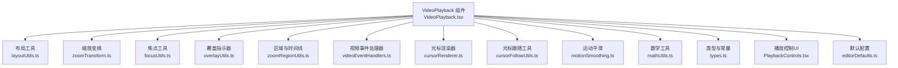
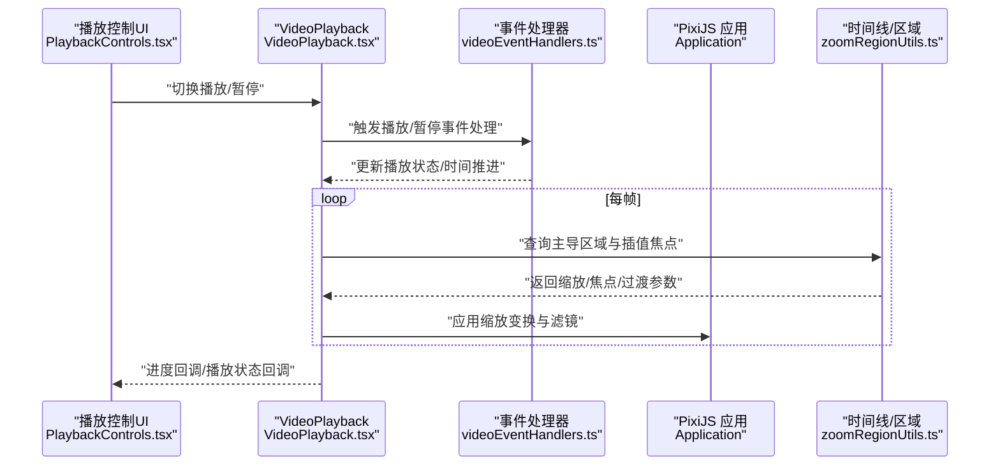
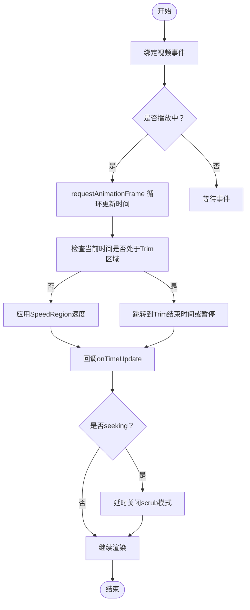
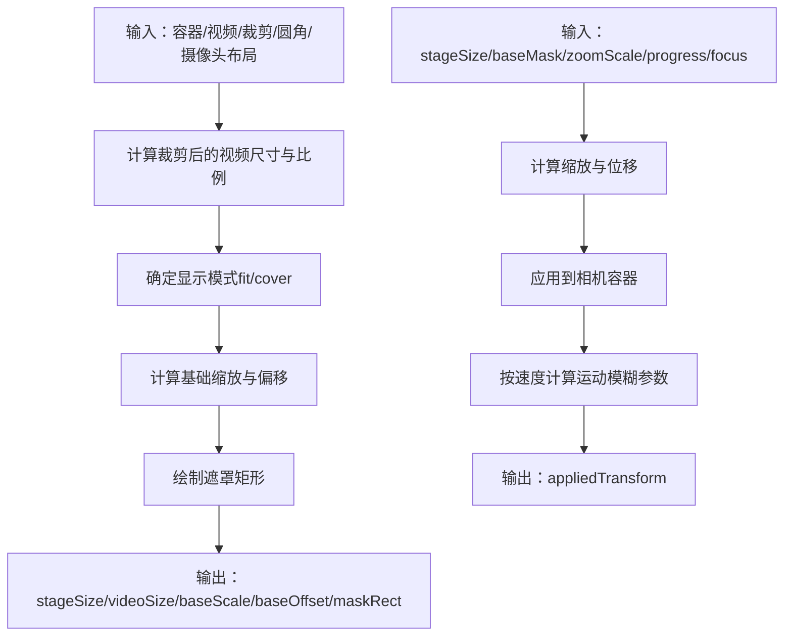
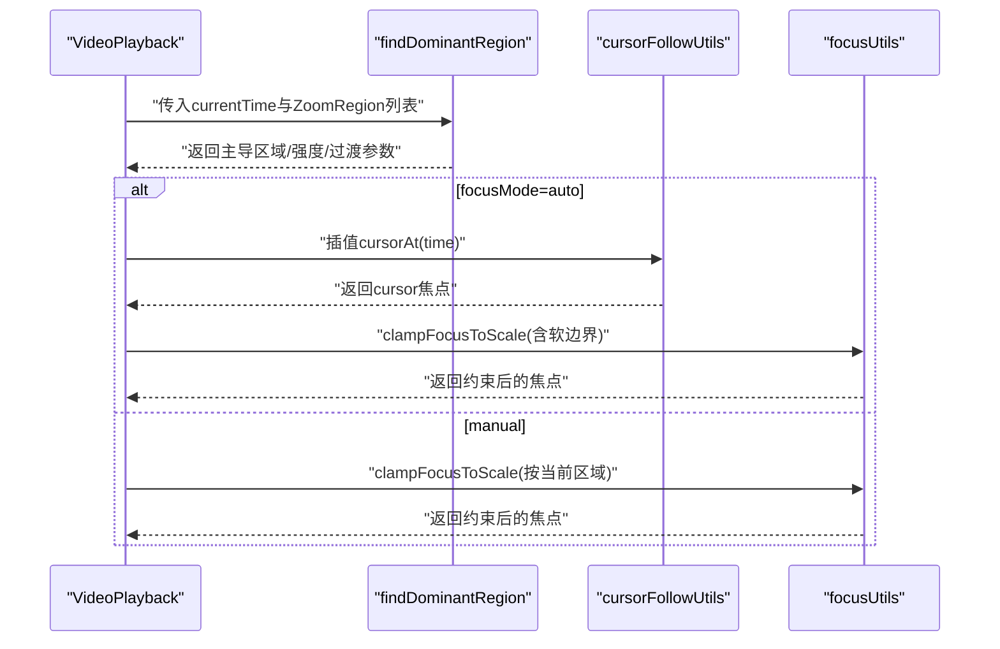
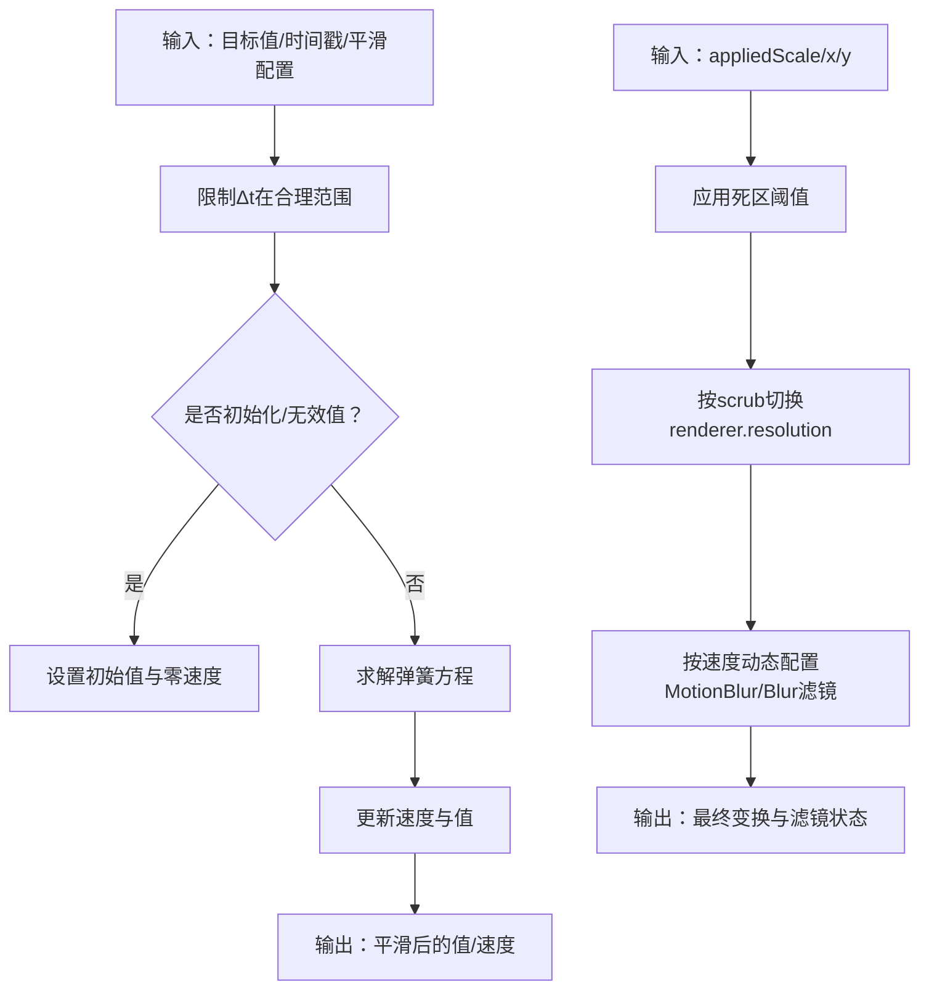
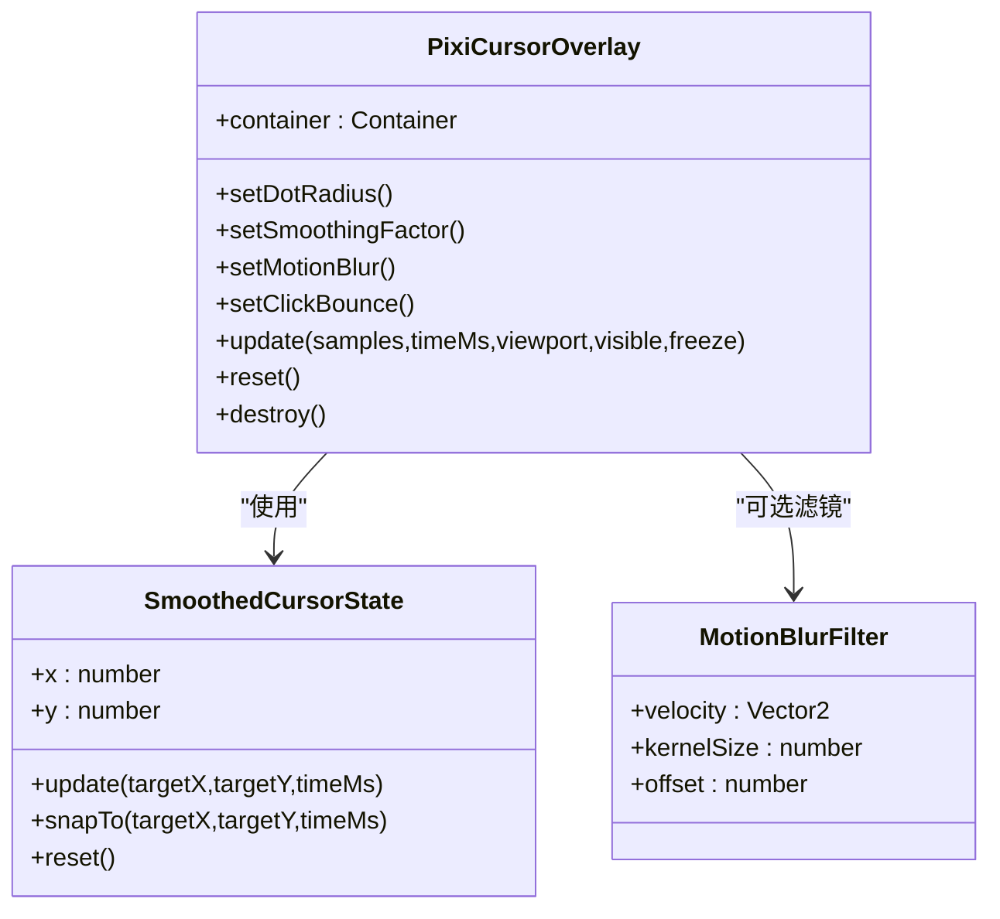
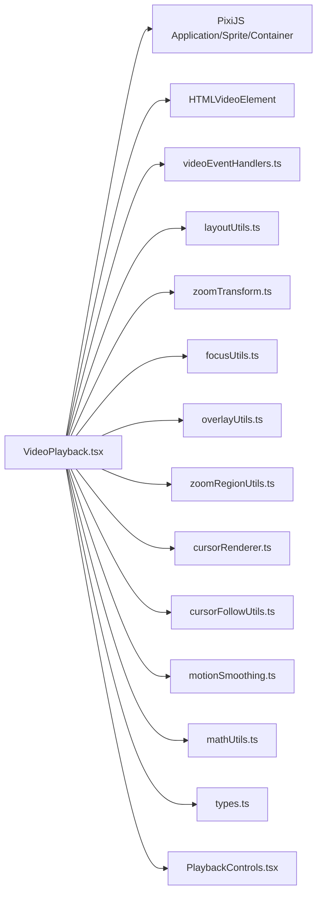

# 视频播放器

<cite>
**本文引用的文件**
- [VideoPlayback.tsx](file://src/components/video-editor/VideoPlayback.tsx)
- [index.ts](file://src/components/video-editor/videoPlayback/index.ts)
- [constants.ts](file://src/components/video-editor/videoPlayback/constants.ts)
- [layoutUtils.ts](file://src/components/video-editor/videoPlayback/layoutUtils.ts)
- [motionSmoothing.ts](file://src/components/video-editor/videoPlayback/motionSmoothing.ts)
- [zoomTransform.ts](file://src/components/video-editor/videoPlayback/zoomTransform.ts)
- [zoomRegionUtils.ts](file://src/components/video-editor/videoPlayback/zoomRegionUtils.ts)
- [focusUtils.ts](file://src/components/video-editor/videoPlayback/focusUtils.ts)
- [overlayUtils.ts](file://src/components/video-editor/videoPlayback/overlayUtils.ts)
- [videoEventHandlers.ts](file://src/components/video-editor/videoPlayback/videoEventHandlers.ts)
- [cursorRenderer.ts](file://src/components/video-editor/videoPlayback/cursorRenderer.ts)
- [cursorFollowUtils.ts](file://src/components/video-editor/videoPlayback/cursorFollowUtils.ts)
- [mathUtils.ts](file://src/components/video-editor/videoPlayback/mathUtils.ts)
- [uploadedCursorAssets.ts](file://src/components/video-editor/videoPlayback/uploadedCursorAssets.ts)
- [types.ts](file://src/components/video-editor/types.ts)
- [PlaybackControls.tsx](file://src/components/video-editor/PlaybackControls.tsx)
- [editorDefaults.ts](file://src/components/video-editor/editorDefaults.ts)
</cite>

## 目录
1. [简介](#简介)
2. [项目结构](#项目结构)
3. [核心组件](#核心组件)
4. [架构总览](#架构总览)
5. [详细组件分析](#详细组件分析)
6. [依赖关系分析](#依赖关系分析)
7. [性能考量](#性能考量)
8. [故障排查指南](#故障排查指南)
9. [结论](#结论)
10. [附录](#附录)

## 简介
本文件面向OpenScreen视频编辑器中的VideoPlayback组件，系统性阐述其播放内核、渲染管线、事件处理机制与交互控制。内容覆盖播放控制（播放/暂停、快进/快退、循环播放与播放速度调节）、布局计算与缩放变换、焦点管理算法、运动平滑与缩放区域跟踪、实时渲染优化、与时间线的同步机制、进度回调与状态更新，以及性能监控、内存管理与GPU加速利用，并提供扩展开发与自定义播放行为的实践指南。

## 项目结构
VideoPlayback位于视频编辑器子模块中，围绕PixiJS构建2D渲染与滤镜管线，结合HTMLVideoElement进行媒体播放与事件驱动，同时集成光标轨迹渲染与原生光标预览能力。关键目录与职责如下：
- 组件层：VideoPlayback.tsx负责生命周期、事件绑定、Ticker驱动、渲染与UI交互
- 渲染工具：layoutUtils.ts、zoomTransform.ts、overlayUtils.ts、focusUtils.ts、mathUtils.ts
- 时间线与区域：zoomRegionUtils.ts、types.ts
- 光标与运动平滑：cursorRenderer.ts、cursorFollowUtils.ts、motionSmoothing.ts、uploadedCursorAssets.ts
- 事件与播放控制：videoEventHandlers.ts、PlaybackControls.tsx
- 常量与默认值：constants.ts、editorDefaults.ts

图表来源
- [VideoPlayback.tsx:1-2127](file://src/components/video-editor/VideoPlayback.tsx#L1-L2127)
- [layoutUtils.ts:1-160](file://src/components/video-editor/videoPlayback/layoutUtils.ts#L1-L160)
- [zoomTransform.ts:1-252](file://src/components/video-editor/videoPlayback/zoomTransform.ts#L1-L252)
- [focusUtils.ts:1-141](file://src/components/video-editor/videoPlayback/focusUtils.ts#L1-L141)
- [overlayUtils.ts:1-65](file://src/components/video-editor/videoPlayback/overlayUtils.ts#L1-L65)
- [zoomRegionUtils.ts:1-354](file://src/components/video-editor/videoPlayback/zoomRegionUtils.ts#L1-L354)
- [videoEventHandlers.ts:1-188](file://src/components/video-editor/videoPlayback/videoEventHandlers.ts#L1-L188)
- [cursorRenderer.ts:1-769](file://src/components/video-editor/videoPlayback/cursorRenderer.ts#L1-L769)
- [cursorFollowUtils.ts:1-74](file://src/components/video-editor/videoPlayback/cursorFollowUtils.ts#L1-L74)
- [motionSmoothing.ts:1-150](file://src/components/video-editor/videoPlayback/motionSmoothing.ts#L1-L150)
- [mathUtils.ts:1-87](file://src/components/video-editor/videoPlayback/mathUtils.ts#L1-L87)
- [types.ts:1-439](file://src/components/video-editor/types.ts#L1-L439)
- [PlaybackControls.tsx:1-112](file://src/components/video-editor/PlaybackControls.tsx#L1-L112)
- [editorDefaults.ts:1-98](file://src/components/video-editor/editorDefaults.ts#L1-L98)

章节来源
- [VideoPlayback.tsx:1-2127](file://src/components/video-editor/VideoPlayback.tsx#L1-L2127)

## 核心组件
- 播放内核与事件驱动：基于HTMLVideoElement与自定义事件处理器，实现播放/暂停、拖拽/拖动（scrub）与时间推进的统一调度；支持Trim区域跳过与SpeedRegion速度调节。
- 渲染管线：PixiJS Application承载Stage/Camera/VideoContainer/Mask/Graphics，使用Blur与MotionBlur滤镜实现动态模糊；Ticker每帧根据时间线区域计算目标缩放与焦点，应用到相机容器。
- 布局与裁剪：layoutUtils.ts根据容器尺寸、视频原始尺寸、裁剪区域、圆角与边距等参数，计算视频显示尺寸、位置与遮罩矩形。
- 缩放与焦点：zoomTransform.ts提供缩放变换与焦点反推；focusUtils.ts提供边界约束与软边界；zoomRegionUtils.ts解析时间线区域并插值焦点与缩放。
- 光标与预览：cursorRenderer.ts管理光标纹理、平滑与运动模糊；支持系统光标与上传光标资产；与原生光标录制数据联动。
- 用户交互：Overlay指示器可视化缩放窗口；拖拽焦点、PiP摄像头拖拽；播放控制UI提供播放/暂停与进度条。

章节来源
- [VideoPlayback.tsx:224-660](file://src/components/video-editor/VideoPlayback.tsx#L224-L660)
- [videoEventHandlers.ts:25-187](file://src/components/video-editor/videoPlayback/videoEventHandlers.ts#L25-L187)
- [zoomTransform.ts:75-251](file://src/components/video-editor/videoPlayback/zoomTransform.ts#L75-L251)
- [layoutUtils.ts:40-159](file://src/components/video-editor/videoPlayback/layoutUtils.ts#L40-L159)
- [cursorRenderer.ts:505-727](file://src/components/video-editor/videoPlayback/cursorRenderer.ts#L505-L727)

## 架构总览
VideoPlayback采用“事件驱动 + Ticker驱动”的双通道架构：
- 事件通道：HTMLVideoElement事件（play/pause/seeked/seeking/ended）经videoEventHandlers统一处理，维护播放状态、时间推进与Trim/Speed区域生效。
- 渲染通道：PixiJS Ticker每帧查询当前时间线主导区域，计算目标缩放、焦点与过渡，应用到相机容器并更新滤镜参数；同时渲染光标与原生光标预览。

图表来源
- [PlaybackControls.tsx:16-112](file://src/components/video-editor/PlaybackControls.tsx#L16-L112)
- [VideoPlayback.tsx:1207-1269](file://src/components/video-editor/VideoPlayback.tsx#L1207-L1269)
- [videoEventHandlers.ts:73-100](file://src/components/video-editor/videoPlayback/videoEventHandlers.ts#L73-L100)
- [zoomRegionUtils.ts:285-353](file://src/components/video-editor/videoPlayback/zoomRegionUtils.ts#L285-L353)

## 详细组件分析

### 播放内核与事件处理机制
- 事件绑定：在视频元素上注册play/pause/seeked/seeking/ended事件，通过createVideoEventHandlers生成处理函数，集中管理播放状态、时间推进、Trim跳过与Speed调节。
- 拖拽/拖动（scrub）：seeking时标记isSeeking，阻止自动播放；seeked后延迟关闭scrub模式，避免频繁闪烁；同时处理进入Trim区域时的跳过逻辑。
- 速度调节：根据当前时间定位SpeedRegion，设置video.playbackRate；补充音频同步播放速率。
- 持续时间解析：通过静默播放与duration/timeupdate监听，解决部分容器无法直接获取duration的问题。

图表来源
- [videoEventHandlers.ts:25-187](file://src/components/video-editor/videoPlayback/videoEventHandlers.ts#L25-L187)
- [VideoPlayback.tsx:1119-1147](file://src/components/video-editor/VideoPlayback.tsx#L1119-L1147)

章节来源
- [videoEventHandlers.ts:25-187](file://src/components/video-editor/videoPlayback/videoEventHandlers.ts#L25-L187)
- [VideoPlayback.tsx:1119-1147](file://src/components/video-editor/VideoPlayback.tsx#L1119-L1147)

### 布局计算与缩放变换
- 布局策略：根据容器尺寸、视频原始尺寸、裁剪区域、圆角、边距与摄像头布局，计算视频显示尺寸、位置与遮罩矩形；支持cover与fit两种模式。
- 缩放与焦点：computeZoomTransform将stage坐标系下的焦点映射为最终缩放与位移；applyZoomTransform将结果应用到相机容器，并按帧速率计算运动模糊强度与方向。
- 边界约束：clampFocusToScale与softenFocusToScale确保焦点在有效范围内，避免越界；stageFocusToVideoSpace用于坐标空间转换。

图表来源
- [layoutUtils.ts:40-159](file://src/components/video-editor/videoPlayback/layoutUtils.ts#L40-L159)
- [zoomTransform.ts:75-251](file://src/components/video-editor/videoPlayback/zoomTransform.ts#L75-L251)
- [focusUtils.ts:75-141](file://src/components/video-editor/videoPlayback/focusUtils.ts#L75-L141)

章节来源
- [layoutUtils.ts:40-159](file://src/components/video-editor/videoPlayback/layoutUtils.ts#L40-L159)
- [zoomTransform.ts:75-251](file://src/components/video-editor/videoPlayback/zoomTransform.ts#L75-L251)
- [focusUtils.ts:75-141](file://src/components/video-editor/videoPlayback/focusUtils.ts#L75-L141)

### 时间线同步与焦点管理
- 主导区域查找：findDominantRegion遍历ZoomRegion，计算区域强度与连接过渡，支持auto聚焦与cursor插值；缓存单帧结果避免重复计算。
- 自适应平滑：当焦点模式为auto且接近满缩放时，使用自适应平滑因子，距离越远越快、越近越慢，减少抖动。
- 连接缩放：相邻区域间提供平滑过渡，插值缩放、焦点与旋转，保证观看连续性。

图表来源
- [zoomRegionUtils.ts:285-353](file://src/components/video-editor/videoPlayback/zoomRegionUtils.ts#L285-L353)
- [cursorFollowUtils.ts:7-43](file://src/components/video-editor/videoPlayback/cursorFollowUtils.ts#L7-L43)
- [focusUtils.ts:75-111](file://src/components/video-editor/videoPlayback/focusUtils.ts#L75-L111)

章节来源
- [zoomRegionUtils.ts:285-353](file://src/components/video-editor/videoPlayback/zoomRegionUtils.ts#L285-L353)
- [cursorFollowUtils.ts:7-43](file://src/components/video-editor/videoPlayback/cursorFollowUtils.ts#L7-L43)
- [focusUtils.ts:75-111](file://src/components/video-editor/videoPlayback/focusUtils.ts#L75-L111)

### 运动平滑与实时渲染优化
- 运动平滑：motionSmoothing.ts提供弹簧模型与自适应阻尼，支持最小/最大平滑范围与分段配置，降低高频数据抖动。
- 实时渲染：Ticker每帧仅计算必要参数，使用死区阈值避免微小变化导致的重绘；scrub期间降低PIXI分辨率至1，恢复播放后按设备像素比重建。
- 滤镜优化：运动模糊按速度平方响应，动态选择kernel大小与offset；当无运动或非播放状态时禁用滤镜，释放GPU资源。

图表来源
- [motionSmoothing.ts:46-90](file://src/components/video-editor/videoPlayback/motionSmoothing.ts#L46-L90)
- [VideoPlayback.tsx:917-933](file://src/components/video-editor/VideoPlayback.tsx#L917-L933)
- [zoomTransform.ts:180-244](file://src/components/video-editor/videoPlayback/zoomTransform.ts#L180-L244)

章节来源
- [motionSmoothing.ts:46-90](file://src/components/video-editor/videoPlayback/motionSmoothing.ts#L46-L90)
- [VideoPlayback.tsx:917-933](file://src/components/video-editor/VideoPlayback.tsx#L917-L933)
- [zoomTransform.ts:180-244](file://src/components/video-editor/videoPlayback/zoomTransform.ts#L180-L244)

### 光标渲染与原生光标预览
- 光标资产：支持系统光标与上传SVG光标，按采样尺寸裁剪并生成PNG纹理；提供锚点归一化与阴影滤镜。
- 平滑与运动模糊：使用弹簧模型平滑光标轨迹；按像素位移与时间计算速度向量，动态调整MotionBlur强度与方向。
- 原生光标：当存在原生录制数据时，将原生光标投影到PIXI坐标空间，按缩放与裁剪区域进行尺寸与位置修正，并可选裁剪到画布边界。

图表来源
- [cursorRenderer.ts:505-727](file://src/components/video-editor/videoPlayback/cursorRenderer.ts#L505-L727)
- [cursorRenderer.ts:420-495](file://src/components/video-editor/videoPlayback/cursorRenderer.ts#L420-L495)
- [zoomTransform.ts:1-31](file://src/components/video-editor/videoPlayback/zoomTransform.ts#L1-L31)

章节来源
- [cursorRenderer.ts:505-727](file://src/components/video-editor/videoPlayback/cursorRenderer.ts#L505-L727)
- [cursorRenderer.ts:420-495](file://src/components/video-editor/videoPlayback/cursorRenderer.ts#L420-L495)
- [zoomTransform.ts:1-31](file://src/components/video-editor/videoPlayback/zoomTransform.ts#L1-L31)

### 播放控制功能详解
- 播放/暂停：通过VideoPlayback的ref暴露play/pause方法；内部启用所有预览音轨并同步补充音频播放速率。
- 快进/快退：通过PlaybackControls的进度条触发seek；事件处理器在seeking阶段暂停播放，seeked后根据Trim区域决定跳转或暂停。
- 循环播放：未在VideoPlayback中显式实现循环标志，通常由外部调用者控制；若需循环，可在播放结束事件中重置currentTime并重新播放。
- 播放速度调节：SpeedRegion区间内的播放速度由video.playbackRate动态设置；补充音频同步速率。

章节来源
- [VideoPlayback.tsx:621-659](file://src/components/video-editor/VideoPlayback.tsx#L621-L659)
- [videoEventHandlers.ts:64-95](file://src/components/video-editor/videoPlayback/videoEventHandlers.ts#L64-L95)
- [PlaybackControls.tsx:34-38](file://src/components/video-editor/PlaybackControls.tsx#L34-L38)

### 与时间线的同步机制、进度回调与状态更新
- 同步机制：Ticker查询当前时间对应的主导区域，插值焦点与缩放；同时根据是否处于Trim区域决定是否跳过。
- 进度回调：onTimeUpdate接收秒级时间，videoEventHandlers将其转换为毫秒并缓存；VideoPlayback在seeked/seeking时更新UI与状态。
- 状态更新：onPlayStateChange在播放/暂停时触发；scrub模式通过onScrubChange通知UI。

章节来源
- [VideoPlayback.tsx:1317-1385](file://src/components/video-editor/VideoPlayback.tsx#L1317-L1385)
- [videoEventHandlers.ts:49-100](file://src/components/video-editor/videoPlayback/videoEventHandlers.ts#L49-L100)

### 扩展开发与自定义播放行为指南
- 自定义缩放曲线：在zoomRegionUtils中扩展区域强度计算与过渡插值，或在mathUtils中引入新的缓动函数。
- 自定义光标样式：通过uploadedCursorAssets新增SVG光标并提供trim与锚点；在cursorRenderer中扩展加载与渲染逻辑。
- 自定义滤镜链：在applyZoomTransform中增加或替换滤镜组合；注意性能与兼容性。
- 自定义播放速度：在types.ts中调整MIN_PLAYBACK_SPEED/MAX_PLAYBACK_SPEED与SPEED_OPTIONS；在videoEventHandlers中扩展速度区域逻辑。
- 自定义布局：在layoutUtils中扩展复合布局策略（如多屏拼接、画中画布局），并同步更新遮罩与焦点约束。

章节来源
- [zoomRegionUtils.ts:41-61](file://src/components/video-editor/videoPlayback/zoomRegionUtils.ts#L41-L61)
- [mathUtils.ts:15-87](file://src/components/video-editor/videoPlayback/mathUtils.ts#L15-L87)
- [uploadedCursorAssets.ts:29-71](file://src/components/video-editor/videoPlayback/uploadedCursorAssets.ts#L29-L71)
- [cursorRenderer.ts:175-271](file://src/components/video-editor/videoPlayback/cursorRenderer.ts#L175-L271)
- [types.ts:362-391](file://src/components/video-editor/types.ts#L362-L391)
- [videoEventHandlers.ts:64-95](file://src/components/video-editor/videoPlayback/videoEventHandlers.ts#L64-L95)

## 依赖关系分析
- 内聚性：VideoPlayback将渲染、事件、布局、光标等功能模块化，通过工具函数与类型定义耦合，保持高内聚低耦合。
- 外部依赖：PixiJS与pixi-filters用于渲染与滤镜；浏览器媒体API用于视频播放；Electron API用于原生光标资产与补充音频。
- 潜在风险：Ticker与事件回调共享状态（如currentTimeRef、isPlayingRef），需确保并发安全与清理；滤镜链与分辨率切换需在渲染器重建时同步。

图表来源
- [VideoPlayback.tsx:1-2127](file://src/components/video-editor/VideoPlayback.tsx#L1-L2127)
- [index.ts:1-9](file://src/components/video-editor/videoPlayback/index.ts#L1-L9)

章节来源
- [index.ts:1-9](file://src/components/video-editor/videoPlayback/index.ts#L1-L9)

## 性能考量
- 渲染分辨率：scrub期间降为1，播放/空闲恢复设备像素比，减少纹理上传开销。
- 死区阈值：缩放与位移采用死区阈值，避免微小变化触发重绘。
- 滤镜按需启用：运动模糊仅在播放且非scrub时启用，减少GPU压力。
- 单帧缓存：findDominantRegion对相同输入进行单槽缓存，避免O(N)扫描与分配。
- 资源释放：组件卸载时销毁Pixi资源与事件监听，防止内存泄漏。

章节来源
- [VideoPlayback.tsx:917-933](file://src/components/video-editor/VideoPlayback.tsx#L917-L933)
- [VideoPlayback.tsx:1476-1492](file://src/components/video-editor/VideoPlayback.tsx#L1476-L1492)
- [zoomRegionUtils.ts:273-353](file://src/components/video-editor/videoPlayback/zoomRegionUtils.ts#L273-L353)

## 故障排查指南
- 无法获取视频时长：使用forceResolveDuration静默播放并监听durationchange/timeupdate/loadeddata/ended，最终回退到ended时长。
- 拖拽焦点无效：确认overlay指针事件未被播放状态禁用；检查selectedZoomId与focusMode。
- 运动模糊异常：检查isPlaying与isScrubbing状态；确认滤镜参数与速度计算。
- 光标不显示：检查showCursor与hasNativeCursorRecording；确认cursorOverlay已初始化与可见。
- 音频不同步：检查supplementalAudio与video的currentTime与playbackRate同步逻辑。

章节来源
- [VideoPlayback.tsx:396-480](file://src/components/video-editor/VideoPlayback.tsx#L396-L480)
- [VideoPlayback.tsx:939-951](file://src/components/video-editor/VideoPlayback.tsx#L939-L951)
- [zoomTransform.ts:180-244](file://src/components/video-editor/videoPlayback/zoomTransform.ts#L180-L244)
- [cursorRenderer.ts:505-727](file://src/components/video-editor/videoPlayback/cursorRenderer.ts#L505-L727)
- [VideoPlayback.tsx:1119-1147](file://src/components/video-editor/VideoPlayback.tsx#L1119-L1147)

## 结论
VideoPlayback通过事件与Ticker双通道驱动，结合PixiJS滤镜与自定义光标渲染，实现了高性能、可扩展的视频播放体验。其时间线同步、焦点管理与运动平滑算法保证了流畅的视觉效果；通过分辨率与滤镜的动态切换，兼顾了性能与质量。开发者可在此基础上灵活扩展缩放曲线、光标样式与播放行为，满足复杂编辑场景需求。

## 附录
- 默认配置参考：编辑器外观、布局、光标与导出默认值定义于editorDefaults.ts。
- 类型与常量：ZoomRegion、SpeedRegion、CursorTelemetryPoint等类型与缩放深度、播放速度范围定义于types.ts。

章节来源
- [editorDefaults.ts:32-77](file://src/components/video-editor/editorDefaults.ts#L32-L77)
- [types.ts:62-439](file://src/components/video-editor/types.ts#L62-L439)