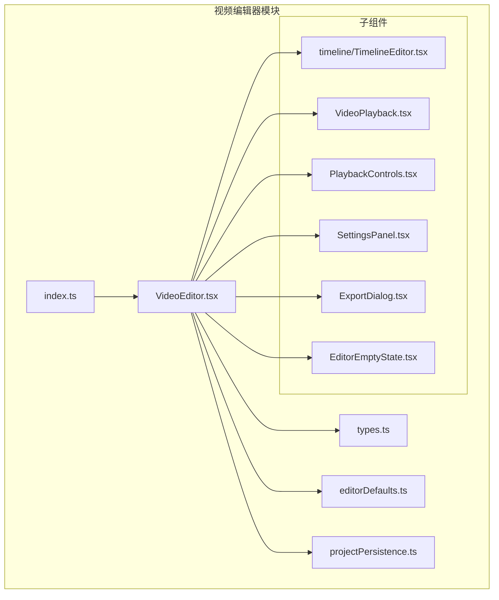
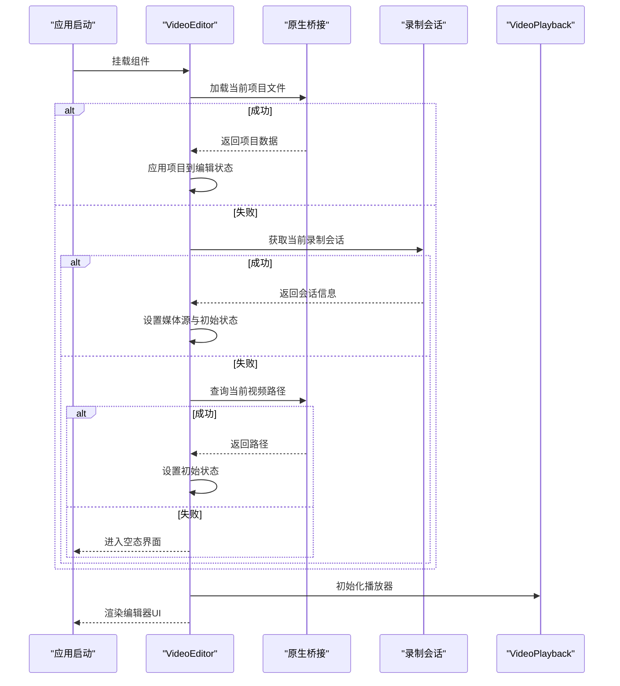
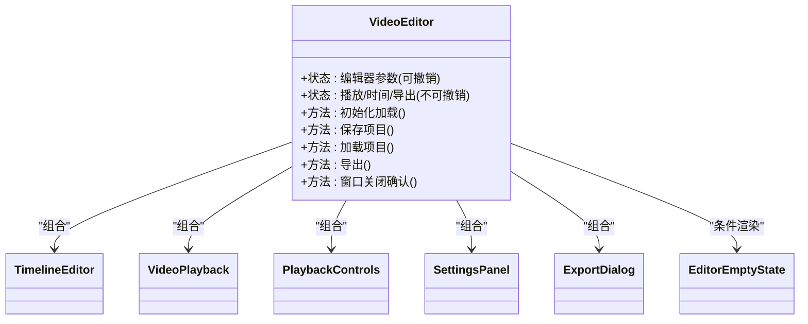
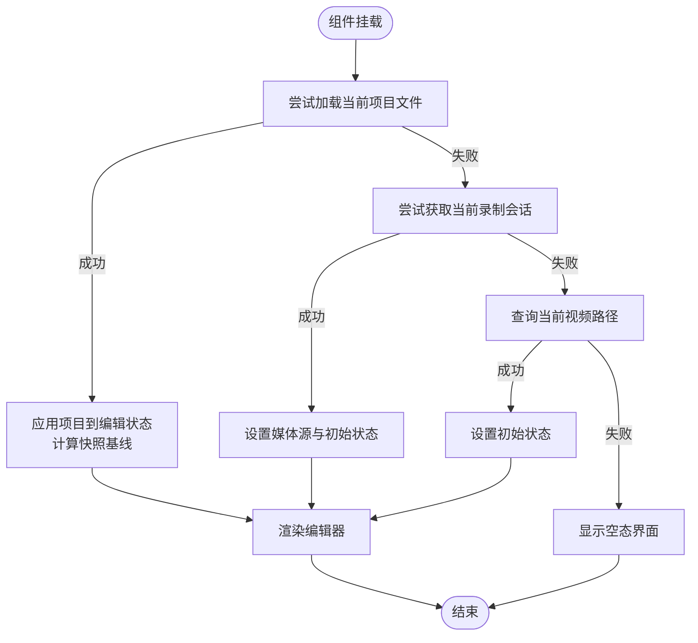
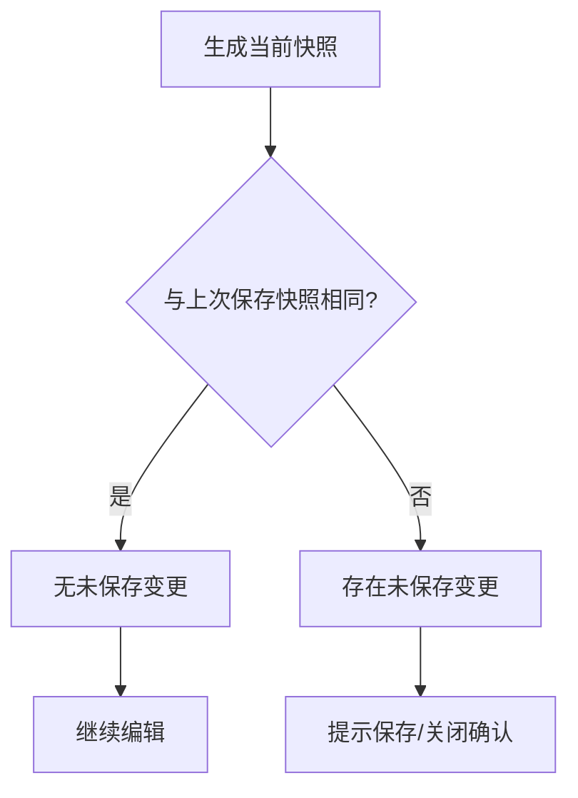
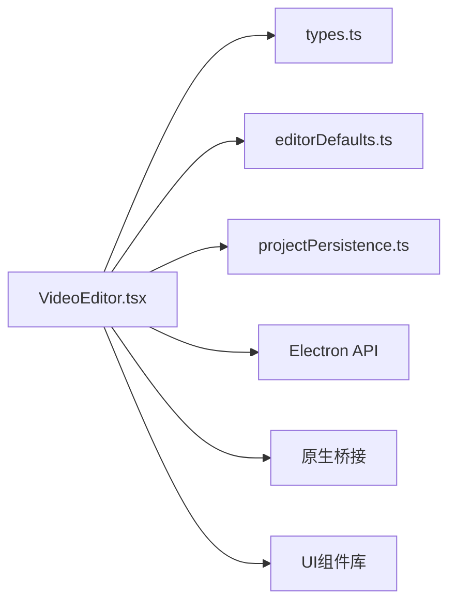

# 视频编辑器组件

<cite>
**本文档引用的文件**
- [VideoEditor.tsx](file://src/components/video-editor/VideoEditor.tsx)
- [types.ts](file://src/components/video-editor/types.ts)
- [editorDefaults.ts](file://src/components/video-editor/editorDefaults.ts)
- [projectPersistence.ts](file://src/components/video-editor/projectPersistence.ts)
- [index.ts](file://src/components/video-editor/index.ts)
</cite>

## 目录
1. [引言](#引言)
2. [项目结构](#项目结构)
3. [核心组件](#核心组件)
4. [架构总览](#架构总览)
5. [详细组件分析](#详细组件分析)
6. [依赖关系分析](#依赖关系分析)
7. [性能考虑](#性能考虑)
8. [故障排查指南](#故障排查指南)
9. [结论](#结论)
10. [附录](#附录)

## 引言
本文件面向OpenScreen视频编辑器核心组件VideoEditor，系统性阐述其架构设计、组件树结构、状态管理模式与生命周期管理；详解编辑器初始化流程、项目加载与状态恢复机制；覆盖配置项、默认设置与用户偏好持久化；解释与子组件的通信、事件传递与数据流；并提供性能优化、内存管理与渲染优化建议，以及扩展与定制的最佳实践。

## 项目结构
VideoEditor位于src/components/video-editor目录下，采用“按功能域分层”的组织方式：核心编辑器、时间线、视频播放、导出与设置等模块清晰分离。入口通过index.ts统一导出，便于上层应用按需引入。

图表来源
- [VideoEditor.tsx:179-800](file://src/components/video-editor/VideoEditor.tsx#L179-L800)
- [index.ts:1-6](file://src/components/video-editor/index.ts#L1-L6)

章节来源
- [index.ts:1-6](file://src/components/video-editor/index.ts#L1-L6)

## 核心组件
本节聚焦VideoEditor主组件的职责边界与关键实现要点：
- 状态聚合与历史管理：使用useEditorHistory维护可撤销的历史栈，并区分“可撤销”与“不可撤销”状态（如播放进度、当前选中区域）。
- 初始化与恢复：在挂载阶段尝试加载已保存项目、当前录制会话或最近视频路径，失败则进入空态界面。
- 项目持久化：提供保存/另存为、加载项目、快照比较与未保存变更检测。
- 用户偏好：加载/保存用户偏好（边距、宽高比、导出质量与格式），避免首次渲染覆盖默认值。
- 导出与诊断：封装导出参数与错误诊断消息构建逻辑，统一toast提示。
- 子组件集成：与时间线、播放器、设置面板、导出对话框等协作，形成完整的编辑工作流。

章节来源
- [VideoEditor.tsx:179-800](file://src/components/video-editor/VideoEditor.tsx#L179-L800)

## 架构总览
VideoEditor作为顶层容器，协调以下关键交互：
- 生命周期：初始化加载 → 偏好加载 → 渲染子组件 → 处理用户操作 → 导出与保存。
- 数据流：从原生桥接（Electron IPC）与本地状态双向流动，确保项目与播放器状态一致。
- 事件链：窗口关闭确认、保存前回调、导出进度与错误反馈。

图表来源
- [VideoEditor.tsx:542-604](file://src/components/video-editor/VideoEditor.tsx#L542-L604)

## 详细组件分析

### VideoEditor 主组件
- 组件树与职责
  - 时间线编辑器：负责缩放/裁剪/变速/标注/文字转语音等片段的可视化与交互。
  - 视频播放器：承载屏幕录制与摄像头画面合成播放，支持光标轨迹叠加与运动模糊。
  - 播放控制：播放/暂停/跳转/速度调节等。
  - 设置面板：导出质量/格式、GIF帧率/循环/尺寸预设、布局与外观设置。
  - 导出对话框：导出流程触发与进度反馈。
  - 空态界面：无项目/视频时的引导页。
- 状态模型
  - 可撤销状态：编辑器参数（壁纸、阴影强度、模糊、圆角、内边距、裁剪、缩放/裁剪/变速区域、标注、TTS区域、宽高比、摄像头布局/遮罩/镜像/尺寸/位置）。
  - 不可撤销状态：当前视频/摄像头源路径、播放状态、播放时间、导出状态、未保存变更标记等。
- 生命周期
  - 首次渲染后加载用户偏好并持久化；随后根据项目/会话/视频路径初始化编辑状态；监听窗口关闭请求并执行保存确认。
- 事件与数据流
  - 通过useEditorHistory进行状态提交与撤销；通过原生桥接读写项目文件；通过Electron API处理窗口关闭确认与保存前回调；通过toast统一提示。

图表来源
- [VideoEditor.tsx:179-800](file://src/components/video-editor/VideoEditor.tsx#L179-L800)

章节来源
- [VideoEditor.tsx:179-800](file://src/components/video-editor/VideoEditor.tsx#L179-L800)

### 初始化与项目加载机制
- 优先级顺序
  1) 当前项目文件（通过原生桥接加载）
  2) 当前录制会话（Electron API）
  3) 最近一次视频路径（原生桥接）
  4) 否则显示空态界面
- 加载后处理
  - 解析媒体源路径，设置视频/摄像头源与游标捕获模式
  - 将项目中的编辑器状态归一化并应用到编辑器
  - 计算并记录快照基线，用于未保存变更检测
- 错误处理
  - 任何阶段失败均设置错误状态并继续尝试后续来源

图表来源
- [VideoEditor.tsx:542-604](file://src/components/video-editor/VideoEditor.tsx#L542-L604)

章节来源
- [VideoEditor.tsx:542-604](file://src/components/video-editor/VideoEditor.tsx#L542-L604)

### 状态恢复与快照机制
- 快照生成
  - 基于当前媒体与编辑器状态生成标准化JSON快照
- 未保存变更检测
  - 比较当前快照与上次保存快照，相等则无变更
- 项目还原
  - 加载项目时先校验数据结构，再解析媒体源，最后将编辑器状态归一化并应用

图表来源
- [projectPersistence.ts:556-571](file://src/components/video-editor/projectPersistence.ts#L556-L571)
- [VideoEditor.tsx:540-541](file://src/components/video-editor/VideoEditor.tsx#L540-L541)

章节来源
- [projectPersistence.ts:556-571](file://src/components/video-editor/projectPersistence.ts#L556-L571)
- [VideoEditor.tsx:540-541](file://src/components/video-editor/VideoEditor.tsx#L540-L541)

### 配置选项、默认设置与用户偏好
- 默认设置
  - 来源于editorDefaults.ts，包括：导出质量/格式、GIF帧率/循环/尺寸预设、编辑器外观与布局、摄像头设置、游标视觉设置、源分辨率等
- 用户偏好
  - 通过userPreferences加载/保存，包含：边距、宽高比、导出质量、导出格式
  - 首次渲染后仅在偏好已加载完成后再写入，避免覆盖默认值
- 类型约束
  - types.ts定义了所有编辑器状态的数据结构与默认值，保证类型安全与归一化

章节来源
- [editorDefaults.ts:1-98](file://src/components/video-editor/editorDefaults.ts#L1-L98)
- [types.ts:1-439](file://src/components/video-editor/types.ts#L1-L439)
- [VideoEditor.tsx:611-626](file://src/components/video-editor/VideoEditor.tsx#L611-L626)

### 与子组件的通信机制
- 属性传递
  - VideoEditor将编辑器状态与回调函数以props形式传递给子组件（如时间线、播放器、设置面板）
- 事件回调
  - 通过useCallback绑定的回调处理保存、加载、导出、窗口关闭确认等动作
- 上下文与国际化
  - 使用I18nContext与ShortcutsContext提供翻译与快捷键上下文
- 原生桥接
  - 通过nativeBridgeClient与Electron API进行项目读写、录制会话查询与窗口交互

章节来源
- [VideoEditor.tsx:179-800](file://src/components/video-editor/VideoEditor.tsx#L179-L800)

### 导出与诊断
- 导出参数
  - 支持MP4与GIF两种格式，GIF包含帧率、循环与尺寸预设
- 诊断消息
  - 构建导出失败的诊断信息，包含原因、源文件名、输出尺寸/帧率、编解码器、比特率与浏览器可用性
- 错误处理
  - 导出过程中捕获异常并通过toast提示用户

章节来源
- [VideoEditor.tsx:130-176](file://src/components/video-editor/VideoEditor.tsx#L130-L176)
- [VideoEditor.tsx:239-247](file://src/components/video-editor/VideoEditor.tsx#L239-L247)

## 依赖关系分析
- 内部依赖
  - types.ts提供强类型定义与默认值
  - editorDefaults.ts提供默认配置
  - projectPersistence.ts提供项目校验、归一化、快照与变更检测
- 外部依赖
  - React Hooks（useState/useEffect/useMemo/useRef/useCallback）、Sonner（toast）、lucide-react（图标）、react-resizable-panels（面板布局）
  - Electron API（窗口关闭确认、保存前回调、当前录制会话）
  - 原生桥接（项目读写、当前视频路径）

图表来源
- [VideoEditor.tsx:1-117](file://src/components/video-editor/VideoEditor.tsx#L1-L117)
- [types.ts:1-439](file://src/components/video-editor/types.ts#L1-L439)
- [editorDefaults.ts:1-98](file://src/components/video-editor/editorDefaults.ts#L1-L98)
- [projectPersistence.ts:1-571](file://src/components/video-editor/projectPersistence.ts#L1-L571)

章节来源
- [VideoEditor.tsx:1-117](file://src/components/video-editor/VideoEditor.tsx#L1-L117)

## 性能考虑
- 渲染优化
  - 使用useMemo缓存派生状态（如注释区域分类、点击时间戳、当前项目媒体），减少不必要的重渲染
  - 将大型计算（如导出诊断消息构建）限制在必要时机调用
- 内存管理
  - 导出器实例通过ref持有，避免重复创建；导出完成后及时清理
  - 对大对象（如音频/视频数据）仅在需要时加载，释放不再使用的资源
- 播放与合成
  - 控制播放速度上限，避免解码器过载导致播放卡顿
  - 合成场景下合理设置摄像头尺寸与遮罩形状，降低GPU压力
- I/O与网络
  - 项目读写通过原生桥接异步执行，避免阻塞主线程
  - 保存/加载时提供取消与错误提示，提升用户体验

## 故障排查指南
- 无法加载项目
  - 检查项目文件结构与版本号；确认媒体路径有效且可访问
  - 查看归一化日志与错误提示，定位字段缺失或非法值
- 导出失败
  - 根据诊断消息检查源文件、输出尺寸/帧率、编解码器与浏览器能力
  - 调整导出质量/格式或降低输出参数
- 未保存变更
  - 确认快照生成与比较逻辑；检查保存流程是否被取消或中断
- 窗口关闭确认
  - 确保保存前回调正确注册与清理；避免重复注册导致行为异常

章节来源
- [VideoEditor.tsx:130-176](file://src/components/video-editor/VideoEditor.tsx#L130-L176)
- [projectPersistence.ts:556-571](file://src/components/video-editor/projectPersistence.ts#L556-L571)

## 结论
VideoEditor通过清晰的状态分层、完善的初始化与恢复机制、严格的类型与默认值体系，以及与子组件的松耦合协作，构建了稳定高效的视频编辑工作台。结合本文提供的性能优化与故障排查建议，可在复杂场景下保持流畅体验并降低维护成本。

## 附录
- 扩展与定制最佳实践
  - 新增编辑器状态时，同步完善types.ts默认值与editorDefaults.ts默认设置
  - 通过projectPersistence.ts的归一化流程保证跨版本兼容
  - 使用useMemo/useCallback减少重渲染与副作用
  - 为导出与I/O操作提供明确的错误处理与用户提示