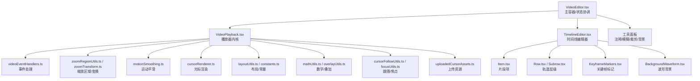
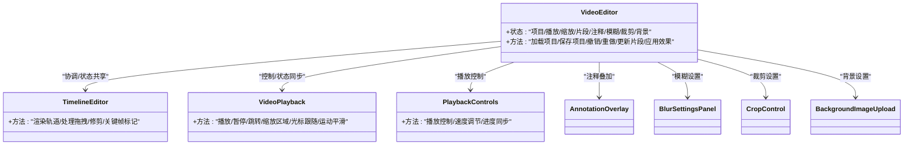
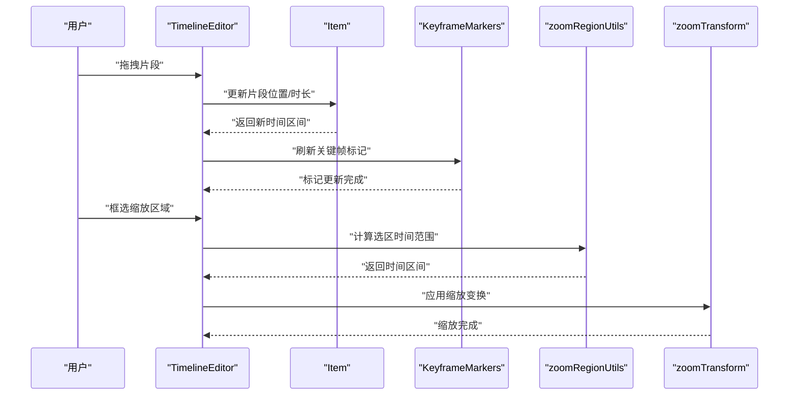
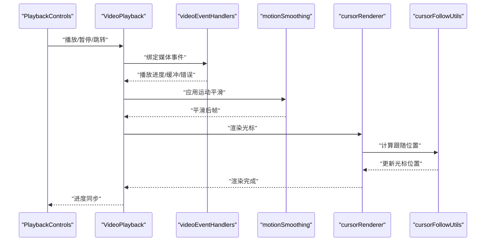
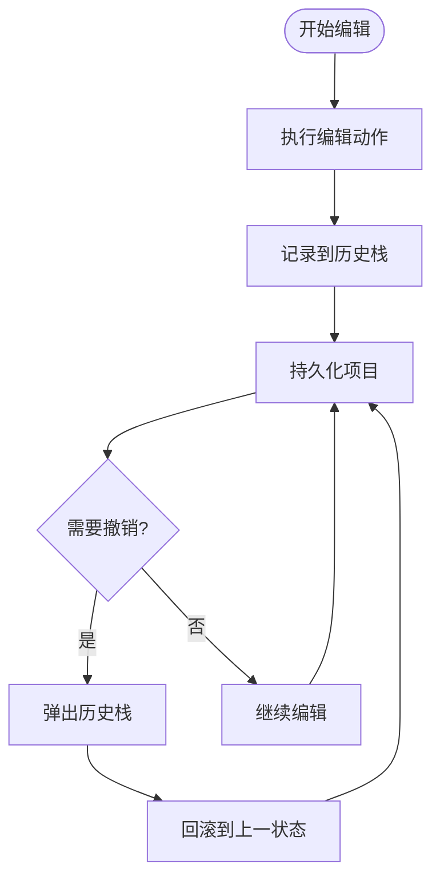
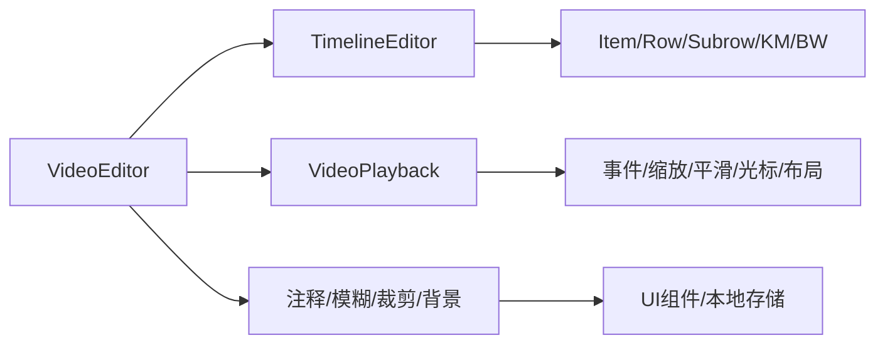

# 视频编辑系统

<cite>
**本文引用的文件**
- [VideoEditor.tsx](file://src/components/video-editor/VideoEditor.tsx)
- [TimelineEditor.tsx](file://src/components/video-editor/timeline/TimelineEditor.tsx)
- [VideoPlayback.tsx](file://src/components/video-editor/VideoPlayback.tsx)
- [index.ts](file://src/components/video-editor/index.ts)
- [types.ts](file://src/components/video-editor/types.ts)
- [projectPersistence.ts](file://src/components/video-editor/projectPersistence.ts)
- [useEditorHistory.ts](file://src/hooks/useEditorHistory.ts)
- [PlaybackControls.tsx](file://src/components/video-editor/PlaybackControls.tsx)
- [AnnotationOverlay.tsx](file://src/components/video-editor/AnnotationOverlay.tsx)
- [BlurSettingsPanel.tsx](file://src/components/video-editor/BlurSettingsPanel.tsx)
- [CropControl.tsx](file://src/components/video-editor/CropControl.tsx)
- [backgroundImageUpload.ts](file://src/components/video-editor/backgroundImageUpload.ts)
- [customPlaybackSpeed.ts](file://src/components/video-editor/customPlaybackSpeed.ts)
- [videoEventHandlers.ts](file://src/components/video-editor/videoPlayback/videoEventHandlers.ts)
- [zoomRegionUtils.ts](file://src/components/video-editor/videoPlayback/zoomRegionUtils.ts)
- [zoomTransform.ts](file://src/components/video-editor/videoPlayback/zoomTransform.ts)
- [motionSmoothing.ts](file://src/components/video-editor/videoPlayback/motionSmoothing.ts)
- [cursorRenderer.ts](file://src/components/video-editor/videoPlayback/cursorRenderer.ts)
- [layoutUtils.ts](file://src/components/video-editor/videoPlayback/layoutUtils.ts)
- [constants.ts](file://src/components/video-editor/videoPlayback/constants.ts)
- [mathUtils.ts](file://src/components/video-editor/videoPlayback/mathUtils.ts)
- [cursorFollowUtils.ts](file://src/components/video-editor/videoPlayback/cursorFollowUtils.ts)
- [focusUtils.ts](file://src/components/video-editor/videoPlayback/focusUtils.ts)
- [overlayUtils.ts](file://src/components/video-editor/videoPlayback/overlayUtils.ts)
- [uploadedCursorAssets.ts](file://src/components/video-editor/videoPlayback/uploadedCursorAssets.ts)
- [Item.tsx](file://src/components/video-editor/timeline/Item.tsx)
- [Row.tsx](file://src/components/video-editor/timeline/Row.tsx)
- [Subrow.tsx](file://src/components/video-editor/timeline/Subrow.tsx)
- [KeyframeMarkers.tsx](file://src/components/video-editor/timeline/KeyframeMarkers.tsx)
- [BackgroundWaveform.tsx](file://src/components/video-editor/timeline/BackgroundWaveform.tsx)
- [zoomSuggestionUtils.ts](file://src/components/video-editor/timeline/zoomSuggestionUtils.ts)
- [01-video-editor-component-and-state-management.md](file://docs/04-video-editor/01-video-editor-component-and-state-management.md)
- [03-video-playback-system.md](file://docs/04-video-editor/03-video-playback-system.md)
</cite>

## 目录
1. [简介](#简介)
2. [项目结构](#项目结构)
3. [核心组件](#核心组件)
4. [架构总览](#架构总览)
5. [详细组件分析](#详细组件分析)
6. [依赖关系分析](#依赖关系分析)
7. [性能考虑](#性能考虑)
8. [故障排除指南](#故障排除指南)
9. [结论](#结论)
10. [附录](#附录)

## 简介
本文件面向OpenScreen的视频编辑系统，聚焦于非线性时间线编辑器与相关功能模块。文档从架构设计、状态管理、组件组织方式入手，深入解析时间线编辑（片段拖拽、缩放区域编辑、修剪、关键帧标记）、播放器实现（播放控制、进度同步、音视频分离、性能优化）、注释系统、模糊效果、裁剪与背景设置，并覆盖编辑状态持久化、撤销重做与项目文件格式，最后提供最佳实践与性能优化建议。

## 项目结构
视频编辑系统主要位于src/components/video-editor目录下，采用按功能域分层的组织方式：
- 核心入口：VideoEditor.tsx作为主容器，协调播放器、时间线、设置面板与工具面板
- 时间线域：timeline子目录包含时间线渲染、片段项、行/子行、关键帧标记与波形背景
- 播放器域：videoPlayback子目录包含播放控制、事件处理、缩放区域、运动平滑、光标渲染等
- 工具与设置：注释、模糊、裁剪、背景、导出、格式选择、快捷键配置等
- 状态与持久化：useEditorHistory钩子、projectPersistence模块、types类型定义
- 文档：docs/04-video-editor目录提供架构与实现说明

```mermaid
graph TB
subgraph "视频编辑组件"
VE["VideoEditor.tsx"]
TL["TimelineEditor.tsx"]
VP["VideoPlayback.tsx"]
PC["PlaybackControls.tsx"]
AO["AnnotationOverlay.tsx"]
BP["BlurSettingsPanel.tsx"]
CC["CropControl.tsx"]
BG["backgroundImageUpload.ts"]
end
subgraph "时间线子系统"
IT["Item.tsx"]
RW["Row.tsx"]
SR["Subrow.tsx"]
KM["KeyframeMarkers.tsx"]
BW["BackgroundWaveform.tsx"]
end
subgraph "播放器子系统"
EH["videoEventHandlers.ts"]
ZR["zoomRegionUtils.ts"]
ZT["zoomTransform.ts"]
MS["motionSmoothing.ts"]
CR["cursorRenderer.ts"]
LU["layoutUtils.ts"]
CT["constants.ts"]
MU["mathUtils.ts"]
CF["cursorFollowUtils.ts"]
FU["focusUtils.ts"]
OU["overlayUtils.ts"]
UA["uploadedCursorAssets.ts"]
end
VE --> TL
VE --> VP
VE --> PC
VE --> AO
VE --> BP
VE --> CC
VE --> BG
TL --> IT
TL --> RW
TL --> SR
TL --> KM
TL --> BW
VP --> EH
VP --> ZR
VP --> ZT
VP --> MS
VP --> CR
VP --> LU
VP --> CT
VP --> MU
VP --> CF
VP --> FU
VP --> OU
VP --> UA
```

**图表来源**
- [VideoEditor.tsx](file://src/components/video-editor/VideoEditor.tsx)
- [TimelineEditor.tsx](file://src/components/video-editor/timeline/TimelineEditor.tsx)
- [VideoPlayback.tsx](file://src/components/video-editor/VideoPlayback.tsx)
- [Item.tsx](file://src/components/video-editor/timeline/Item.tsx)
- [Row.tsx](file://src/components/video-editor/timeline/Row.tsx)
- [Subrow.tsx](file://src/components/video-editor/timeline/Subrow.tsx)
- [KeyframeMarkers.tsx](file://src/components/video-editor/timeline/KeyframeMarkers.tsx)
- [BackgroundWaveform.tsx](file://src/components/video-editor/timeline/BackgroundWaveform.tsx)
- [videoEventHandlers.ts](file://src/components/video-editor/videoPlayback/videoEventHandlers.ts)
- [zoomRegionUtils.ts](file://src/components/video-editor/videoPlayback/zoomRegionUtils.ts)
- [zoomTransform.ts](file://src/components/video-editor/videoPlayback/zoomTransform.ts)
- [motionSmoothing.ts](file://src/components/video-editor/videoPlayback/motionSmoothing.ts)
- [cursorRenderer.ts](file://src/components/video-editor/videoPlayback/cursorRenderer.ts)
- [layoutUtils.ts](file://src/components/video-editor/videoPlayback/layoutUtils.ts)
- [constants.ts](file://src/components/video-editor/videoPlayback/constants.ts)
- [mathUtils.ts](file://src/components/video-editor/videoPlayback/mathUtils.ts)
- [cursorFollowUtils.ts](file://src/components/video-editor/videoPlayback/cursorFollowUtils.ts)
- [focusUtils.ts](file://src/components/video-editor/videoPlayback/focusUtils.ts)
- [overlayUtils.ts](file://src/components/video-editor/videoPlayback/overlayUtils.ts)
- [uploadedCursorAssets.ts](file://src/components/video-editor/videoPlayback/uploadedCursorAssets.ts)

**章节来源**
- [index.ts](file://src/components/video-editor/index.ts)
- [types.ts](file://src/components/video-editor/types.ts)

## 核心组件
- VideoEditor主组件：负责整体布局、状态聚合、工具面板切换、播放器与时间线的协调，以及与持久化模块的交互
- TimelineEditor时间线编辑器：提供轨道行、子行、片段项渲染与交互，支持拖拽、缩放、修剪、关键帧标记
- VideoPlayback播放器：封装播放控制、进度同步、音视频分离、缩放区域、运动平滑与光标跟随等
- 注释系统：AnnotationOverlay与AnnotationSettingsPanel，支持文本注释叠加与样式设置
- 视觉效果：BlurSettingsPanel（模糊）、CropControl（裁剪）、backgroundImageUpload（背景）
- 持久化与历史：useEditorHistory钩子与projectPersistence模块，支持撤销重做与项目序列化

**章节来源**
- [VideoEditor.tsx](file://src/components/video-editor/VideoEditor.tsx)
- [TimelineEditor.tsx](file://src/components/video-editor/timeline/TimelineEditor.tsx)
- [VideoPlayback.tsx](file://src/components/video-editor/VideoPlayback.tsx)
- [useEditorHistory.ts](file://src/hooks/useEditorHistory.ts)
- [projectPersistence.ts](file://src/components/video-editor/projectPersistence.ts)

## 架构总览
系统采用“主容器 + 子域组件”的分层架构：
- 主容器VideoEditor通过状态管理协调播放器与时间线，同时承载工具面板与设置面板
- 时间线域以Item为核心，Row/Subrow组织轨道层级，KeyframeMarkers与BackgroundWaveform提供可视化辅助
- 播放器域以VideoPlayback为中心，围绕事件处理、缩放区域、运动平滑与光标渲染构建播放体验
- 工具域独立模块化，通过统一接口与主容器集成

**图表来源**
- [VideoEditor.tsx](file://src/components/video-editor/VideoEditor.tsx)
- [TimelineEditor.tsx](file://src/components/video-editor/timeline/TimelineEditor.tsx)
- [VideoPlayback.tsx](file://src/components/video-editor/VideoPlayback.tsx)
- [Item.tsx](file://src/components/video-editor/timeline/Item.tsx)
- [Row.tsx](file://src/components/video-editor/timeline/Row.tsx)
- [Subrow.tsx](file://src/components/video-editor/timeline/Subrow.tsx)
- [KeyframeMarkers.tsx](file://src/components/video-editor/timeline/KeyframeMarkers.tsx)
- [BackgroundWaveform.tsx](file://src/components/video-editor/timeline/BackgroundWaveform.tsx)
- [videoEventHandlers.ts](file://src/components/video-editor/videoPlayback/videoEventHandlers.ts)
- [zoomRegionUtils.ts](file://src/components/video-editor/videoPlayback/zoomRegionUtils.ts)
- [zoomTransform.ts](file://src/components/video-editor/videoPlayback/zoomTransform.ts)
- [motionSmoothing.ts](file://src/components/video-editor/videoPlayback/motionSmoothing.ts)
- [cursorRenderer.ts](file://src/components/video-editor/videoPlayback/cursorRenderer.ts)
- [layoutUtils.ts](file://src/components/video-editor/videoPlayback/layoutUtils.ts)
- [constants.ts](file://src/components/video-editor/videoPlayback/constants.ts)
- [mathUtils.ts](file://src/components/video-editor/videoPlayback/mathUtils.ts)
- [cursorFollowUtils.ts](file://src/components/video-editor/videoPlayback/cursorFollowUtils.ts)
- [focusUtils.ts](file://src/components/video-editor/videoPlayback/focusUtils.ts)
- [overlayUtils.ts](file://src/components/video-editor/videoPlayback/overlayUtils.ts)
- [uploadedCursorAssets.ts](file://src/components/video-editor/videoPlayback/uploadedCursorAssets.ts)

## 详细组件分析

### VideoEditor主组件
- 职责：作为顶层容器，整合播放器、时间线、工具面板与设置面板；维护编辑会话状态；触发持久化与历史记录
- 状态管理：集中管理当前项目、播放位置、缩放级别、选中片段、注释集合、模糊参数、裁剪参数、背景设置等
- 组件组织：通过条件渲染与布局模块化工具面板；与PlaybackControls、TimelineEditor、VideoPlayback解耦协作
- 集成点：与projectPersistence进行项目读写；与useEditorHistory进行撤销重做；与各工具面板通过props与回调通信

**图表来源**
- [VideoEditor.tsx](file://src/components/video-editor/VideoEditor.tsx)
- [TimelineEditor.tsx](file://src/components/video-editor/timeline/TimelineEditor.tsx)
- [VideoPlayback.tsx](file://src/components/video-editor/VideoPlayback.tsx)
- [PlaybackControls.tsx](file://src/components/video-editor/PlaybackControls.tsx)
- [AnnotationOverlay.tsx](file://src/components/video-editor/AnnotationOverlay.tsx)
- [BlurSettingsPanel.tsx](file://src/components/video-editor/BlurSettingsPanel.tsx)
- [CropControl.tsx](file://src/components/video-editor/CropControl.tsx)
- [backgroundImageUpload.ts](file://src/components/video-editor/backgroundImageUpload.ts)

**章节来源**
- [VideoEditor.tsx](file://src/components/video-editor/VideoEditor.tsx)
- [index.ts](file://src/components/video-editor/index.ts)
- [types.ts](file://src/components/video-editor/types.ts)

### TimelineEditor时间线编辑器
- 时间线渲染：基于Row/Subrow组织轨道层级，Item渲染片段，KeyframeMarkers绘制关键帧标记，BackgroundWaveform提供音频波形背景
- 片段拖拽：通过Item实现片段移动与对齐，结合时间轴刻度与网格对齐
- 缩放区域编辑：支持在时间线上框选区域，生成缩放目标范围，配合zoomRegionUtils与zoomTransform
- 修剪操作：通过Item的拖拽边界实现入点/出点调整，保持相邻片段的时序连续性
- 关键帧标记：在关键帧Marker处插入/编辑关键帧数据，用于动画曲线或属性插值

**图表来源**
- [TimelineEditor.tsx](file://src/components/video-editor/timeline/TimelineEditor.tsx)
- [Item.tsx](file://src/components/video-editor/timeline/Item.tsx)
- [KeyframeMarkers.tsx](file://src/components/video-editor/timeline/KeyframeMarkers.tsx)
- [zoomRegionUtils.ts](file://src/components/video-editor/videoPlayback/zoomRegionUtils.ts)
- [zoomTransform.ts](file://src/components/video-editor/videoPlayback/zoomTransform.ts)

**章节来源**
- [TimelineEditor.tsx](file://src/components/video-editor/timeline/TimelineEditor.tsx)
- [Item.tsx](file://src/components/video-editor/timeline/Item.tsx)
- [Row.tsx](file://src/components/video-editor/timeline/Row.tsx)
- [Subrow.tsx](file://src/components/video-editor/timeline/Subrow.tsx)
- [KeyframeMarkers.tsx](file://src/components/video-editor/timeline/KeyframeMarkers.tsx)
- [BackgroundWaveform.tsx](file://src/components/video-editor/timeline/BackgroundWaveform.tsx)
- [zoomSuggestionUtils.ts](file://src/components/video-editor/timeline/zoomSuggestionUtils.ts)

### VideoPlayback播放器
- 播放控制：PlaybackControls提供播放/暂停/跳转/速度调节；VideoPlayback内部维护播放状态与时间轴
- 进度同步：播放器与时间线双向同步，确保播放位置与时间线选中状态一致
- 音视频分离：通过videoEventHandlers与媒体元素分离音视频轨道，分别处理音频峰值与视频渲染
- 性能优化：motionSmoothing减少抖动，cursorRenderer与cursorFollowUtils优化光标渲染与跟随；layoutUtils与constants保证布局一致性
- 缩放区域：zoomRegionUtils与zoomTransform支持局部放大查看细节
- 叠加与资源：overlayUtils与uploadedCursorAssets管理注释与自定义光标资源

**图表来源**
- [PlaybackControls.tsx](file://src/components/video-editor/PlaybackControls.tsx)
- [VideoPlayback.tsx](file://src/components/video-editor/VideoPlayback.tsx)
- [videoEventHandlers.ts](file://src/components/video-editor/videoPlayback/videoEventHandlers.ts)
- [motionSmoothing.ts](file://src/components/video-editor/videoPlayback/motionSmoothing.ts)
- [cursorRenderer.ts](file://src/components/video-editor/videoPlayback/cursorRenderer.ts)
- [cursorFollowUtils.ts](file://src/components/video-editor/videoPlayback/cursorFollowUtils.ts)

**章节来源**
- [VideoPlayback.tsx](file://src/components/video-editor/VideoPlayback.tsx)
- [PlaybackControls.tsx](file://src/components/video-editor/PlaybackControls.tsx)
- [videoEventHandlers.ts](file://src/components/video-editor/videoPlayback/videoEventHandlers.ts)
- [motionSmoothing.ts](file://src/components/video-editor/videoPlayback/motionSmoothing.ts)
- [cursorRenderer.ts](file://src/components/video-editor/videoPlayback/cursorRenderer.ts)
- [cursorFollowUtils.ts](file://src/components/video-editor/videoPlayback/cursorFollowUtils.ts)
- [layoutUtils.ts](file://src/components/video-editor/videoPlayback/layoutUtils.ts)
- [constants.ts](file://src/components/video-editor/videoPlayback/constants.ts)
- [mathUtils.ts](file://src/components/video-editor/videoPlayback/mathUtils.ts)
- [overlayUtils.ts](file://src/components/video-editor/videoPlayback/overlayUtils.ts)
- [uploadedCursorAssets.ts](file://src/components/video-editor/videoPlayback/uploadedCursorAssets.ts)

### 注释系统
- AnnotationOverlay：在视频画面上叠加注释文本，支持多语言与动画效果
- AnnotationSettingsPanel：提供注释样式、颜色、字体、大小等设置
- 与VideoPlayback集成：通过overlayUtils与VideoPlayback的渲染管线协同，确保注释与视频帧同步

**章节来源**
- [AnnotationOverlay.tsx](file://src/components/video-editor/AnnotationOverlay.tsx)
- [AnnotationSettingsPanel.tsx](file://src/components/video-editor/AnnotationSettingsPanel.tsx)
- [overlayUtils.ts](file://src/components/video-editor/videoPlayback/overlayUtils.ts)

### 模糊效果
- BlurSettingsPanel：提供模糊强度、形状与中心点设置
- 与VideoPlayback集成：通过渲染管线叠加模糊效果，支持实时预览与性能优化

**章节来源**
- [BlurSettingsPanel.tsx](file://src/components/video-editor/BlurSettingsPanel.tsx)
- [blurEffects.ts](file://src/lib/blurEffects.ts)

### 裁剪功能
- CropControl：提供矩形裁剪区域设置，支持宽高比锁定与实时预览
- 与VideoPlayback集成：裁剪参数传递至渲染管线，确保输出符合预期

**章节来源**
- [CropControl.tsx](file://src/components/video-editor/CropControl.tsx)
- [compositeLayout.ts](file://src/lib/compositeLayout.ts)

### 背景设置
- backgroundImageUpload：支持上传背景图片并应用到编辑器
- 与VideoPlayback集成：背景作为底层图层参与合成

**章节来源**
- [backgroundImageUpload.ts](file://src/components/video-editor/backgroundImageUpload.ts)
- [wallpaper.ts](file://src/lib/wallpaper.ts)

### 编辑状态持久化与撤销重做
- useEditorHistory：提供撤销/重做栈，记录关键编辑动作（片段移动、修剪、关键帧、注释、模糊、裁剪、背景）
- projectPersistence：负责项目文件的序列化与反序列化，支持版本兼容与增量更新
- 类型系统：types.ts定义项目结构、片段类型、关键帧数据、效果参数等

**图表来源**
- [useEditorHistory.ts](file://src/hooks/useEditorHistory.ts)
- [projectPersistence.ts](file://src/components/video-editor/projectPersistence.ts)
- [types.ts](file://src/components/video-editor/types.ts)

**章节来源**
- [useEditorHistory.ts](file://src/hooks/useEditorHistory.ts)
- [projectPersistence.ts](file://src/components/video-editor/projectPersistence.ts)
- [types.ts](file://src/components/video-editor/types.ts)

## 依赖关系分析
- 组件耦合：VideoEditor作为协调者，与各子系统松耦合；时间线与播放器通过公共状态与回调交互
- 外部依赖：播放器依赖浏览器媒体API；工具面板依赖UI库与本地存储；持久化依赖项目文件格式规范
- 循环依赖：通过单一状态源与事件驱动避免循环依赖

**图表来源**
- [VideoEditor.tsx](file://src/components/video-editor/VideoEditor.tsx)
- [TimelineEditor.tsx](file://src/components/video-editor/timeline/TimelineEditor.tsx)
- [VideoPlayback.tsx](file://src/components/video-editor/VideoPlayback.tsx)
- [Item.tsx](file://src/components/video-editor/timeline/Item.tsx)
- [Row.tsx](file://src/components/video-editor/timeline/Row.tsx)
- [Subrow.tsx](file://src/components/video-editor/timeline/Subrow.tsx)
- [KeyframeMarkers.tsx](file://src/components/video-editor/timeline/KeyframeMarkers.tsx)
- [BackgroundWaveform.tsx](file://src/components/video-editor/timeline/BackgroundWaveform.tsx)
- [videoEventHandlers.ts](file://src/components/video-editor/videoPlayback/videoEventHandlers.ts)
- [zoomRegionUtils.ts](file://src/components/video-editor/videoPlayback/zoomRegionUtils.ts)
- [zoomTransform.ts](file://src/components/video-editor/videoPlayback/zoomTransform.ts)
- [motionSmoothing.ts](file://src/components/video-editor/videoPlayback/motionSmoothing.ts)
- [cursorRenderer.ts](file://src/components/video-editor/videoPlayback/cursorRenderer.ts)
- [layoutUtils.ts](file://src/components/video-editor/videoPlayback/layoutUtils.ts)

**章节来源**
- [index.ts](file://src/components/video-editor/index.ts)
- [types.ts](file://src/components/video-editor/types.ts)

## 性能考虑
- 渲染优化：使用运动平滑与光标跟随算法降低抖动；时间线采用虚拟滚动与按需渲染
- 媒体处理：分离音视频轨道，避免不必要的重绘；缩放区域仅渲染可见部分
- 内存管理：历史栈限制大小，定期清理；项目持久化采用增量更新
- 并发处理：音频峰值计算使用Web Worker，避免阻塞主线程
- 最佳实践：优先使用受控组件与不可变更新；合理拆分大任务，使用requestIdleCallback

[本节为通用性能指导，无需列出具体文件来源]

## 故障排除指南
- 播放异常：检查媒体事件绑定与错误回调；确认音视频轨道分离是否正确
- 时间线卡顿：检查片段数量与渲染频率；启用虚拟滚动与按需渲染
- 注释错位：验证overlay坐标系与VideoPlayback布局一致性
- 模糊/裁剪不生效：确认参数传递与渲染管线顺序
- 撤销重做失效：检查历史栈记录完整性与项目持久化时机

**章节来源**
- [videoEventHandlers.ts](file://src/components/video-editor/videoPlayback/videoEventHandlers.ts)
- [overlayUtils.ts](file://src/components/video-editor/videoPlayback/overlayUtils.ts)
- [useEditorHistory.ts](file://src/hooks/useEditorHistory.ts)
- [projectPersistence.ts](file://src/components/video-editor/projectPersistence.ts)

## 结论
OpenScreen视频编辑系统通过清晰的分层架构与模块化设计，实现了非线性时间线编辑与高质量播放体验。VideoEditor作为协调者，结合TimelineEditor与VideoPlayback，辅以注释、模糊、裁剪与背景等工具，形成完整的编辑工作流。借助useEditorHistory与projectPersistence，系统具备可靠的撤销重做与持久化能力。遵循本文的性能优化建议与最佳实践，可进一步提升编辑效率与用户体验。

[本节为总结性内容，无需列出具体文件来源]

## 附录
- 项目文件格式：由projectPersistence模块定义，包含片段列表、关键帧、注释、效果参数与元数据
- 快捷键与国际化：通过ShortcutsContext与i18n配置提供多语言与快捷键支持
- 导出与构建：导出管道与构建脚本位于docs/05-export与docs/06-build目录

**章节来源**
- [projectPersistence.ts](file://src/components/video-editor/projectPersistence.ts)
- [01-video-editor-component-and-state-management.md](file://docs/04-video-editor/01-video-editor-component-and-state-management.md)
- [03-video-playback-system.md](file://docs/04-video-editor/03-video-playback-system.md)