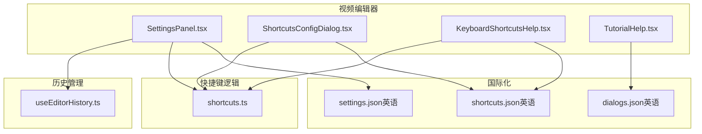
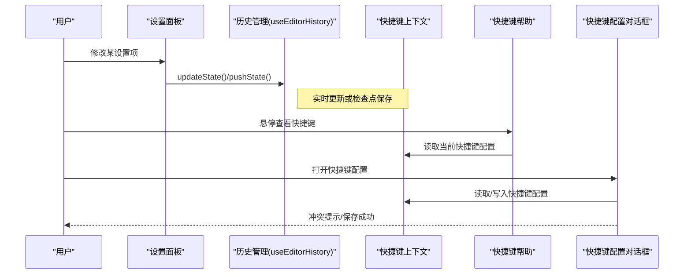
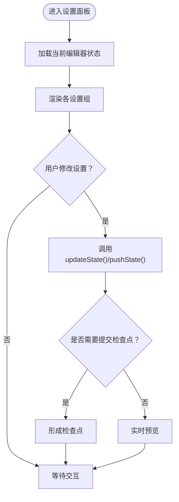
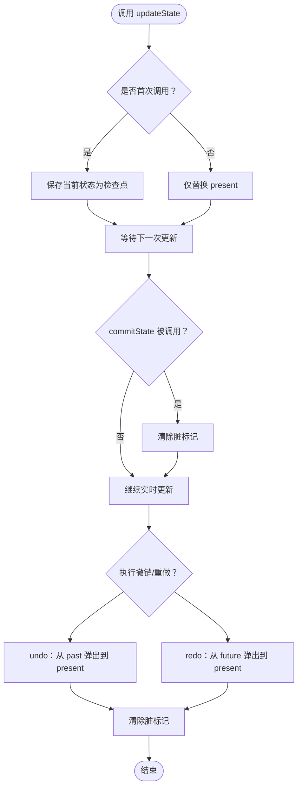
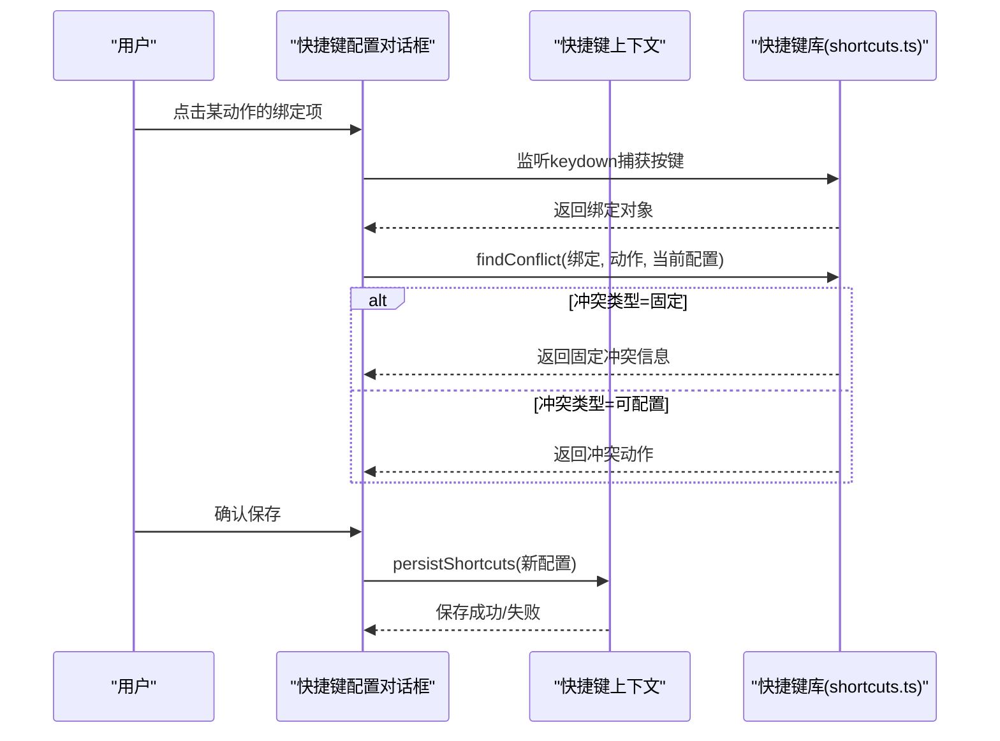
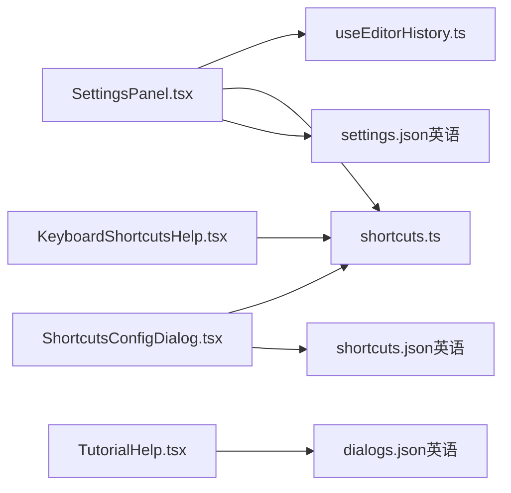

# 设置面板

<cite>
**本文引用的文件**
- [SettingsPanel.tsx](file://src/components/video-editor/SettingsPanel.tsx)
- [ShortcutsConfigDialog.tsx](file://src/components/video-editor/ShortcutsConfigDialog.tsx)
- [KeyboardShortcutsHelp.tsx](file://src/components/video-editor/KeyboardShortcutsHelp.tsx)
- [useEditorHistory.ts](file://src/hooks/useEditorHistory.ts)
- [shortcuts.ts](file://src/lib/shortcuts.ts)
- [TutorialHelp.tsx](file://src/components/video-editor/TutorialHelp.tsx)
- [settings.json（英语）](file://src/i18n/locales/en/settings.json)
- [shortcuts.json（英语）](file://src/i18n/locales/en/shortcuts.json)
- [dialogs.json（英语）](file://src/i18n/locales/en/dialogs.json)
- [userPreferences.ts](file://src/lib/userPreferences.ts)
- [settings-panel-and-configuration-ui.md](file://docs/04-video-editor/02-settings-panel-and-configuration-ui.md)
</cite>

## 目录
1. [简介](#简介)
2. [项目结构](#项目结构)
3. [核心组件](#核心组件)
4. [架构总览](#架构总览)
5. [详细组件分析](#详细组件分析)
6. [依赖关系分析](#依赖关系分析)
7. [性能考量](#性能考量)
8. [故障排查指南](#故障排查指南)
9. [结论](#结论)
10. [附录](#附录)

## 简介
本文件面向OpenScreen视频编辑器的“设置面板”，系统性阐述其组织结构与功能实现，覆盖以下方面：
- 设置面板的模块划分：编辑器设置、快捷键配置、教程帮助系统
- 撤销重做历史管理机制：状态快照、内存优化、历史回溯流程
- 键盘快捷键系统：绑定规则、冲突检测、自定义配置与平台差异
- 教程帮助系统：交互式引导、上下文帮助、多语言内容管理
- 设置的持久化存储、配置迁移与默认值策略
- 响应式设计、主题支持与无障碍访问
- 扩展开发与自定义设置项的实现指南

## 项目结构
设置面板相关代码主要位于视频编辑器子目录中，并辅以国际化资源与历史管理钩子：
- 视频编辑器UI组件：设置面板、快捷键配置对话框、快捷键帮助气泡、教程帮助
- 快捷键逻辑：绑定、格式化、冲突检测、默认值合并
- 历史管理：编辑器状态的撤销/重做与检查点机制
- 国际化：设置与快捷键相关的多语言文案
- 用户偏好：用户设置的持久化与迁移

图表来源
- [SettingsPanel.tsx:238-1515](file://src/components/video-editor/SettingsPanel.tsx#L238-L1515)
- [ShortcutsConfigDialog.tsx:1-201](file://src/components/video-editor/ShortcutsConfigDialog.tsx#L1-L201)
- [KeyboardShortcutsHelp.tsx:1-59](file://src/components/video-editor/KeyboardShortcutsHelp.tsx#L1-L59)
- [useEditorHistory.ts:83-154](file://src/hooks/useEditorHistory.ts#L83-L154)
- [shortcuts.ts:77-176](file://src/lib/shortcuts.ts#L77-L176)
- [settings.json（英语）](file://src/i18n/locales/en/settings.json)
- [shortcuts.json（英语）](file://src/i18n/locales/en/shortcuts.json)
- [dialogs.json（英语）](file://src/i18n/locales/en/dialogs.json)

章节来源
- [settings-panel-and-configuration-ui.md:92-107](file://docs/04-video-editor/02-settings-panel-and-configuration-ui.md#L92-L107)

## 核心组件
- 设置面板（SettingsPanel）
  - 负责编辑器各类设置项的展示与变更，如缩放、裁剪、模糊、边框圆角、内边距等；同时包含光标显示与裁剪边界等高级选项。
  - 支持与历史管理钩子协作，确保非即时更新的设置在提交后形成检查点，便于撤销/重做。
- 快捷键配置对话框（ShortcutsConfigDialog）
  - 提供可配置快捷键列表，支持捕获用户按键、冲突检测、交换冲突项、重置默认值与保存持久化。
- 快捷键帮助（KeyboardShortcutsHelp）
  - 鼠标悬停显示当前快捷键概览，支持打开配置对话框进行自定义。
- 教程帮助（TutorialHelp）
  - 提供交互式引导与上下文帮助，配合多语言文案实现跨语言支持。
- 历史管理钩子（useEditorHistory）
  - 实现编辑器状态的撤销/重做与检查点机制，支持长序列操作的“实时更新”与最终提交。

章节来源
- [SettingsPanel.tsx:238-1515](file://src/components/video-editor/SettingsPanel.tsx#L238-L1515)
- [ShortcutsConfigDialog.tsx:1-201](file://src/components/video-editor/ShortcutsConfigDialog.tsx#L1-L201)
- [KeyboardShortcutsHelp.tsx:1-59](file://src/components/video-editor/KeyboardShortcutsHelp.tsx#L1-L59)
- [TutorialHelp.tsx](file://src/components/video-editor/TutorialHelp.tsx)
- [useEditorHistory.ts:83-154](file://src/hooks/useEditorHistory.ts#L83-L154)

## 架构总览
设置面板围绕“状态-视图-事件”的单向数据流构建，结合上下文与钩子完成复杂交互。

图表来源
- [SettingsPanel.tsx:238-1515](file://src/components/video-editor/SettingsPanel.tsx#L238-L1515)
- [useEditorHistory.ts:83-154](file://src/hooks/useEditorHistory.ts#L83-L154)
- [KeyboardShortcutsHelp.tsx:1-59](file://src/components/video-editor/KeyboardShortcutsHelp.tsx#L1-L59)
- [ShortcutsConfigDialog.tsx:1-201](file://src/components/video-editor/ShortcutsConfigDialog.tsx#L1-L201)
- [shortcuts.ts:77-176](file://src/lib/shortcuts.ts#L77-L176)

## 详细组件分析

### 设置面板（SettingsPanel）
- 组织结构
  - 使用标签页/折叠面板组织不同设置组，如“缩放”、“裁剪”、“模糊”、“光标”等。
  - 每个设置项通过受控组件（Switch、Slider、Input等）与父级回调联动，确保变更可追踪。
- 交互与状态
  - 对于需要“拖拽即生效”的设置（如缩放比例），采用“实时更新+最终提交”的模式；对于一次性变更（如选择壁纸），采用“提交后形成检查点”的方式。
- 可访问性
  - 基于Radix UI组件，具备良好的键盘导航与屏幕阅读器支持；所有控件均配有可见标签与焦点指示。

图表来源
- [SettingsPanel.tsx:238-1515](file://src/components/video-editor/SettingsPanel.tsx#L238-L1515)
- [useEditorHistory.ts:83-154](file://src/hooks/useEditorHistory.ts#L83-L154)

章节来源
- [SettingsPanel.tsx:238-1515](file://src/components/video-editor/SettingsPanel.tsx#L238-L1515)
- [settings-panel-and-configuration-ui.md:92-107](file://docs/04-video-editor/02-settings-panel-and-configuration-ui.md#L92-L107)

### 撤销重做历史管理（useEditorHistory）
- 设计要点
  - 历史栈由三段组成：past（可撤销）、present（当前状态）、future（可重做）。
  - 检查点策略：首次更新时保存“交互前”状态作为检查点，后续连续更新仅替换present，避免历史碎片化。
- 关键流程
  - updateState：首次调用保存检查点，后续调用仅更新present。
  - pushState：直接形成新的检查点，清空future。
  - undo/redo：从past/future转移状态，清空future/past。
  - resetState：重置历史栈并清除脏标记。
- 复杂度与优化
  - 时间复杂度：单次操作O(1)，历史长度受限于MAX_HISTORY。
  - 空间优化：past数组仅保留最近一次检查点之前的记录，避免无限增长。

图表来源
- [useEditorHistory.ts:83-154](file://src/hooks/useEditorHistory.ts#L83-L154)

章节来源
- [useEditorHistory.ts:83-154](file://src/hooks/useEditorHistory.ts#L83-L154)

### 键盘快捷键系统
- 快捷键绑定与格式化
  - 绑定结构包含键位与修饰键（ctrl/shift/alt/meta），并区分macOS的⌘⇧⌥与Windows/Linux的Ctrl/Shift/Alt。
  - 格式化函数根据平台输出对应符号，统一显示风格。
- 冲突检测
  - 固定快捷键（不可更改）与可配置快捷键分别处理；当新绑定与固定或现有可配置项冲突时，返回冲突类型与目标动作。
- 自定义配置
  - 支持逐项捕获按键、显示冲突、交换冲突项、重置默认值与保存持久化。
- 平台差异
  - 主修饰键随平台变化（macOS使用meta，其他使用ctrl），匹配函数据此判断。

图表来源
- [ShortcutsConfigDialog.tsx:1-201](file://src/components/video-editor/ShortcutsConfigDialog.tsx#L1-L201)
- [shortcuts.ts:77-176](file://src/lib/shortcuts.ts#L77-L176)

章节来源
- [ShortcutsConfigDialog.tsx:1-201](file://src/components/video-editor/ShortcutsConfigDialog.tsx#L1-L201)
- [KeyboardShortcutsHelp.tsx:1-59](file://src/components/video-editor/KeyboardShortcutsHelp.tsx#L1-L59)
- [shortcuts.ts:77-176](file://src/lib/shortcuts.ts#L77-L176)

### 教程帮助系统（TutorialHelp）
- 结构
  - 交互式引导：通过步骤化的说明与可视化示例，帮助用户完成特定任务。
  - 上下文帮助：在设置面板中提供与当前操作相关的帮助提示。
- 多语言支持
  - 使用I18n上下文加载多语言文案，确保不同语言环境下的帮助文本一致且准确。
- 与设置面板的集成
  - 在设置面板的关键位置嵌入帮助入口，使用户可在操作过程中随时获取指导。

章节来源
- [TutorialHelp.tsx](file://src/components/video-editor/TutorialHelp.tsx)
- [dialogs.json（英语）](file://src/i18n/locales/en/dialogs.json)

### 设置的持久化存储、配置迁移与默认值管理
- 默认值
  - 快捷键默认值集中定义，用于初始化与重置场景；设置项默认值在设置面板中按需提供。
- 持久化
  - 快捷键配置通过上下文提供的持久化方法写入存储；设置项变更通常通过历史管理与应用状态同步。
- 迁移
  - 当新增或调整设置项时，可通过版本化策略在启动时迁移旧配置，保证兼容性与一致性。

章节来源
- [shortcuts.ts:108-176](file://src/lib/shortcuts.ts#L108-L176)
- [userPreferences.ts](file://src/lib/userPreferences.ts)

## 依赖关系分析
- 组件耦合
  - 设置面板依赖历史管理钩子以实现撤销/重做；依赖快捷键上下文以读取/写入快捷键配置。
  - 快捷键配置对话框依赖快捷键库进行冲突检测与格式化。
  - 快捷键帮助依赖快捷键上下文与国际化资源。
- 外部依赖
  - 国际化资源提供设置与快捷键的多语言文案。
  - Radix UI组件提供可访问性基础。

图表来源
- [SettingsPanel.tsx:238-1515](file://src/components/video-editor/SettingsPanel.tsx#L238-L1515)
- [ShortcutsConfigDialog.tsx:1-201](file://src/components/video-editor/ShortcutsConfigDialog.tsx#L1-L201)
- [KeyboardShortcutsHelp.tsx:1-59](file://src/components/video-editor/KeyboardShortcutsHelp.tsx#L1-L59)
- [useEditorHistory.ts:83-154](file://src/hooks/useEditorHistory.ts#L83-L154)
- [shortcuts.ts:77-176](file://src/lib/shortcuts.ts#L77-L176)
- [settings.json（英语）](file://src/i18n/locales/en/settings.json)
- [shortcuts.json（英语）](file://src/i18n/locales/en/shortcuts.json)
- [dialogs.json（英语）](file://src/i18n/locales/en/dialogs.json)

## 性能考量
- 历史管理
  - 限制历史长度，避免past无限增长；实时更新仅替换present，减少不必要的快照生成。
- 快捷键检测
  - 冲突检测线性扫描当前配置，时间复杂度低；避免在高频按键事件中重复计算。
- UI渲染
  - 设置面板采用细粒度状态更新与受控组件，减少不必要重渲染。

## 故障排查指南
- 快捷键无法注册
  - 检查是否与固定快捷键冲突；确认平台主修饰键设置是否正确。
- 快捷键配置未生效
  - 确认保存流程已完成；检查持久化返回状态与错误提示。
- 撤销/重做无效
  - 确认历史栈是否存在past/ future；检查是否在实时更新期间误触发提交。
- 设置项无响应
  - 检查回调链路与状态更新是否正确；确认受控组件的value与onChange配对。

章节来源
- [ShortcutsConfigDialog.tsx:104-113](file://src/components/video-editor/ShortcutsConfigDialog.tsx#L104-L113)
- [useEditorHistory.ts:116-136](file://src/hooks/useEditorHistory.ts#L116-L136)

## 结论
设置面板通过清晰的模块划分、完善的撤销重做机制、健壮的快捷键系统与多语言帮助体系，为用户提供高效、可定制且可访问的编辑体验。历史管理与快捷键逻辑的解耦设计，使得扩展与维护更加便捷；国际化与可访问性策略则确保了产品的全球化与包容性。

## 附录
- 快捷键动作与默认绑定参考路径
  - [默认快捷键定义:108-118](file://src/lib/shortcuts.ts#L108-L118)
  - [快捷键动作枚举与标签:120-130](file://src/lib/shortcuts.ts#L120-L130)
- 设置面板国际化文案参考路径
  - [设置文案（英语）](file://src/i18n/locales/en/settings.json)
  - [快捷键文案（英语）](file://src/i18n/locales/en/shortcuts.json)
  - [教程帮助文案（英语）](file://src/i18n/locales/en/dialogs.json)