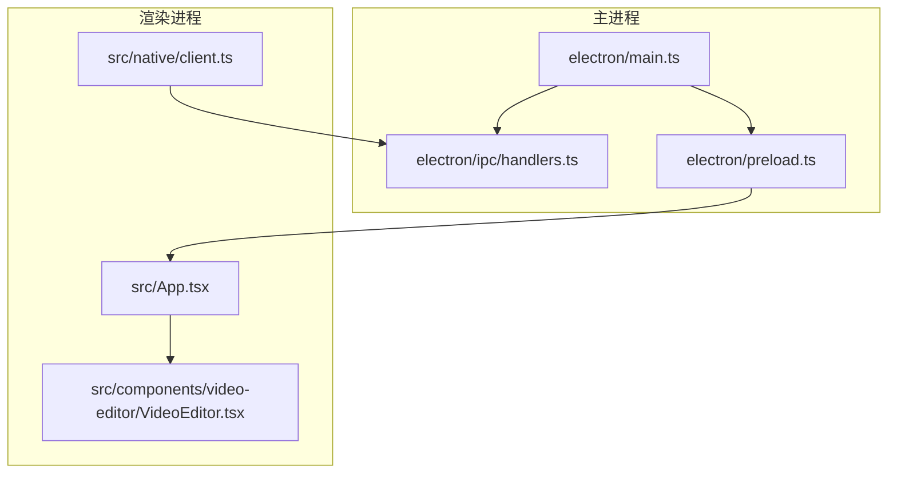
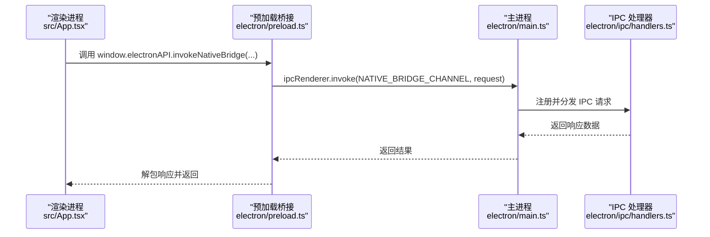
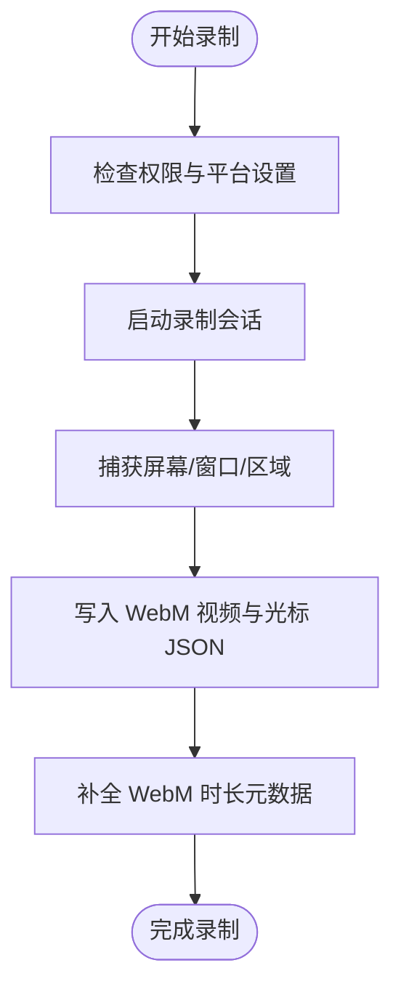
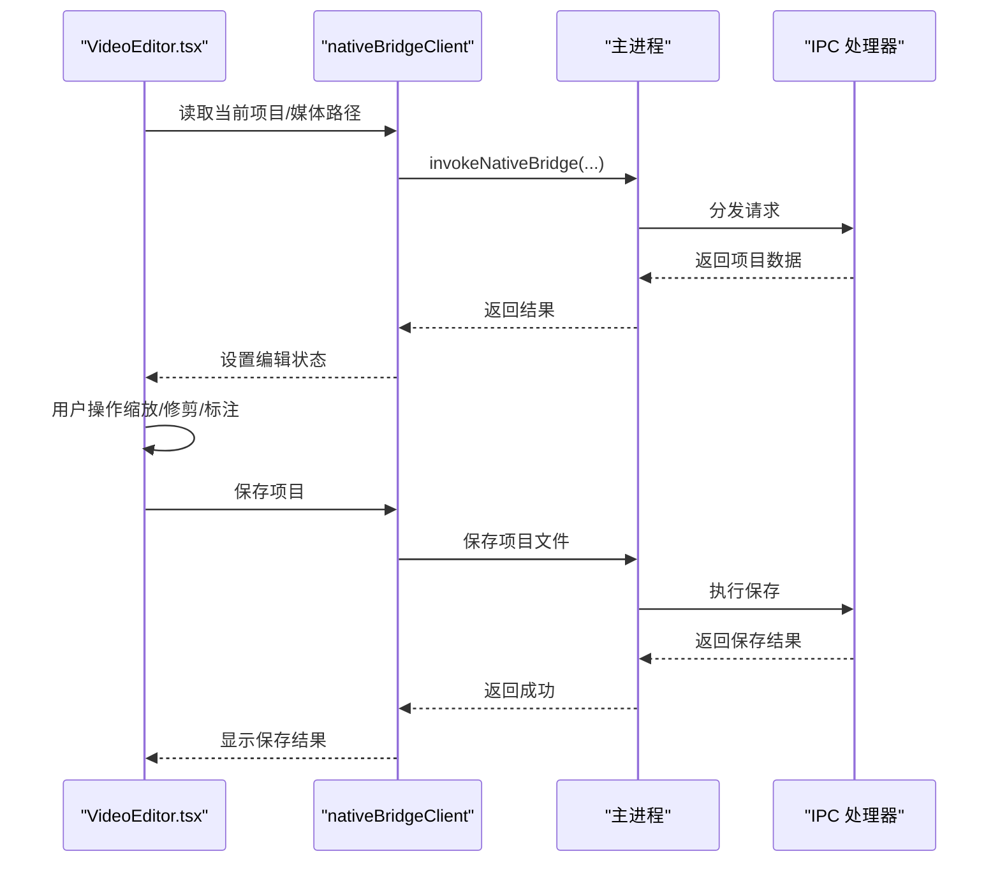
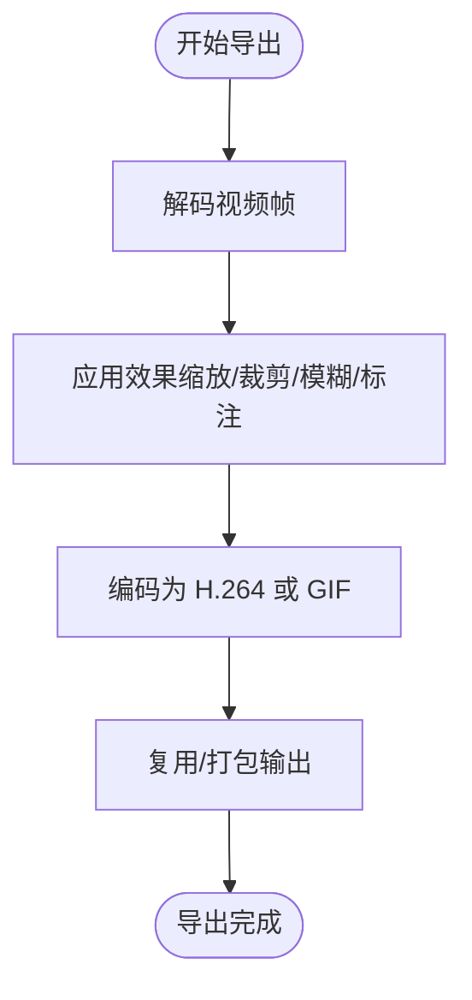
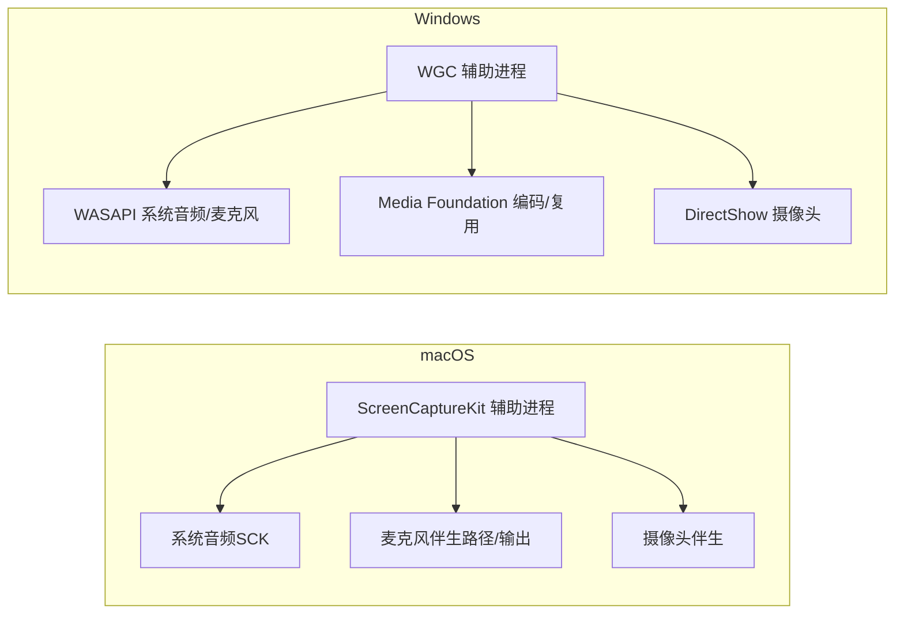
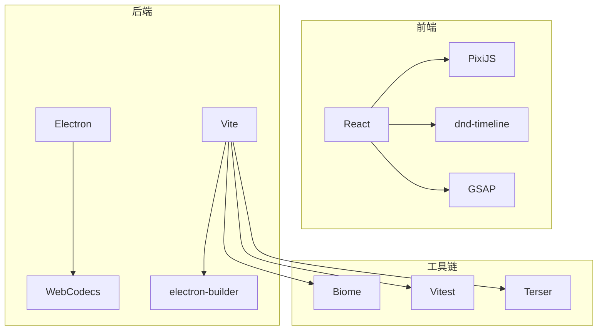

# 项目概述

<cite>
**本文档引用的文件**
- [README.md](file://README.md)
- [docs/README.md](file://docs/README.md)
- [docs/01-overview.md](file://docs/01-overview.md)
- [package.json](file://package.json)
- [electron/main.ts](file://electron/main.ts)
- [electron/preload.ts](file://electron/preload.ts)
- [src/App.tsx](file://src/App.tsx)
- [src/components/video-editor/VideoEditor.tsx](file://src/components/video-editor/VideoEditor.tsx)
- [src/lib/recordingSession.ts](file://src/lib/recordingSession.ts)
- [src/lib/exporter/index.ts](file://src/lib/exporter/index.ts)
- [src/native/client.ts](file://src/native/client.ts)
- [electron/ipc/handlers.ts](file://electron/ipc/handlers.ts)
- [docs/engineering/macos-native-recorder-roadmap.md](file://docs/engineering/macos-native-recorder-roadmap.md)
- [docs/engineering/windows-native-recorder-roadmap.md](file://docs/engineering/windows-native-recorder-roadmap.md)
- [CONTRIBUTING.md](file://CONTRIBUTING.md)
</cite>

## 目录
1. [简介](#简介)
2. [项目结构](#项目结构)
3. [核心组件](#核心组件)
4. [架构总览](#架构总览)
5. [详细组件分析](#详细组件分析)
6. [依赖关系分析](#依赖关系分析)
7. [性能考量](#性能考量)
8. [故障排查指南](#故障排查指南)
9. [结论](#结论)
10. [附录](#附录)

## 简介
OpenScreen 是一款免费、开源的桌面屏幕录制与视频编辑工具，定位为轻量级替代方案，面向需要快速制作产品演示或教程的用户。它基于 Electron 构建，覆盖从录制到导出的完整工作流，并提供跨 macOS、Linux 和 Windows 的原生体验。

- 核心价值主张
  - 免费且开源：MIT 许可，支持个人与商业用途。
  - 轻量化替代：聚焦 Screen Studio 的常用场景，避免过度复杂化。
  - 开源路线：鼓励社区协作与透明开发，降低使用门槛。
  - 跨平台：统一的 UI 与核心逻辑，多平台一致体验。

- 主要功能特性
  - 屏幕/窗口/区域录制；系统音频与麦克风采集。
  - 网页摄像头画中画叠加与自定义形状。
  - 时间轴缩放区域、裁剪、变速与片段修剪。
  - 背景墙纸、纯色/渐变、模糊、阴影等视觉效果。
  - 光标高亮与点击动画、文本/箭头/图片标注。
  - 项目保存与重开，避免重复录制。
  - MP4/GIF 导出，多分辨率与宽高比支持。

- 与 Screen Studio 的关系
  - OpenScreen 并非 1:1 克隆，而是简化版替代，专注于“够用”的基础能力，适合追求控制力与成本效益的用户。

- 安装与平台兼容
  - 支持通过包管理器或发行版安装，提供多格式二进制包与沙箱运行选项。
  - 音频采集在不同平台存在差异，需按平台说明授予相应权限。

**章节来源**
- [README.md:22-49](file://README.md#L22-L49)
- [README.md:50-148](file://README.md#L50-L148)
- [docs/01-overview.md:3-14](file://docs/01-overview.md#L3-L14)

## 项目结构
OpenScreen 采用 Electron 双进程模型（主进程 + 渲染进程），通过预加载脚本桥接 IPC，实现安全可控的系统调用。前端以 React/Vite 构建，后端负责应用生命周期、窗口管理、权限请求与文件系统访问。

**图表来源**
- [electron/main.ts:1-120](file://electron/main.ts#L1-L120)
- [electron/preload.ts:15-281](file://electron/preload.ts#L15-L281)
- [src/App.tsx:18-119](file://src/App.tsx#L18-L119)
- [src/components/video-editor/VideoEditor.tsx:179-220](file://src/components/video-editor/VideoEditor.tsx#L179-L220)
- [src/native/client.ts:52-140](file://src/native/client.ts#L52-L140)

**章节来源**
- [docs/README.md:57-79](file://docs/README.md#L57-L79)
- [docs/01-overview.md:65-96](file://docs/01-overview.md#L65-L96)

## 核心组件
- 应用窗口路由
  - 通过 URL 参数 windowType 决定渲染的窗口类型：HUD 覆盖层、源选择器、倒计时覆盖层、编辑器。
- 录制会话与数据模型
  - 录制会话包含屏幕视频路径、可选摄像头视频路径、光标采集模式与创建时间。
- 导出管线
  - 视频导出：解码、帧渲染、编码、复用；GIF 导出：逐帧渲染与调色板生成。
- 原生桥接客户端
  - 提供系统能力查询、项目读写、光标数据获取等接口，封装 IPC 调用。

**章节来源**
- [src/App.tsx:18-119](file://src/App.tsx#L18-L119)
- [src/lib/recordingSession.ts:1-87](file://src/lib/recordingSession.ts#L1-L87)
- [src/lib/exporter/index.ts:1-30](file://src/lib/exporter/index.ts#L1-L30)
- [src/native/client.ts:52-140](file://src/native/client.ts#L52-L140)

## 架构总览
OpenScreen 严格遵循 Electron 的上下文隔离策略：主进程拥有 Node.js 权限与系统资源访问能力，渲染进程运行在沙盒环境，通过预加载脚本暴露有限的 IPC 方法。应用窗口类型由路由参数决定，编辑器负责组织所有编辑状态并分发给子组件。

**图表来源**
- [src/App.tsx:18-119](file://src/App.tsx#L18-L119)
- [electron/preload.ts:15-281](file://electron/preload.ts#L15-L281)
- [electron/main.ts:552-568](file://electron/main.ts#L552-L568)
- [electron/ipc/handlers.ts:1-50](file://electron/ipc/handlers.ts#L1-L50)

**章节来源**
- [docs/01-overview.md:65-96](file://docs/01-overview.md#L65-L96)
- [electron/main.ts:50-90](file://electron/main.ts#L50-L90)

## 详细组件分析

### 录制系统
- 录制入口与权限
  - 主进程根据平台设置命令行开关与权限检查，确保 Wayland 环境下正确启用屏幕捕获与窗口管理。
- 录制会话与存储
  - 会话对象包含屏幕视频路径、可选摄像头路径、光标采集模式与创建时间；持久化目录位于用户数据目录下的 recordings 子目录。
- 光标遥测
  - 支持系统光标与可编辑覆盖层两种模式，光标采样数据用于智能缩放建议与点击高亮。

**图表来源**
- [electron/main.ts:31-48](file://electron/main.ts#L31-L48)
- [electron/main.ts:50-60](file://electron/main.ts#L50-L60)
- [electron/ipc/handlers.ts:291-302](file://electron/ipc/handlers.ts#L291-L302)
- [src/lib/recordingSession.ts:18-31](file://src/lib/recordingSession.ts#L18-L31)

**章节来源**
- [electron/main.ts:31-48](file://electron/main.ts#L31-L48)
- [electron/main.ts:50-60](file://electron/main.ts#L50-L60)
- [electron/ipc/handlers.ts:291-302](file://electron/ipc/handlers.ts#L291-L302)
- [src/lib/recordingSession.ts:18-31](file://src/lib/recordingSession.ts#L18-L31)

### 视频编辑器
- 编辑器职责
  - 统一管理编辑状态（缩放、修剪、变速、标注、模糊、裁剪、背景等），驱动播放器与时间轴组件。
- 项目持久化
  - 支持项目文件保存与加载，记录当前媒体路径、光标采集模式与编辑器配置快照。
- 导出流程
  - 依据导出质量与格式计算输出尺寸与编码参数，执行视频解码、帧渲染、编码与复用。

**图表来源**
- [src/components/video-editor/VideoEditor.tsx:542-604](file://src/components/video-editor/VideoEditor.tsx#L542-L604)
- [src/native/client.ts:71-119](file://src/native/client.ts#L71-L119)
- [electron/ipc/handlers.ts:304-347](file://electron/ipc/handlers.ts#L304-L347)

**章节来源**
- [src/components/video-editor/VideoEditor.tsx:542-604](file://src/components/video-editor/VideoEditor.tsx#L542-L604)
- [src/native/client.ts:71-119](file://src/native/client.ts#L71-L119)
- [electron/ipc/handlers.ts:304-347](file://electron/ipc/handlers.ts#L304-L347)

### 导出系统
- 视频导出
  - 使用 WebCodecs 解码、Canvas 渲染效果、VideoEncoder 编码、VideoMuxer 复用，生成 H.264 MP4。
- GIF 导出
  - 通过 gif.js 在 Web Worker 中生成调色板并编码，支持帧率与尺寸预设。
- 输出诊断
  - 导出失败时提供格式标签、原因、源路径、输出尺寸、帧率、编解码器与比特率等诊断信息。

**图表来源**
- [src/lib/exporter/index.ts:1-30](file://src/lib/exporter/index.ts#L1-L30)

**章节来源**
- [src/lib/exporter/index.ts:1-30](file://src/lib/exporter/index.ts#L1-L30)

### 原生录制路线图（macOS/Windows）
- macOS
  - 通过 ScreenCaptureKit 进行显示/窗口捕获，隐藏系统光标以使用可编辑光标覆盖层；在支持版本内直接捕获系统音频；麦克风通过伴生路径或 ScreenCaptureKit 微型输出混合。
- Windows
  - 通过 Windows Graphics Capture 捕获屏幕/窗口；WASAPI 捕获系统音频与麦克风；Media Foundation 编码与复用；摄像头通过 Media Foundation 或 DirectShow 捕获并合成到主 MP4。

**图表来源**
- [docs/engineering/macos-native-recorder-roadmap.md:26-48](file://docs/engineering/macos-native-recorder-roadmap.md#L26-L48)
- [docs/engineering/windows-native-recorder-roadmap.md:23-46](file://docs/engineering/windows-native-recorder-roadmap.md#L23-L46)

**章节来源**
- [docs/engineering/macos-native-recorder-roadmap.md:1-211](file://docs/engineering/macos-native-recorder-roadmap.md#L1-L211)
- [docs/engineering/windows-native-recorder-roadmap.md:1-249](file://docs/engineering/windows-native-recorder-roadmap.md#L1-L249)

## 依赖关系分析
- 技术栈
  - 前端：React、PixiJS、dnd-timeline、GSAP、TailwindCSS 等。
  - 后端：Electron、WebCodecs、TypeScript、Vite、Biome、electron-builder。
- 关键依赖
  - 录制：desktopCapturer + MediaRecorder（浏览器路径）与原生辅助进程（macOS/Windows）。
  - 编辑：PixiJS 实时渲染与滤镜、dnd-timeline 拖拽时间轴。
  - 导出：web-demuxer、mediabunny、mp4box、gif.js、@fix-webm-duration/fix。

**图表来源**
- [docs/01-overview.md:30-64](file://docs/01-overview.md#L30-L64)
- [package.json:47-90](file://package.json#L47-L90)
- [package.json:91-120](file://package.json#L91-L120)

**章节来源**
- [docs/01-overview.md:30-64](file://docs/01-overview.md#L30-L64)
- [package.json:47-90](file://package.json#L47-L90)
- [package.json:91-120](file://package.json#L91-L120)

## 性能考量
- 渲染与特效
  - 使用 PixiJS 进行 GPU 加速合成，减少 CPU 占用；运动模糊与阴影等效果在渲染阶段一次性叠加，避免重复计算。
- 导出效率
  - WebCodecs 解码与编码流水线，结合 Canvas 帧渲染，提升导出吞吐；GIF 导出通过 Web Worker 并行处理。
- 录制路径
  - 浏览器路径适用于快速录制与跨平台一致性；原生辅助进程在 macOS/Windows 上提供更稳定的时序与更低的系统开销。
- 文件 I/O
  - 录制文件与项目文件分离存储，避免大文件阻塞编辑器；对 WebM 时长进行磁盘修补，保证时间轴与播放器同步。

[本节为通用指导，无需特定文件引用]

## 故障排查指南
- 权限问题
  - macOS 需要“屏幕录制”与“辅助功能”权限；Windows 需要管理员权限与设备权限；Linux 需要 PipeWire 或 PulseAudio 支持。
- 音频采集
  - macOS 13+ 支持系统音频采集；旧版本仅支持麦克风；Windows 默认可用；Linux 需要现代音频堆栈。
- 导出失败
  - 查看导出诊断消息中的原因、源文件名、输出尺寸、帧率、编解码器与比特率；确认浏览器是否支持 VideoEncoder。
- 项目保存/加载
  - 确认项目文件扩展名与受信任目录；加载项目时注意路径合法性与文件存在性。

**章节来源**
- [README.md:149-156](file://README.md#L149-L156)
- [src/components/video-editor/VideoEditor.tsx:156-175](file://src/components/video-editor/VideoEditor.tsx#L156-L175)
- [electron/ipc/handlers.ts:91-102](file://electron/ipc/handlers.ts#L91-L102)

## 结论
OpenScreen 以 Electron 为基础，结合原生辅助进程与 Web 技术，提供了稳定、可扩展的屏幕录制与视频编辑能力。其开源路线与简洁的功能集使其成为 Screen Studio 的理想替代，尤其适合需要控制力与成本效益的用户。随着 macOS/Windows 原生录制的逐步完善，OpenScreen 将进一步提升录制稳定性与时序一致性。

[本节为总结性内容，无需特定文件引用]

## 附录

### 安装方式概览
- macOS
  - Homebrew：自动选择 Apple Silicon/Intel 版本并校验签名。
  - 手动安装：如被 Gatekeeper 阻止，可通过移除 quarantine 属性绕过。
- Windows
  - winget：一键安装/更新/卸载。
  - 直接下载：从发行版页面获取安装包。
- Linux
  - Debian/Ubuntu：.deb 包安装。
  - Arch/Manjaro：.pacman 包安装。
  - 任意发行版：.AppImage，必要时使用 --no-sandbox 运行。
  - Nix/NixOS：通过 flake/nixpkgs 安装或运行。

**章节来源**
- [README.md:54-148](file://README.md#L54-L148)

### 系统要求与平台兼容
- macOS：推荐 13+；Wayland 环境下启用 WebRTCPipeWireCapturer。
- Windows：默认支持；需要合适的音频设备与权限。
- Linux：需要 PipeWire（默认于较新发行版）；旧版可能仅支持麦克风。

**章节来源**
- [electron/main.ts:38-48](file://electron/main.ts#L38-L48)
- [README.md:149-156](file://README.md#L149-L156)

### 许可证与社区贡献
- 许可证：MIT，允许自由使用、修改与分发。
- 贡献指南：欢迎提交 PR 并附带截图或短视频说明变更；UI 或用户可见功能变更需展示效果。

**章节来源**
- [README.md:188-191](file://README.md#L188-L191)
- [CONTRIBUTING.md:1-57](file://CONTRIBUTING.md#L1-L57)