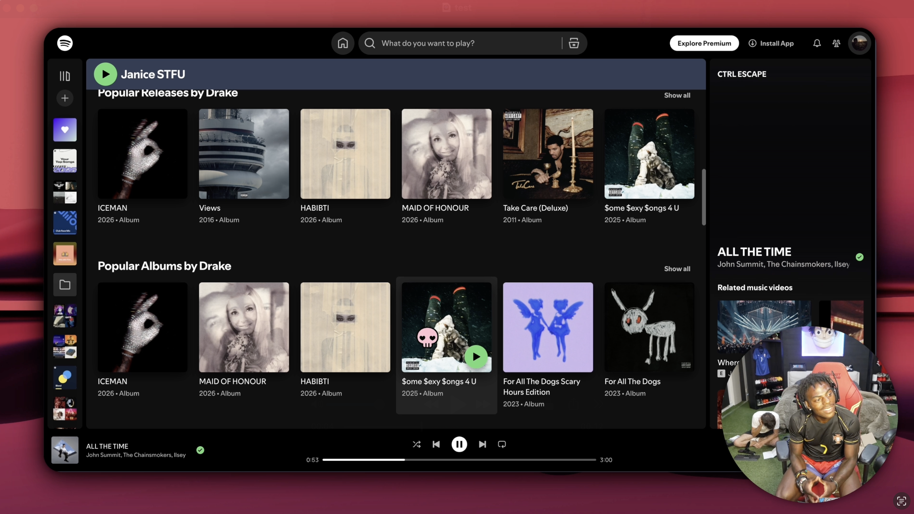

> [!WARNING]
> This started as a side project that blew up; not production grade and you'll hit bugs, but hopefully it covers what you need. **This project will soon be archived.**


<p align="center">
  
  <br />
  <br />
	<a href="https://trendshift.io/repositories/17427" target="_blank"></a>


  </a>
</p>

# <p align="center">OpenScreen</p>

<p align="center"><strong>OpenScreen is your free, open-source alternative to Screen Studio.</strong></p>

If you don't want to pay $29/month for Screen Studio but want a version that does what most people seem to need - quick, polished product demos and walkthroughs you'd post on X, Reddit or Youtube. OpenScreen does not offer every Screen Studio feature, but covers a lot of the core functionality.

Screen Studio is an awesome product and this is definitely not a 1:1 clone. If you just want something fully free and open source, this project should cover most of your needs.

**100% free** for both **personal** and **commercial** use. Use it, modify it, distribute it. Please respect the License. 

> [!NOTE]
>Software should be accessible. OpenScreen has no paid tiers, premium features, upsells, or functionality locked behind a paywall.

<p align="center">
	
  
</p>

## Core Features
- Record a specific window, or your whole screen.
- Record microphone and system audio.
- Webcam overlay with picture-in-picture, drag-to-position, mirroring, and shape options.
- Auto or manual zooms with adjustable depth, duration, easing, and pixel-precise position; auto-zoom follows your cursor as you work.
- Custom cursor size, smoothing, and click effects, with cursor themes and post-recording path smoothing.
- Automatic captions for voiceovers, generated on-device with no upload (works offline).
- Wallpapers, solid colors, gradients, or your own background image.
- Motion blur.
- Crop, trim, and per-segment speed control on the timeline.
- Text, arrow, and image annotations, with text animation presets.
- Timeline snapping guides and an audio waveform to make trimming easier.
- Customizable keyboard shortcuts.
- Export to MP4 or GIF in multiple aspect ratios and resolutions.
- Languages supported: Arabic, English, Spanish, French, Italian, Japanese, Korean, Portuguese (Brazil), Russian, Turkish, Vietnamese, Simplified Chinese, and Traditional Chinese.


## Installation

Download the latest installer for your platform from the [GitHub Releases](https://github.com/siddharthvaddem/openscreen/releases) page.

### macOS

The easiest way to install on macOS is via [Homebrew](https://brew.sh):

```bash
brew install --cask siddharthvaddem/openscreen/openscreen
```

Brew automatically picks the right build for Apple Silicon or Intel, and verifies the download against a notarized signature so Gatekeeper won't block it.

To update later: `brew upgrade --cask openscreen`
To uninstall: `brew uninstall --cask openscreen` (add `--zap` to also remove app data)

#### Manual install (if you prefer)

If you'd rather grab the `.dmg` directly from the [Releases page](https://github.com/siddharthvaddem/openscreen/releases) and encounter Gatekeeper blocking the app, you can bypass it by running the following command in your terminal after installation:

```bash
xattr -rd com.apple.quarantine /Applications/Openscreen.app
```

Note: Give your terminal Full Disk Access in **System Settings > Privacy & Security** to grant you access and then run the above command.

After running this command, proceed to **System Preferences > Security & Privacy** to grant the necessary permissions for "screen recording" and "accessibility". Once permissions are granted, you can launch the app.

> [!NOTE]
> **Upgrading from an older version and hitting permission issues?** If you already had OpenScreen installed and the new version won't record (Screen Recording or Accessibility keep failing even after you grant them), uninstall the old version, remove OpenScreen's existing entries under **System Settings > Privacy & Security** (both Screen Recording and Accessibility), then do a fresh install and grant the permissions again when prompted.

### Windows

Install via [winget](https://learn.microsoft.com/en-us/windows/package-manager/winget/):

```bash
winget install SiddharthVaddem.OpenScreen
```

To update later: `winget upgrade SiddharthVaddem.OpenScreen`
To uninstall: `winget uninstall SiddharthVaddem.OpenScreen`

If you'd rather grab the `.exe` installer directly, download it from the [Releases page](https://github.com/siddharthvaddem/openscreen/releases).

### Linux

Three packages are published to the [Releases page](https://github.com/siddharthvaddem/openscreen/releases) for each version. Pick the one that matches your distro:

**Debian / Ubuntu / Pop!_OS (`.deb`)**
```bash
sudo apt install ./Openscreen-Linux-latest.deb
```

**Arch / Manjaro (`.pacman`)**
```bash
sudo pacman -U Openscreen-Linux-latest.pacman
```

**Any distro (`.AppImage`)**
```bash
chmod +x Openscreen-Linux-*.AppImage
./Openscreen-Linux-*.AppImage
```

**NixOS / Nix (flake)**

Try without installing:
```bash
nix run github:siddharthvaddem/openscreen
```

Install into your user profile:
```bash
nix profile install github:siddharthvaddem/openscreen
```

For a NixOS system config (flake):
```nix
{
  inputs.openscreen.url = "github:siddharthvaddem/openscreen";

  outputs = { nixpkgs, openscreen, ... }: {
    nixosConfigurations.<host> = nixpkgs.lib.nixosSystem {
      modules = [
        openscreen.nixosModules.default
        { programs.openscreen.enable = true; }
      ];
    };
  };
}
```

For Home Manager, use `openscreen.homeManagerModules.default` with the same `programs.openscreen.enable = true;`.

You may need to grant screen recording permissions depending on your desktop environment.

**Sandbox error:** If the AppImage fails to launch with a "sandbox" error, run it with `--no-sandbox`:
```bash
./Openscreen-Linux-*.AppImage --no-sandbox
```

### Platform differences

Everything in the editor and export is the same on macOS, Windows, and Linux: zooms, backgrounds, motion blur, crop/trim/speed, blur regions, annotations, auto-captions, projects, export, and all languages. The differences are in **capture**, where macOS and Windows use a native pipeline that Linux doesn't have:

- **Native recording**: macOS (ScreenCaptureKit) and Windows (Windows Graphics Capture) record through a native pipeline for higher quality and clean window-level capture. Linux records through the browser pipeline instead.
- **Custom cursors**: on macOS and Windows the real cursor is captured (shape, type, and clicks), which powers the cursor themes, click effects, and editable cursor overlay. On Linux only the cursor position is captured (used for auto-zoom), so those cursor options aren't available.
- **Webcam**: captured natively on macOS and Windows; on Linux it's recorded through the browser, but still works as a picture-in-picture overlay.
- **System audio** support varies by OS:
  - **macOS**: requires macOS 13+. On macOS 14.2+ you'll be prompted to grant audio capture permission. macOS 12 and below can't capture system audio (mic still works).
  - **Windows**: works out of the box.
  - **Linux**: needs PipeWire (default on Ubuntu 22.04+, Fedora 34+). Older PulseAudio-only setups may not capture system audio (mic should still work).

---

## License

This project is licensed under the [MIT License](./LICENSE). By using this software, you agree that the authors are not liable for any issues, damages, or claims arising from its use.
